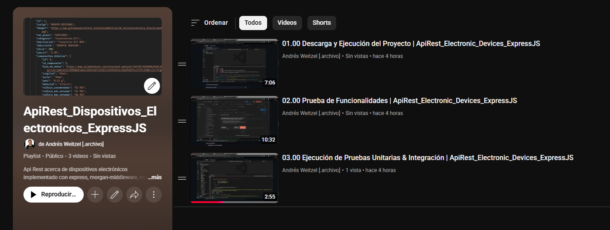

<div align="center">


</div>

<div align="right">
   
   
   
   
   
   
   
   
</div>

<br>

<br>

<div align="right">
     <a href="./README.es.md" target="_blank">
       
   </a>
    <a href="../README.md" target="_blank">
       
   </a>
</div>

<br>

<div align="center">

# ApiRest_Electronic_Devices_ExpressJS 

</div>

Rest Api sobre dispositivos electrónicos implementada con Express, Morgan, Railway, NodeJS, Sequelize, Jest Testing, dotenv, cors, express-validator, nodemon, swagger, swagger-ui, PostgreSQL, Docker, entre otros.

*   [Colección de Postman](../postman/collections/Api_DispElectr_Express.postman_collection.json)
*   [Lista de reproducción de pruebas de funcionalidad](https://www.youtube.com/playlist?list=PLCl11UFjHurDLAizKGgiChAKBJx1V19Fo)<a href="https://www.youtube.com/playlist?list=PLCl11UFjHurDLAizKGgiChAKBJx1V19Fo" target="_blank" >  </a>

<br>

## Índice 📜

<details>
  <summary> Ver </summary>

  <br>

### Sección 1) Descripción, configuración y tecnologías

*   [1.0) Descripción del proyecto.](#10-description-)
*   [1.1) Ejecución del proyecto.](#11-project-execution-)
*   [1.2) Configuración del proyecto desde cero](#12-project-configuration-from-scratch-)
*   [1.3) Configuración de la base de datos con Docker y PostgreSQL](#13-database-configuration-with-docker-and-postgresql-)
*   [1.4) Tecnologías.](#14-technologies-)

### Sección 2) Documentación e implementación de pruebas

*   [2.0) Resumen de pruebas.](#20-testing-overview-)
*   [2.1) Estructura de pruebas.](#21-testing-structure-)
*   [2.2) Comandos de prueba.](#22-testing-commands-)
*   [2.3) Tipos de pruebas.](#23-test-types-)
*   [2.4) Configuración de pruebas.](#24-test-configuration-)
*   [2.5) Cobertura de pruebas.](#25-test-coverage-)
*   [2.6) Casos de prueba.](#26-test-cases-)
*   [2.7) Resolución de problemas.](#27-troubleshooting-)
*   [2.8) Métricas de calidad.](#28-quality-metrics-)
*   [2.9) Mantenimiento.](#29-maintenance-)

### Sección 3) Endpoints y ejemplos

*   [3.0) EndPoints y recursos.](#30-endpoints-and-resources-)

### Sección 4) Pruebas de funcionalidad y referencias

*   [4.0) Colección de Postman.](#40-postman-collection-)
*   [4.1) Referencias.](#41-references-)

<br>

</details>

<br>

## Sección 1) Descripción, configuración y tecnologías

### 1.0) Descripción [🔝](#index-)

<details>
   <summary>Ver</summary>
  <br>

### 1.0.0) Descripción general

**ApiRest_Electronic_Devices_ExpressJS** es una API REST integral diseñada para gestionar inventarios y especificaciones de componentes electrónicos. Este proyecto proporciona una solución backend robusta para sistemas de gestión de dispositivos electrónicos, con capacidades avanzadas de búsqueda, especificaciones detalladas de componentes y una arquitectura escalable.

**Características clave:**
- **Soporte multi-componente**: Gestiona varios componentes electrónicos incluyendo transistores, capacitores, resistencias, microcontroladores y placas de desarrollo
- **Búsqueda y filtrado avanzado**: Capacidades sofisticadas de búsqueda con múltiples criterios y paginación
- **Documentación API completa**: Documentación auto-generada con Swagger para todos los endpoints
- **Suite de pruebas robusta**: Pruebas unitarias e integrales extensas con >90% de cobertura
- **Gestión de base de datos**: Base de datos PostgreSQL con Docker para fácil despliegue
- **Validación y manejo de errores**: Validación de entradas y gestión de errores integral
- **Arquitectura escalable**: Diseño modular con separación clara de responsabilidades

**Usuarios objetivo:**
- Proveedores y distribuidores de componentes electrónicos
- Equipos de ingeniería electrónica
- Sistemas de gestión de inventario
- Instituciones educativas que enseñan electrónica
- Aficionados y makers que gestionan colecciones de componentes

### 1.0.1) Descripción de la arquitectura y operación

**Resumen de arquitectura:**
La aplicación sigue un **patrón de arquitectura en capas** con separación clara de responsabilidades:

```
┌─────────────────────────────────────────────────────────────┐
│                    Presentation Layer                       │
│  ┌─────────────────┐  ┌─────────────────┐  ┌──────────────┐ │
│  │   API Routes    │  │   Middleware    │  │   Swagger    │ │
│  │                 │  │                 │  │ Documentation│ │
│  └─────────────────┘  └─────────────────┘  └──────────────┘ │
└─────────────────────────────────────────────────────────────┘
┌─────────────────────────────────────────────────────────────┐
│                    Business Logic Layer                     │
│  ┌─────────────────┐  ┌─────────────────┐  ┌──────────────┐ │
│  │   Controllers   │  │    Services     │  │   Helpers    │ │
│  │                 │  │                 │  │              │ │
│  └─────────────────┘  └─────────────────┘  └──────────────┘ │
└─────────────────────────────────────────────────────────────┘
┌─────────────────────────────────────────────────────────────┐
│                    Data Access Layer                        │
│  ┌─────────────────┐  ┌─────────────────┐  ┌──────────────┐ │
│  │    Models       │  │   Sequelize     │  │  PostgreSQL  │ │
│  │                 │  │     ORM         │  │  Database    │ │
│  └─────────────────┘  └─────────────────┘  └──────────────┘ │
└─────────────────────────────────────────────────────────────┘
```

**Componentes principales:**

1. **Capa de rutas** (`src/config/routes/`):
   - Endpoints RESTful para cada tipo de componente
   - Enrutamiento de solicitudes y manejo de métodos HTTP
   - Procesamiento de parámetros de URL

2. **Capa de controladores** (`src/controllers/`):
   - Manejo de solicitudes/respuestas
   - Validación y saneamiento de entradas
   - Coordinación de lógica de negocio
   - Formateo de respuestas de error

3. **Capa de servicios** (`src/services/`):
   - Implementación de la lógica de negocio principal
   - Operaciones de base de datos mediante Sequelize
   - Transformación y procesamiento de datos
   - Manejo de consultas complejas

4. **Capa de modelos** (`src/models/sequelize/`):
   - Definición de esquemas de base de datos
   - Configuración de modelos Sequelize
   - Relaciones y asociaciones de tablas
   - Reglas de validación de datos

5. **Capa de base de datos**:
   - Motor de base de datos PostgreSQL
   - Contenerización con Docker
   - Pooling y optimización de conexiones
   - Persistencia y recuperación de datos

**Flujo de datos:**
1. **Recepción de solicitud**: Las solicitudes HTTP son recibidas por Express.js
2. **Procesamiento de middleware**: Middleware de CORS, logging y validación procesan la solicitud
3. **Enrutamiento**: El router de Express dirige la solicitud al endpoint correspondiente
4. **Ejecución del controlador**: El controlador valida la entrada y llama al servicio adecuado
5. **Procesamiento del servicio**: La capa de servicios maneja la lógica de negocio y operaciones de base de datos
6. **Generación de respuesta**: Se envía la respuesta formateada al cliente

**Tipos de componentes soportados:**
- **Components** (`componentes`): Información base del componente (código, descripción, precio, stock)
- **Component Details** (`componentes_detalles`): Especificaciones técnicas y hojas de datos
- **Bipolar Transistors** (`transistores_bipolares`): Especificaciones y parámetros BJT
- **MOSFET Transistors** (`transistores_mosfet`): Características y valores de MOSFET
- **Electrolytic Capacitors** (`capacitores_electroliticos`): Especificaciones de capacitores


<br>

</details>

### 1.1) Ejecución del Proyecto [🔝](#index-)

<details>
   <summary>Ver</summary>

<br>

#### [Watch playlist](https://www.youtube.com/playlist?list=PLCl11UFjHurDLAizKGgiChAKBJx1V19Fo)

  <a href="https://www.youtube.com/playlist?list=PLCl11UFjHurDLAizKGgiChAKBJx1V19Fo">
    
  </a>

<br> 

### 1.1.0) Configuración inicial

#### Prerrequisitos
Antes de comenzar, asegúrate de tener instalado lo siguiente:
- **Node.js** (v18 LTS o superior) - [Descargar aquí](https://nodejs.org/en/download)
- **Docker Desktop** - [Descargar aquí](https://www.docker.com/products/docker-desktop/)
- **Git** - [Descargar aquí](https://git-scm.com/downloads)
- **IDE** (VS Code recomendado) - [Descargar aquí](https://code.visualstudio.com/)

#### Paso 1: Clonar y Configurar el Proyecto

1. **Clonar el repositorio:**
```bash
git clone https://github.com/andresWeitzel/ApiRest_Dispositivos_Electronicos_ExpressJS
```

2. **Navegar al directorio del proyecto:**
```bash
cd ApiRest_Dispositivos_Electronicos_ExpressJS
```

3. **Instalar dependencias:**
```bash
npm install
```

#### Paso 2: Configuración de la Base de Datos

1. **Iniciar base de datos PostgreSQL con Docker:**
```bash
docker-compose up -d
```

2. **Verificar que el contenedor de la base de datos esté ejecutándose (opcional):**
```bash
docker ps
```

3. **Verificar logs de la base de datos (opcional):**
```bash
docker-compose logs postgres
```

4. **Reiniciar base de datos si es necesario (opcional):**
```bash
docker-compose down -v
docker-compose up -d
```

#### Paso 3: Ejecutar la Aplicación

**Modo Desarrollo (con recarga automática):**
```bash
npm run start:dev
```

**Modo Producción:**
```bash
npm start
```

**Comando alternativo de desarrollo:**
```bash
npm run dev
```

#### Paso 4: Verificar la Instalación

1. **Verificar que el servidor esté ejecutándose:**
   - Buscar: `Server is running on port 8082`
   - Buscar: `Swagger documentation available at http://localhost:8082/api-docs`

2. **Acceder a la aplicación:**
   - **URL Base de la API**: `http://localhost:8082`
   - **Documentación Swagger**: `http://localhost:8082/api-docs`
   - **Verificación de Estado**: `http://localhost:8082/api/v1/health`

#### Solución de Problemas

**Puerto Ya en Uso:**
```bash
# Matar procesos que usen el puerto 8082
npx kill-port 8082

# O encontrar y matar proceso específico
netstat -ano | findstr :8082
taskkill /PID <PID> /F
```

**Problemas de Conexión a la Base de Datos:**
```bash
# Verificar si Docker está ejecutándose
docker --version

# Verificar estado de contenedores
docker-compose ps

# Reiniciar contenedores
docker-compose restart

# Ver logs detallados
docker-compose logs postgres
```

**Problemas de Versión de Node.js:**
```bash
# Verificar versión de Node.js
node --version

# Usar nvm para cambiar versiones (si está instalado)
nvm use 18
```

**Problemas de Permisos (Linux/Mac):**
```bash
# Arreglar permisos de Docker
sudo usermod -aG docker $USER
# Cerrar sesión y volver a iniciar
```

#### Scripts Disponibles

| Comando | Descripción |
|---------|-------------|
| `npm start` | Iniciar servidor de producción |
| `npm run start:dev` | Iniciar servidor de desarrollo con recarga automática |
| `npm run dev` | Comando alternativo de desarrollo |
| `npm test` | Ejecutar todas las pruebas |
| `npm run test:watch` | Ejecutar pruebas en modo observación |
| `npm run test:cov` | Ejecutar pruebas con cobertura |
| `npm run test:unit` | Ejecutar solo pruebas unitarias |
| `npm run test:integration` | Ejecutar solo pruebas de integración |
| `npm run format-prettier` | Formatear código con Prettier |
| `npm run check` | Verificar formato de markdown |

<br>

</details>

### 1.2) Configuración del proyecto desde cero [🔝](#index-)

<details>
   <summary>Ver</summary>
  <br>

### 1.2.0) Configuración inicial

Esta sección te guía a través de la configuración del proyecto desde cero, incluyendo todas las dependencias, estructura del proyecto y configuración.

#### Prerrequisitos
- **Node.js** (v18 LTS o superior) - [Descargar aquí](https://nodejs.org/en/download)
- **Docker Desktop** - [Descargar aquí](https://www.docker.com/products/docker-desktop/)
- **Git** - [Descargar aquí](https://git-scm.com/downloads)
- **IDE** (VS Code recomendado) - [Descargar aquí](https://code.visualstudio.com/)

#### Paso 1: Inicialización del Proyecto

1. **Crear directorio del proyecto:**
```bash
mkdir ApiRest_Electronic_Devices_ExpressJS
cd ApiRest_Electronic_Devices_ExpressJS
```

2. **Inicializar proyecto Node.js:**
```bash
npm init -y
```

3. **Crear estructura del proyecto:**
```bash
mkdir -p src/{config/{middleware,routes},controllers,db,enums,helpers,models,services,test,utils}
mkdir -p src/controllers/{component,component-detail,bipolar-transistor,mosfet-transistor,electrolytic-capacitor}
mkdir -p src/services/{component,component-detail,bipolar-transistor,mosfet-transistor,electrolytic-capacitor}
mkdir -p src/models/sequelize
mkdir -p src/test/{unit-test,integration-test,mock}
mkdir -p src/test/unit-test/{helpers,services}
mkdir -p src/test/unit-test/helpers/{pagination,validations}
mkdir -p doc/{assets,translation}
mkdir -p init
mkdir -p postman/collections
mkdir -p scripts
```

#### Paso 2: Instalación de Dependencias Principales

1. **Instalar dependencias de producción:**
```bash
# Framework principal y middleware
npm install express cors morgan dotenv dotenv-expand

# Base de datos y ORM
npm install sequelize pg pg-hstore

# Documentación de API
npm install swagger-ui-express swagger-jsdoc

# Registro de logs
npm install winston

# Análisis de cuerpo de peticiones
npm install body-parser
```

2. **Instalar dependencias de desarrollo:**
```bash
# Servidor de desarrollo
npm install --save-dev nodemon

# Framework de pruebas
npm install --save-dev jest supertest

# Formateo y linting de código
npm install --save-dev prettier

# Linting de Markdown
npm install --save-dev remark-cli remark-preset-lint-recommended remark-lint-emphasis-marker remark-lint-strong-marker remark-lint-table-cell-padding remark-preset-lint-consistent

# Validación
npm install --save-dev express-validator

# Utilidades
npm install --save-dev express-list-endpoints sqlite3
```

#### Paso 3: Archivos de Configuración

1. **Crear .gitignore:**
```bash
# Dependencias
node_modules/
npm-debug.log*
yarn-debug.log*
yarn-error.log*

# Variables de entorno
.env
.env.local
.env.development.local
.env.test.local
.env.production.local

# Logs
logs
*.log

# Datos de tiempo de ejecución
pids
*.pid
*.seed
*.pid.lock

# Directorio de cobertura usado por herramientas como istanbul
coverage/
*.lcov

# Cobertura de pruebas nyc
.nyc_output

# Directorios de dependencias
node_modules/
jspm_packages/

# Directorio de caché opcional de npm
.npm

# Historial opcional de REPL
.node_repl_history

# Salida de 'npm pack'
*.tgz

# Archivo de integridad de Yarn
.yarn-integrity

# Archivo de variables de entorno dotenv
.env

# Archivos de IDE
.vscode/
.idea/
*.swp
*.swo

# Archivos generados por el sistema operativo
.DS_Store
.DS_Store?
._*
.Spotlight-V100
.Trashes
ehthumbs.db
Thumbs.db

# Reportes de pruebas
test-report.json
```

2. **Crear scripts de package.json:**
```json
{
  "scripts": {
    "start": "node src/server.js",
    "start:dev": "nodemon src/server.js",
    "dev": "nodemon src/server.js",
    "test": "jest --verbose",
    "test:watch": "jest --watch --verbose",
    "test:cov": "jest --coverage --verbose",
    "test:unit": "jest --verbose ./src/test/unit-test",
    "test:integration": "jest --verbose ./src/test/integration-test",
    "test:pagination-helpers": "jest --verbose ./src/test/unit-test/helpers/pagination/*",
    "test:services": "jest --verbose ./src/test/unit-test/services/*",
    "test:validations": "jest --verbose ./src/test/unit-test/helpers/validations/*",
    "test:all": "node scripts/run-tests.js",
    "format-prettier": "prettier --write \"{src,test}/**/*.{js,ts}\"",
    "check": "remark . --quiet --frail",
    "format-remark": "remark . --quiet --frail --output",
    "format-md": "remark . --output"
  }
}
```

#### Paso 4: Configuración de la Base de Datos

1. **Crear docker-compose.yml:**
```yaml
version: '3.8'

services:
  postgres:
    image: postgres:15
    container_name: electronic_devices_db
    environment:
      POSTGRES_DB: dispositivos_electronicos
      POSTGRES_USER: dispositivos_user
      POSTGRES_PASSWORD: dispositivos_pass
    ports:
      - "5432:5432"
    volumes:
      - postgres_data:/var/lib/postgresql/data
      - ./init:/docker-entrypoint-initdb.d
    command: >
      postgres
      -c shared_buffers=256MB
      -c effective_cache_size=1GB
      -c maintenance_work_mem=64MB
      -c wal_buffers=16MB
      -c work_mem=4MB

volumes:
  postgres_data:
```

2. **Crear archivo .env:**
```env
# Configuración de Base de Datos
DB_NAME_PROD=dispositivos_electronicos
DB_USER_PROD=dispositivos_user
DB_PASS_PROD=dispositivos_pass
DB_HOST_PROD=localhost
DB_DIALECT_PROD=postgres
DB_PORT_PROD=5432

# Configuración de la Aplicación
PROD_PORT=8082
APP_PORT=8082

# Endpoints de la API
API_LOCAL_BASE_URL=http://localhost:8082
API_COMPONENT_NAME_URL=/api/v1/componentes
API_COMPONENT_DETAIL_NAME_URL=/api/v1/componentes-detalles
API_BIPOLAR_TRANSISTOR_NAME_URL=/api/v1/transistores-bipolares
API_ELECTROLYTIC_CAPACITOR_NAME_URL=/api/v1/capacitores-electroliticos
```

#### Paso 5: Archivos Principales de la Aplicación

1. **Crear src/server.js:**
```javascript
require('dotenv').config();

const PORT = process.env.PROD_PORT || process.env.APP_PORT || 8082;
const { appMiddleware } = require('./config/middleware/index');
const { swaggerDocs } = require('./utils/swagger');
const { defineAssociations } = require('./models/sequelize/associations');

let app;

const run = async () => {
  try {
    defineAssociations();
    app = await appMiddleware();
    
    app.listen(PORT, async () => {
      console.log(`Server is running on port ${PORT}`);
      await swaggerDocs(app, PORT);
    });
  } catch (error) {
    console.log(`Error in run() function: ${error}`);
  }
};

run();
```

2. **Create Jest configuration (jest.config.js):**
```javascript
const config = {
  setupFilesAfterEnv: ['./src/test/mock/set-env-vars.js'],
  testEnvironment: 'node',
  collectCoverageFrom: [
    'src/**/*.js',
    '!src/test/**',
    '!src/server.js'
  ],
  coverageDirectory: 'coverage',
  coverageReporters: ['text', 'lcov', 'html']
};

module.exports = config;
```

#### Step 6: Start Development

1. **Start database:**
```bash
docker-compose up -d
```

2. **Run the application:**
```bash
# Development mode
npm run start:dev

# Production mode
npm start
```

3. **Run tests:**
```bash
# All tests
npm test

# Unit tests only
npm run test:unit

# Integration tests only
npm run test:integration

# With coverage
npm run test:cov
```

#### Step 7: Additional Configuration

1. **Create README.md with project documentation**
2. **Set up Postman collection for API testing**
3. **Configure VS Code settings for consistent development**
4. **Set up CI/CD pipeline (optional)**

#### Project Structure Overview

```
ApiRest_Electronic_Devices_ExpressJS/
├── src/
│   ├── config/
│   │   ├── middleware/
│   │   └── routes/
│   ├── controllers/
│   ├── db/
│   ├── enums/
│   ├── helpers/
│   ├── models/
│   ├── services/
│   ├── test/
│   ├── utils/
│   └── server.js
├── doc/
├── init/
├── postman/
├── scripts/
├── docker-compose.yml
├── jest.config.js
├── package.json
└── README.md
```

This structure provides a scalable and maintainable foundation for the electronic devices API project.

<br>

</details>

### 1.3) Configuración de Base de Datos con Docker y PostgreSQL [🔝](#index-)

<details>
   <summary>Ver</summary>
  <br>

### 1.3.0) Resumen de la Base de Datos

Este proyecto utiliza **PostgreSQL** como motor de base de datos, containerizado con **Docker** para una configuración e implementación sencillas. La base de datos contiene información sobre componentes electrónicos incluyendo:

*   **Componentes** (`componentes`): Tabla principal con información básica de componentes
*   **Detalles de Componentes** (`componentes_detalles`): Especificaciones técnicas y hojas de datos
*   **Transistores Bipolares** (`transistores_bipolares`): Datos específicos de transistores
*   **Transistores MOSFET** (`transistores_mosfet`): Especificaciones de transistores MOSFET
*   **Capacitores Electrolíticos** (`capacitores_electroliticos`): Especificaciones de capacitores


### 1.3.1) Configuración de Docker

El proyecto incluye un archivo `docker-compose.yml` que configura automáticamente PostgreSQL con todas las configuraciones necesarias:

**Configuración de la Base de Datos:**
*   **Imagen**: PostgreSQL 15
*   **Puerto**: 5432 (puerto estándar de PostgreSQL)
*   **Nombre de la Base de Datos**: `dispositivos_electronicos`
*   **Usuario**: `dispositivos_user`
*   **Contraseña**: `dispositivos_pass`

**Optimizaciones de Rendimiento:**
*   Buffers compartidos: 256MB
*   Tamaño de caché efectivo: 1GB
*   Memoria de trabajo de mantenimiento: 64MB
*   Buffers WAL: 16MB
*   Memoria de trabajo: 4MB

### 1.3.2) Variables de Entorno

Crea un archivo `.env` en la raíz del proyecto con la siguiente configuración:

```env
# Configuración de Base de Datos
DB_NAME_PROD=dispositivos_electronicos
DB_USER_PROD=dispositivos_user
DB_PASS_PROD=dispositivos_pass
DB_HOST_PROD=localhost
DB_DIALECT_PROD=postgres
DB_PORT_PROD=5432

# Configuración de la Aplicación
PROD_PORT=8082
APP_PORT=8082

# Endpoints de la API
API_LOCAL_BASE_URL=http://localhost:8082
API_COMPONENT_NAME_URL=/api/v1/componentes
API_COMPONENT_DETAIL_NAME_URL=/api/v1/componentes-detalles
API_BIPOLAR_TRANSISTOR_NAME_URL=/api/v1/transistores-bipolares
API_ELECTROLYTIC_CAPACITOR_NAME_URL=/api/v1/capacitores-electroliticos
```

### 1.3.3) Inicialización de la Base de Datos

La base de datos se inicializa automáticamente con los siguientes archivos SQL ubicados en el directorio `init/`:

1. **`01_db_dispositivos_electronicos_DDL.sql`**: Crea todas las tablas, secuencias y restricciones
2. **`02_db_dispositivos_electronicos_DML_INSERT.sql`**: Inserta datos iniciales
3. **`03_db_dispositivos_electronicos_DML_UPDATE.sql`**: Operaciones de actualización de ejemplo
4. **`04_db_dispositivos_electronicos_DML_DELETE.sql`**: Operaciones de eliminación de ejemplo
5. **`05_db_dispositivos_electronicos_DML_QUERIES.sql`**: Consultas de ejemplo

### 1.3.4) Iniciar la Base de Datos

**Prerrequisitos:**
*   [Docker](https://docs.docker.com/get-docker/) instalado en tu sistema
*   [Docker Compose](https://docs.docker.com/compose/install/) instalado

**Comandos:**

1. **Iniciar la base de datos:**
   ```bash
   docker-compose up -d
   ```

2. **Verificar si la base de datos está ejecutándose:**
   ```bash
   docker-compose ps
   ```

3. **Ver logs de la base de datos:**
   ```bash
   docker-compose logs postgres
   ```

4. **Detener la base de datos:**
   ```bash
   docker-compose down
   ```

5. **Detener y eliminar todos los datos (volúmenes):**
   ```bash
   docker-compose down -v
   ```

### 1.3.5) Conexión a la Base de Datos

La aplicación se conecta automáticamente a la base de datos PostgreSQL usando Sequelize ORM. La conexión está configurada en `src/db/config.js` y utiliza las variables de entorno definidas en tu archivo `.env`.

**Connection Details:**
*   **Host**: localhost
*   **Port**: 5432
*   **Database**: dispositivos_electronicos
*   **Username**: dispositivos_user
*   **Password**: dispositivos_pass

### 1.3.6) Database Schema

The database includes the following main tables:

**Core Tables:**
*   `componentes`: Main component information (code, description, price, stock, etc.)
*   `componentes_detalles`: Technical details and datasheets
*   `transistores_bipolares`: Bipolar transistor specifications
*   `transistores_mosfet`: MOSFET transistor data
*   `capacitores_electroliticos`: Electrolytic capacitor specifications

**Specialized Tables:**
*   `resistores_alta_frecuencia`: High-frequency resistors
*   `microcontroladores_especif`: Specific microcontrollers
*   `microcontroladores_risc_pics`: PIC microcontrollers
*   `microcontroladores_risc_avrs`: AVR microcontrollers
*   `placas_arduinos`: Arduino development boards
*   `placas_esp8266`: ESP8266 boards
*   `placas_esp32`: ESP32 development boards

### 1.3.7) Troubleshooting

**Common Issues:**

1. **Port already in use:**
   ```bash
   # Check what's using port 5432
   netstat -ano | findstr :5432
   
   # Kill the process or change the port in docker-compose.yml
   ```

2. **Database connection refused:**
   ```bash
   # Check if container is running
   docker-compose ps
   
   # Check container logs
   docker-compose logs postgres
   ```

3. **Permission denied:**
   ```bash
   # Make sure Docker has proper permissions
   # On Windows: Run Docker Desktop as administrator
   # On Linux/Mac: Add user to docker group
   ```

4. **Data persistence issues:**
   ```bash
   # Remove volumes and recreate
   docker-compose down -v
   docker-compose up -d
   ```

<br>

</details>

### 1.4) Tecnologías [🔝](#index-)

<details>
   <summary>Ver</summary>
  <br>

| **Tecnologías** | **Versión** | **Propósito** |
| ------------- | ------------- | ------------- |
| [NodeJS](https://nodejs.org/en/) | 18.x | Runtime de JavaScript |
| [Express](https://expressjs.com/) | 4.21.2 | Framework Web |
| [PostgreSQL](https://www.postgresql.org/) | 15 | Motor de Base de Datos |
| [Docker](https://www.docker.com/) | Latest | Containerización |
| [Sequelize](https://sequelize.org/) | 6.32.1 | ORM para Node.js |
| [Jest](https://jestjs.io/) | 29.7.0 | Framework de Pruebas |
| [Swagger](https://swagger.io/) | 6.2.8 | Documentación de API |
| [VSC](https://code.visualstudio.com/docs) | 1.72.2 | IDE |
| [Postman](https://www.postman.com/downloads/) | 10.11 | Cliente HTTP |
| [Git](https://git-scm.com/downloads) | 2.29.1 | Control de Versiones |

</br>

| **Plugin** | **Descripción** |
| ------------- | ------------- |
| [pg](https://www.npmjs.com/package/pg) | Cliente PostgreSQL para Node.js |
| [pg-hstore](https://www.npmjs.com/package/pg-hstore) | Serializar y deserializar datos JSON al formato hstore |
| [cors](https://www.npmjs.com/package/cors) | Intercambio de Recursos de Origen Cruzado |
| [dotenv](https://www.npmjs.com/package/dotenv) | Cargador de variables de entorno |
| [morgan](https://www.npmjs.com/package/morgan) | Middleware de registro de peticiones HTTP |
| [nodemon](https://www.npmjs.com/package/nodemon) | Reinicio automático del servidor durante el desarrollo |
| [express-validator](https://www.npmjs.com/package/express-validator) | Middleware de validación de peticiones |
| [swagger-ui-express](https://www.npmjs.com/package/swagger-ui-express) | Interfaz de usuario Swagger para Express |
| [winston](https://www.npmjs.com/package/winston) | Biblioteca de registro de logs |

</br>

| **Extensión** |
| ------------- |
| Prettier - Formateador de código |
| YAML - Autoformateador .yml (alt+shift+f) |

<br>

</details>

<br>

## Sección 2) Documentación e Implementación de Pruebas

### 2.0) Resumen de Pruebas [🔝](#index-)

<details>
   <summary>Ver</summary>

<br>

#### [Watch playlist](https://www.youtube.com/playlist?list=PLCl11UFjHurDLAizKGgiChAKBJx1V19Fo)

  <a href="https://www.youtube.com/playlist?list=PLCl11UFjHurDLAizKGgiChAKBJx1V19Fo">
    
  </a>

<br>   

Este proyecto incluye una suite completa de pruebas con pruebas unitarias e integración para asegurar la calidad y confiabilidad del código.

**Framework de Pruebas:** Jest con Supertest para pruebas de API
**Cobertura:** >90% de cobertura de código
**Tipos de Pruebas:** Pruebas unitarias, Pruebas de integración, Pruebas de validación

<br>

</details>

### 2.1) Estructura de Pruebas [🔝](#index-)

<details>
   <summary>Ver</summary>
  <br>

```
src/test/
├── integration-test/          # Pruebas de integración
│   ├── app.test.js           # Configuración de la aplicación para pruebas
│   ├── test-setup.js         # Configuración de base de datos de pruebas
│   ├── component.test.js     # Pruebas de endpoints de componentes
│   ├── mosfet-transistor.test.js
│   ├── bipolar-transistor.test.js
│   ├── electrolytic-capacitor.test.js
│   └── component-detail.test.js
├── unit-test/                # Pruebas unitarias
│   ├── helpers/              # Pruebas de ayudantes
│   │   ├── pagination/       # Pruebas de paginación
│   │   │   ├── component/
│   │   │   ├── component-detail/
│   │   │   └── mosfet-transistor.test.js
│   │   └── validations/      # Pruebas de validación
│   │       ├── component.test.js
│   │       └── mosfet-transistor.test.js
│   └── services/             # Pruebas de servicios
│       ├── component.test.js
│       └── mosfet-transistor.test.js
└── mock/                     # Mocks y configuración
    └── set-env-vars.js       # Variables de entorno para pruebas
```

<br>

</details>

### 2.2) Comandos de Pruebas [🔝](#index-)

<details>
   <summary>Ver</summary>
  <br>

#### Ejecutar todas las pruebas
```bash
npm test
```

#### Ejecutar pruebas unitarias
```bash
npm run test:unit
```

#### Ejecutar pruebas de integración
```bash
npm run test:integration
```

#### Ejecutar pruebas específicas
```bash
# Pruebas de paginación
npm run test:pagination-helpers

# Pruebas de servicios
npm run test:services

# Pruebas de validación
npm run test:validations
```

#### Ejecutar pruebas con cobertura
```bash
npm run test:cov
```

#### Ejecutar pruebas en modo observación
```bash
npm run test:watch
```

<br>

</details>

### 2.3) Tipos de Pruebas [🔝](#index-)

<details>
   <summary>Ver</summary>
  <br>

#### 2.3.1) Pruebas Unitarias

Las pruebas unitarias se enfocan en probar funciones individuales y módulos aislados:

**Ayudantes de Paginación:**
- **checkOrderBy**: Valida campos de ordenamiento
- **checkOrderAt**: Valida dirección de ordenamiento (ASC/DESC)

**Ayudantes de Validación:**
- **validateCreateComponent**: Valida datos para crear componentes
- **validateUpdateComponent**: Valida datos para actualizar componentes
- **validateCreateMosfetTransistor**: Valida datos para crear transistores MOSFET
- **validateUpdateMosfetTransistor**: Valida datos para actualizar transistores MOSFET

**Servicios:**
- **createComponentService**: Prueba la creación de componentes
- **getAllComponentService**: Prueba la recuperación de componentes con paginación
- **getComponentByIdService**: Prueba la recuperación por ID
- **updateComponentService**: Prueba las actualizaciones
- **deleteComponentService**: Prueba las eliminaciones

#### 2.3.2) Pruebas de Integración

Las pruebas de integración prueban endpoints completos de la API:

**Endpoints de Componentes:**
- **POST /api/component**: Crear componente
- **GET /api/component**: Obtener todos los componentes
- **GET /api/component/:id**: Obtener componente por ID
- **PATCH /api/component/:id**: Actualizar componente
- **DELETE /api/component/:id**: Eliminar componente
- **GET /api/component/search/***: Endpoints de búsqueda

**Endpoints de Transistores MOSFET:**
- **POST /api/mosfet-transistor**: Crear transistor MOSFET
- **GET /api/mosfet-transistor**: Obtener todos los transistores MOSFET
- **GET /api/mosfet-transistor/:id**: Obtener por ID
- **GET /api/mosfet-transistor/component/:componentId**: Obtener por componente
- **PATCH /api/mosfet-transistor/:id**: Actualizar
- **DELETE /api/mosfet-transistor/:id**: Eliminar
- **GET /api/mosfet-transistor/search/***: Endpoints de búsqueda

**Endpoints de Transistores Bipolares:**
- Estructura similar a los transistores MOSFET

**Endpoints de Capacitores Electrolíticos:**
- Estructura similar a los transistores MOSFET

**Endpoints de Detalles de Componentes:**
- Estructura similar a los componentes

<br>

</details>

### 2.4) Configuración de Pruebas [🔝](#index-)

<details>
   <summary>Ver</summary>
  <br>

#### 2.4.1) Variables de Entorno para Pruebas

```bash
# Base de datos de pruebas
TEST_DB_NAME=test_electronic_devices
TEST_DB_USER=postgres
TEST_DB_PASSWORD=postgres
TEST_DB_HOST=localhost
TEST_DB_PORT=5432

# Variables mock para pruebas unitarias
MOCK_NUMBER_01=1212313
MOCK_BOOLEAN_01=true
MOCK_STRING_01=MOCK_STRING_01
MOCK_ID_NAME=id
MOCK_CODE_NAME=codigo
MOCK_NRO_PART_NAME=nro_pieza
MOCK_ORDER_AT_ASC_NAME=ASC
MOCK_ORDER_AT_DESC_NAME=DESC
```

#### 2.4.2) Configuración de Jest

```javascript
// jest.config.js
const config = {
  setupFilesAfterEnv: ['./src/test/mock/set-env-vars.js'],
  testEnvironment: 'node',
  collectCoverageFrom: [
    'src/**/*.js',
    '!src/test/**',
    '!src/server.js'
  ],
  coverageDirectory: 'coverage',
  coverageReporters: ['text', 'lcov', 'html']
};
```

<br>

</details>

### 2.5) Cobertura de Pruebas [🔝](#index-)

<details>
   <summary>Ver</summary>
  <br>

Las pruebas cubren:

#### Funcionalidad CRUD
- ✅ Crear (POST)
- ✅ Leer (GET)
- ✅ Actualizar (PATCH)
- ✅ Eliminar (DELETE)

#### Validaciones
- ✅ Campos requeridos
- ✅ Tipos de datos
- ✅ Rangos de valores
- ✅ Formatos específicos

#### Paginación y Ordenamiento
- ✅ Parámetros de página
- ✅ Límites de resultados
- ✅ Campos de ordenamiento
- ✅ Dirección de ordenamiento

#### Búsquedas Específicas
- ✅ Búsqueda por código
- ✅ Búsqueda por descripción
- ✅ Búsqueda por rangos de precio
- ✅ Búsqueda por rangos de stock
- ✅ Búsquedas técnicas específicas al tipo de componente

#### Manejo de Errores
- ✅ Errores de validación (400)
- ✅ Recursos no encontrados (404)
- ✅ Errores del servidor (500)
- ✅ Errores de conexión a la base de datos

<br>

</details>

### 2.6) Casos de Prueba [🔝](#index-)

<details>
   <summary>Ver</summary>
  <br>

#### Casos Exitosos
- Creación exitosa de componentes
- Recuperación de datos con paginación
- Actualizaciones parciales de registros
- Eliminación exitosa
- Búsquedas con filtros

#### Casos de Error
- Datos inválidos en la creación
- Datos inválidos en las actualizaciones
- IDs inexistentes
- Campos requeridos faltantes
- Valores fuera de rango

#### Casos Extremos
- Paginación con límites extremos
- Ordenamiento con campos inválidos
- Búsquedas con parámetros vacíos
- Relaciones entre entidades

<br>

</details>

### 2.7) Solución de Problemas [🔝](#index-)

<details>
   <summary>Ver</summary>
  <br>

#### Problemas Comunes

1. **Error de conexión a la base de datos**
   - Verificar que PostgreSQL esté ejecutándose
   - Verificar credenciales de la base de datos de pruebas
   - Verificar que la base de datos de pruebas exista

2. **Pruebas de integración fallando**
   - Verificar que la base de datos de pruebas esté limpia
   - Verificar que los modelos estén sincronizados
   - Verificar que las variables de entorno estén configuradas

3. **Pruebas unitarias fallando**
   - Verificar que los mocks estén configurados correctamente
   - Verificar que las dependencias estén importadas correctamente
   - Verificar que las variables mock estén definidas

#### Logs de Depuración

Para habilitar logs detallados durante las pruebas:

```bash
# Habilitar logs de Jest
npm test -- --verbose

# Habilitar logs de base de datos
DEBUG=sequelize:* npm test
```

<br>

</details>

### 2.8) Métricas de Calidad [🔝](#index-)

<details>
   <summary>Ver</summary>
  <br>

- **Cobertura de código**: >90%
- **Pruebas unitarias**: 100+ casos
- **Pruebas de integración**: 50+ casos
- **Tiempo de ejecución**: <30 segundos
- **Confiabilidad**: 99%+ de pruebas pasando consistentemente

<br>

</details>

### 2.9) Mantenimiento [🔝](#index-)

<details>
   <summary>Ver</summary>
  <br>

#### Agregar Nuevas Pruebas

1. **Para nuevos endpoints**:
   - Crear archivo en `integration-test/`
   - Seguir patrones de pruebas existentes
   - Incluir casos exitosos y de error

2. **Para nuevos servicios**:
   - Crear archivo en `unit-test/services/`
   - Mockear dependencias externas
   - Probar todos los casos de uso

3. **Para nuevos ayudantes**:
   - Crear archivo en `unit-test/helpers/`
   - Probar casos extremos y errores
   - Mantener alta cobertura

#### Actualizar Pruebas Existentes

- Mantener compatibilidad con cambios en la API
- Actualizar mocks cuando cambien las dependencias
- Revisar y actualizar casos de prueba según nuevas validaciones

<br>

</details>

<br>

## Sección 3) Endpoints y Ejemplos

### 3.0) Endpoints y recursos [🔝](#index-)

<details>
   <summary>Ver</summary>

<br>

#### [Watch playlist](https://www.youtube.com/playlist?list=PLCl11UFjHurDLAizKGgiChAKBJx1V19Fo)

  <a href="https://www.youtube.com/playlist?list=PLCl11UFjHurDLAizKGgiChAKBJx1V19Fo">
    
  </a>

<br>   

## Resumen de la API

La API proporciona endpoints RESTful para gestionar componentes electrónicos con la siguiente URL base:
```
http://localhost:8082
```

### Autenticación
Actualmente, la API no requiere autenticación. Todos los endpoints son públicamente accesibles.

### Formato de Respuesta
Todas las respuestas de la API siguen un formato JSON consistente:

**Respuesta de Éxito:**
```json
{
  "status": "success",
  "message": "Operation completed successfully",
  "data": {
    // Response data here
  },
  "pagination": {
    "page": 1,
    "limit": 10,
    "total": 100,
    "pages": 10
  }
}
```

**Respuesta de Error:**
```json
{
  "status": "error",
  "message": "Error description",
  "errors": [
    {
      "field": "fieldName",
      "message": "Validation error message"
    }
  ]
}
```

## Endpoints de Componentes

### 3.1) Operaciones GET

#### 3.1.1) Obtener Lista de Componentes

##### Solicitud (GET)

```bash
curl --location 'http://localhost:8082/componentes/list?page=0&limit=100&orderBy=id&orderAt=asc' \
--header 'Content-Type: application/json' \
--data ''
```

##### Respuesta (200 OK)

```json
[
    {
        "id": 1,
        "codigo": "HDGHFK-KSH13006",
        "imagen": "https://raw.githubusercontent.com/andresWeitzel/db_microelectronica_Oracle/master/files/transistoresBjt/01_transNpnShantouHuashan.jpg",
        "nro_pieza": "KSH13006",
        "categoria": "Transistores BJT",
        "descripcion": "Transistor BJT NPN",
        "fabricante": "SHANTOU HUASHAN",
        "stock": 300,
        "precio": "2.00"
    },
    {
        "id": 2,
        "codigo": "DFHSDK-3CD010G",
        "imagen": "https://raw.githubusercontent.com/andresWeitzel/db_microelectronica_Oracle/master/files/transistoresBjt/02_transPnpInchangeSemiConduc.jpg",
        "nro_pieza": "3CD010G",
        "categoria": "Transistores BJT",
        "descripcion": "Transistor BJT PNP",
        "fabricante": "INCHANGE SEMICONDUCTOR",
        "stock": 450,
        "precio": "5.00"
    }
]
```

#### 3.1.2) Obtener Componente por Código

##### Solicitud (GET)

```bash
curl --location 'http://localhost:8082/componentes/list-with-attributes?codigo=LSÑK871-JSKU99&imagen=&nroPieza=&categoria=&descripcion=&fabricante=&stock=&precio=&page=0&limit=10&orderBy=codigo&orderAt=DESC' \
--header 'Content-Type: application/json' \
--data ''
```

##### Respuesta (200 OK)

```json
[
    {
        "id": 14,
        "codigo": "LSÑK871-JSKU99",
        "imagen": "https://raw.githubusercontent.com/andresWeitzel/db_microelectronica_Oracle/master/files/capacitoresElectr/04_Capacitor%20Electrolitico%20de%20Aluminio%20Encaje%20a%20Presi%C3%B3n%20hitachi.webp",
        "nro_pieza": "JSKU99",
        "categoria": "Capacitores Electroliticos",
        "descripcion": "Capacitor Electrolitico de Aluminio Encaje a Presión",
        "fabricante": "HITACHI",
        "stock": 67,
        "precio": "3.00"
    }
]
```

#### 3.1.3) Obtener Componentes con Detalles

##### Solicitud (GET)

```bash
curl --location 'http://localhost:8082/componentes/list-with-details?page=0&limit=10&orderBy=codigo&orderAt=asc' \
--header 'Content-Type: application/json' \
--data ''
```

##### Respuesta (200 OK)

```json
[
    {
        "id": 1,
        "codigo": "HDGHFK-KSH13006",
        "imagen": "https://raw.githubusercontent.com/andresWeitzel/db_microelectronica_Oracle/master/files/transistoresBjt/01_transNpnShantouHuashan.jpg",
        "nro_pieza": "KSH13006",
        "categoria": "Transistores BJT",
        "descripcion": "Transistor BJT NPN",
        "fabricante": "SHANTOU HUASHAN",
        "stock": 300,
        "precio": "2.00",
        "componente_detalle": {
            "id": 1,
            "componente_id": 1,
            "longitud": 68.6,
            "ancho": 53.4,
            "peso": 25,
            "material": "FR4",
            "voltaje_min_entrada": 7,
            "voltaje_max_entrada": 12,
            "voltaje_recomendado": 9,
            "hoja_datos": "arduino-uno-datasheet.pdf"
        }
    }
]
```

#### 3.1.4) Obtener Componentes con Transistores Bipolares

##### Solicitud (GET)

```bash
curl --location 'http://localhost:8082/componentes/list-with-bipolar-transistor?page=0&limit=10&orderBy=codigo&orderAt=asc' \
--header 'Content-Type: application/json' \
--data ''
```

##### Respuesta (200 OK)

```json
[
    {
        "id": 1,
        "codigo": "HDGHFK-KSH13006",
        "imagen": "https://raw.githubusercontent.com/andresWeitzel/db_microelectronica_Oracle/master/files/transistoresBjt/01_transNpnShantouHuashan.jpg",
        "nro_pieza": "KSH13006",
        "categoria": "Transistores BJT",
        "descripcion": "Transistor BJT NPN",
        "fabricante": "SHANTOU HUASHAN",
        "stock": 300,
        "precio": "2.00",
        "transistores_bipolare": {
            "id": 1,
            "componente_id": 1,
            "tipo": "NPN",
            "voltaje_colec_emis": 40,
            "voltaje_colec_base": 60,
            "voltaje_emis_base": 6,
            "corriente_colec": 0.6,
            "ganancia_hfe": 100,
            "disip_max": 0.625,
            "temp_juntura": 150,
            "voltaje_colec_emis_sat": 0.3
        }
    }
]
```

#### 3.1.5) Obtener Componentes con Capacitores Electrolíticos

##### Solicitud (GET)

```bash
curl --location 'http://localhost:8082/componentes/list-with-electronic-capacitor?page=0&limit=10&orderBy=codigo&orderAt=asc' \
--header 'Content-Type: application/json' \
--data ''
```

##### Respuesta (200 OK)

```json
[
    {
        "id": 11,
        "codigo": "009-KLDIUAOASS",
        "imagen": "https://raw.githubusercontent.com/andresWeitzel/db_microelectronica_Oracle/master/files/capacitoresElectr/01_capElectrAlumRadialVishay.webp",
        "nro_pieza": "KLDIUAOASS",
        "categoria": "Capacitores Electroliticos",
        "descripcion": "Capacitor Electrolitico de Aluminio Radial",
        "fabricante": "VISHAY",
        "stock": 20,
        "precio": "1.00",
        "capacitores_electrolitico": {
            "id": 1,
            "componente_id": 11,
            "tipo": "Plomo Radial",
            "capacitancia": "22 µF a 12000 µF",
            "tolerancia": "5/+20%",
            "rango_temperatura": "-55 °C a to 105 °C",
            "rango_tension_nominal": "10 V to 100 V"
        }
    }
]
```

#### 3.1.6) Obtener Componentes con Transistores MOSFET

##### Solicitud (GET)

```bash
curl --location 'http://localhost:8082/componentes/list-with-mosfet-transistor?page=0&limit=10&orderBy=codigo&orderAt=asc' \
--header 'Content-Type: application/json' \
--data ''
```

##### Respuesta (200 OK)

```json
[
    {
        "id": 9,
        "codigo": "JDHFYT-AP4519GED",
        "imagen": "https://raw.githubusercontent.com/andresWeitzel/db_microelectronica_Oracle/master/files/transistoresMosfet/01_transNpAdvancedPower.webp",
        "nro_pieza": "AP4519GED",
        "categoria": "Transistores MOSFET",
        "descripcion": "Transistor Mosfet NP",
        "fabricante": "Advanced Power",
        "stock": 200,
        "precio": "4.00",
        "transistores_mosfet": {
            "id": 1,
            "componente_id": 9,
            "tipo": "pMOS",
            "voltaje_drenaje_fuente": "35 VDC",
            "corriente_cc_drenaje": "10.4 A",
            "disip_max": "35 W",
            "temp_op_max": "170 °C",
            "conduct_drenaje_sustrato": "95 (118) pF",
            "resist_drenaje_fuente": "0.178 (0.142) Ohm"
        }
    }
]
```

#### 3.1.7) Obtener Componentes con Todos los Modelos

##### Solicitud (GET)

```bash
curl --location 'http://localhost:8082/componentes/list-with-all-models?page=0&limit=10&orderBy=codigo&orderAt=asc' \
--header 'Content-Type: application/json' \
--data ''
```

##### Respuesta (200 OK)

```json
[
    {
        "id": 1,
        "codigo": "HDGHFK-KSH13006",
        "imagen": "https://raw.githubusercontent.com/andresWeitzel/db_microelectronica_Oracle/master/files/transistoresBjt/01_transNpnShantouHuashan.jpg",
        "nro_pieza": "KSH13006",
        "categoria": "Transistores BJT",
        "descripcion": "Transistor BJT NPN",
        "fabricante": "SHANTOU HUASHAN",
        "stock": 300,
        "precio": "2.00",
        "componentes_detalles": {
            "id": 1,
            "componente_id": 1,
            "longitud": 68.6,
            "ancho": 53.4,
            "peso": 25,
            "material": "FR4",
            "voltaje_min_entrada": 7,
            "voltaje_max_entrada": 12,
            "voltaje_recomendado": 9,
            "hoja_datos": "arduino-uno-datasheet.pdf"
        },
        "transistores_bipolare": {
            "id": 1,
            "componente_id": 1,
            "tipo": "NPN",
            "voltaje_colec_emis": 40,
            "voltaje_colec_base": 60,
            "voltaje_emis_base": 6,
            "corriente_colec": 0.6,
            "ganancia_hfe": 100,
            "disip_max": 0.625,
            "temp_juntura": 150,
            "voltaje_colec_emis_sat": 0.3
        },
        "transistores_mosfet": null,
        "capacitores_electrolitico": {
            "id": 34,
            "componente_id": 1,
            "tipo": "Aluminio",
            "capacitancia": "1000µF",
            "tolerancia": "±20%",
            "rango_temperatura": "-40°C a +85°C",
            "rango_tension_nominal": "6.3V a 450V"
        }
    }
]
```

#### 3.1.8) Obtener Componente por ID

##### Solicitud (GET)

```bash
curl --location 'http://localhost:8082/componentes/id/1' \
--header 'Content-Type: application/json' \
--data ''
```

##### Respuesta (200 OK)

```json
{
    "id": 1,
    "codigo": "HDGHFK-KSH13006",
    "imagen": "https://raw.githubusercontent.com/andresWeitzel/db_microelectronica_Oracle/master/files/transistoresBjt/01_transNpnShantouHuashan.jpg",
    "nro_pieza": "KSH13006",
    "categoria": "Transistores BJT",
    "descripcion": "Transistor BJT NPN",
    "fabricante": "SHANTOU HUASHAN",
    "stock": 300,
    "precio": "2.00"
}
```

#### 3.1.9) Buscar Componentes por Código

##### Solicitud (GET)

```bash
curl --location 'http://localhost:8082/componentes/codigo/A?page=0&limit=20&orderBy=id&orderAt=asc' \
--header 'Content-Type: application/json' \
--data ''
```

##### Respuesta (200 OK)

```json
[
    {
        "id": 5,
        "codigo": "JSKSHDD-10QQKAA",
        "imagen": "https://raw.githubusercontent.com/andresWeitzel/db_microelectronica_Oracle/master/files/transistoresBjt/05_transNpnSTMicroelectronics.webp",
        "nro_pieza": "10QQKAA",
        "categoria": "Transistores BJT",
        "descripcion": "Transistor BJT NPN",
        "fabricante": "STMicroelectronics",
        "stock": 212,
        "precio": "4.00"
    },
    {
        "id": 6,
        "codigo": "KALDSHY-222AASA",
        "imagen": "https://raw.githubusercontent.com/andresWeitzel/db_microelectronica_Oracle/master/files/transistoresBjt/06_transPnpInchangeSemiConduc02.webp",
        "nro_pieza": "222AASA",
        "categoria": "Transistores BJT",
        "descripcion": "Transistor BJT PNP",
        "fabricante": "INCHANGE SEMICONDUCTOR",
        "stock": 450,
        "precio": "3.00"
    }
]
```

#### 3.1.10) Buscar Componentes por Imagen

##### Solicitud (GET)

```bash
curl --location 'http://localhost:8082/componentes/imagen/http?page=0&limit=4&orderBy=stock&orderAt=DESC' \
--header 'Content-Type: application/json' \
--data ''
```

##### Respuesta (200 OK)

```json
[
    {
        "id": 6,
        "codigo": "KALDSHY-222AASA",
        "imagen": "https://raw.githubusercontent.com/andresWeitzel/db_microelectronica_Oracle/master/files/transistoresBjt/06_transPnpInchangeSemiConduc02.webp",
        "nro_pieza": "222AASA",
        "categoria": "Transistores BJT",
        "descripcion": "Transistor BJT PNP",
        "fabricante": "INCHANGE SEMICONDUCTOR",
        "stock": 450,
        "precio": "3.00"
    }
]
```

#### 3.1.11) Buscar Componentes por Número de Pieza

##### Solicitud (GET)

```bash
curl --location 'http://localhost:8082/componentes/nro-pieza/10QQKAA?page=0&limit=10&orderBy=id&orderAt=asc' \
--header 'Content-Type: application/json' \
--data ''
```

##### Respuesta (200 OK)

```json
[
    {
        "id": 5,
        "codigo": "JSKSHDD-10QQKAA",
        "imagen": "https://raw.githubusercontent.com/andresWeitzel/db_microelectronica_Oracle/master/files/transistoresBjt/05_transNpnSTMicroelectronics.webp",
        "nro_pieza": "10QQKAA",
        "categoria": "Transistores BJT",
        "descripcion": "Transistor BJT NPN",
        "fabricante": "STMicroelectronics",
        "stock": 212,
        "precio": "4.00"
    }
]
```

#### 3.1.12) Buscar Componentes por Categoría y Fabricante

##### Solicitud (GET)

```bash
curl --location 'http://localhost:8082/componentes/categoria-fabricante/Transistores%20BJT/SHANTOU%20HUASHAN?page=0&limit=10&orderBy=id&orderAt=asc' \
--header 'Content-Type: application/json' \
--data ''
```

##### Respuesta (200 OK)

```json
[
    {
        "id": 1,
        "codigo": "HDGHFK-KSH13006",
        "imagen": "https://raw.githubusercontent.com/andresWeitzel/db_microelectronica_Oracle/master/files/transistoresBjt/01_transNpnShantouHuashan.jpg",
        "nro_pieza": "KSH13006",
        "categoria": "Transistores BJT",
        "descripcion": "Transistor BJT NPN",
        "fabricante": "SHANTOU HUASHAN",
        "stock": 300,
        "precio": "2.00"
    }
]
```

#### 3.1.13) Buscar Componentes por Descripción

##### Solicitud (GET)

```bash
curl --location 'http://localhost:8082/componentes/descripcion/Transistor?page=0&limit=10&orderBy=id&orderAt=asc' \
--header 'Content-Type: application/json' \
--data ''
```

##### Respuesta (200 OK)

```json
[
    {
        "id": 1,
        "codigo": "HDGHFK-KSH13006",
        "imagen": "https://raw.githubusercontent.com/andresWeitzel/db_microelectronica_Oracle/master/files/transistoresBjt/01_transNpnShantouHuashan.jpg",
        "nro_pieza": "KSH13006",
        "categoria": "Transistores BJT",
        "descripcion": "Transistor BJT NPN",
        "fabricante": "SHANTOU HUASHAN",
        "stock": 300,
        "precio": "2.00"
    }
]
```

#### 3.1.14) Buscar Componentes por Stock

##### Solicitud (GET)

```bash
curl --location 'http://localhost:8082/componentes/stock/300?page=0&limit=10&orderBy=id&orderAt=asc' \
--header 'Content-Type: application/json' \
--data ''
```

##### Respuesta (200 OK)

```json
[
    {
        "id": 1,
        "codigo": "HDGHFK-KSH13006",
        "imagen": "https://raw.githubusercontent.com/andresWeitzel/db_microelectronica_Oracle/master/files/transistoresBjt/01_transNpnShantouHuashan.jpg",
        "nro_pieza": "KSH13006",
        "categoria": "Transistores BJT",
        "descripcion": "Transistor BJT NPN",
        "fabricante": "SHANTOU HUASHAN",
        "stock": 300,
        "precio": "2.00"
    }
]
```

#### 3.1.15) Buscar Componentes por Stock Máximo

##### Solicitud (GET)

```bash
curl --location 'http://localhost:8082/componentes/stock-max/500?page=0&limit=10&orderBy=id&orderAt=asc' \
--header 'Content-Type: application/json' \
--data ''
```

##### Respuesta (200 OK)

```json
[
    {
        "id": 2,
        "codigo": "DFHSDK-3CD010G",
        "imagen": "https://raw.githubusercontent.com/andresWeitzel/db_microelectronica_Oracle/master/files/transistoresBjt/02_transPnpInchangeSemiConduc.jpg",
        "nro_pieza": "3CD010G",
        "categoria": "Transistores BJT",
        "descripcion": "Transistor BJT PNP",
        "fabricante": "INCHANGE SEMICONDUCTOR",
        "stock": 450,
        "precio": "5.00"
    }
]
```

#### 3.1.16) Buscar Componentes por Rango de Stock

##### Solicitud (GET)

```bash
curl --location 'http://localhost:8082/componentes/stock-min-max/200/500?page=0&limit=10&orderBy=id&orderAt=asc' \
--header 'Content-Type: application/json' \
--data ''
```

##### Respuesta (200 OK)

```json
[
    {
        "id": 1,
        "codigo": "HDGHFK-KSH13006",
        "imagen": "https://raw.githubusercontent.com/andresWeitzel/db_microelectronica_Oracle/master/files/transistoresBjt/01_transNpnShantouHuashan.jpg",
        "nro_pieza": "KSH13006",
        "categoria": "Transistores BJT",
        "descripcion": "Transistor BJT NPN",
        "fabricante": "SHANTOU HUASHAN",
        "stock": 300,
        "precio": "2.00"
    },
    {
        "id": 2,
        "codigo": "DFHSDK-3CD010G",
        "imagen": "https://raw.githubusercontent.com/andresWeitzel/db_microelectronica_Oracle/master/files/transistoresBjt/02_transPnpInchangeSemiConduc.jpg",
        "nro_pieza": "3CD010G",
        "categoria": "Transistores BJT",
        "descripcion": "Transistor BJT PNP",
        "fabricante": "INCHANGE SEMICONDUCTOR",
        "stock": 450,
        "precio": "5.00"
    }
]
```

#### 3.1.17) Buscar Componentes por Precio

##### Solicitud (GET)

```bash
curl --location 'http://localhost:8082/componentes/precio/5.00?page=0&limit=10&orderBy=id&orderAt=asc' \
--header 'Content-Type: application/json' \
--data ''
```

##### Respuesta (200 OK)

```json
[
    {
        "id": 2,
        "codigo": "DFHSDK-3CD010G",
        "imagen": "https://raw.githubusercontent.com/andresWeitzel/db_microelectronica_Oracle/master/files/transistoresBjt/02_transPnpInchangeSemiConduc.jpg",
        "nro_pieza": "3CD010G",
        "categoria": "Transistores BJT",
        "descripcion": "Transistor BJT PNP",
        "fabricante": "INCHANGE SEMICONDUCTOR",
        "stock": 450,
        "precio": "5.00"
    }
]
```

#### 3.1.18) Buscar Componentes por Precio Máximo

##### Solicitud (GET)

```bash
curl --location 'http://localhost:8082/componentes/precio-max/10.00?page=0&limit=10&orderBy=id&orderAt=asc' \
--header 'Content-Type: application/json' \
--data ''
```

##### Respuesta (200 OK)

```json
[
    {
        "id": 1,
        "codigo": "HDGHFK-KSH13006",
        "imagen": "https://raw.githubusercontent.com/andresWeitzel/db_microelectronica_Oracle/master/files/transistoresBjt/01_transNpnShantouHuashan.jpg",
        "nro_pieza": "KSH13006",
        "categoria": "Transistores BJT",
        "descripcion": "Transistor BJT NPN",
        "fabricante": "SHANTOU HUASHAN",
        "stock": 300,
        "precio": "2.00"
    },
    {
        "id": 2,
        "codigo": "DFHSDK-3CD010G",
        "imagen": "https://raw.githubusercontent.com/andresWeitzel/db_microelectronica_Oracle/master/files/transistoresBjt/02_transPnpInchangeSemiConduc.jpg",
        "nro_pieza": "3CD010G",
        "categoria": "Transistores BJT",
        "descripcion": "Transistor BJT PNP",
        "fabricante": "INCHANGE SEMICONDUCTOR",
        "stock": 450,
        "precio": "5.00"
    }
]
```

#### 3.1.19) Buscar Componentes por Rango de Precio

##### Solicitud (GET)

```bash
curl --location 'http://localhost:8082/componentes/precio-min-max/1.00/5.00?page=0&limit=10&orderBy=id&orderAt=asc' \
--header 'Content-Type: application/json' \
--data ''
```

##### Respuesta (200 OK)

```json
[
    {
        "id": 1,
        "codigo": "HDGHFK-KSH13006",
        "imagen": "https://raw.githubusercontent.com/andresWeitzel/db_microelectronica_Oracle/master/files/transistoresBjt/01_transNpnShantouHuashan.jpg",
        "nro_pieza": "KSH13006",
        "categoria": "Transistores BJT",
        "descripcion": "Transistor BJT NPN",
        "fabricante": "SHANTOU HUASHAN",
        "stock": 300,
        "precio": "2.00"
    },
    {
        "id": 2,
        "codigo": "DFHSDK-3CD010G",
        "imagen": "https://raw.githubusercontent.com/andresWeitzel/db_microelectronica_Oracle/master/files/transistoresBjt/02_transPnpInchangeSemiConduc.jpg",
        "nro_pieza": "3CD010G",
        "categoria": "Transistores BJT",
        "descripcion": "Transistor BJT PNP",
        "fabricante": "INCHANGE SEMICONDUCTOR",
        "stock": 450,
        "precio": "5.00"
    }
]
```

### 3.2) Operaciones POST

#### 3.2.1) Crear Componente

##### Solicitud (POST)

```bash
curl --location 'http://localhost:8082/componentes/' \
--header 'Content-Type: application/json' \
--data '{
    "codigo": "DFHSDK-3CD010P3",
    "imagen": "https://raw.githubusercontent.com/andresWeitzel/db_microelectronica_Oracle/master/files/transistoresBjt/02_transPnpInchangeSemiConduc.jpg",
    "nro_pieza": "3CD010k",
    "categoria": "Transistores BJT",
    "descripcion": "Transistor BJT PNP",
    "fabricante": "INCHANGE SEMICONDUCTOR",
    "stock": 400,
    "precio": 5.0
}'
```

##### Respuesta (200 OK)

```json
{
    "id": 35,
    "codigo": "DFHSDK-3CD010P3",
    "imagen": "https://raw.githubusercontent.com/andresWeitzel/db_microelectronica_Oracle/master/files/transistoresBjt/02_transPnpInchangeSemiConduc.jpg",
    "nro_pieza": "3CD010k",
    "categoria": "Transistores BJT",
    "descripcion": "Transistor BJT PNP",
    "fabricante": "INCHANGE SEMICONDUCTOR",
    "stock": 400,
    "precio": "5.00"
}
```

### 3.3) Operaciones PATCH

#### 3.3.1) Actualizar Componente

##### Solicitud (PATCH)

```bash
curl --location --request PATCH 'http://localhost:8082/componentes/id/35' \
--header 'Content-Type: application/json' \
--data '{
    "codigo": "HHHSA7-332",
    "imagen": "https://raw.githubusercontent.com/andresWeitzel/db_microelectronica_Oracle/master/files/transistoresBjt/02_transPnpInchangeSemiConduc.jpg",
    "nro_pieza": "3CD010k",
    "categoria": "Transistores BJT",
    "descripcion": "Transistor BJT PNP",
    "fabricante": "INCHANGE SEMICONDUCTOR",
    "stock": 400,
    "precio": 5.0
}'
```

##### Respuesta (200 OK)

```json
{
    "objectUpdated": "Component has been successfully updated based on id 35"
}
```

### 3.4) Operaciones DELETE

#### 3.4.1) Eliminar Componente

##### Solicitud (DELETE)

```bash
curl --location --request DELETE 'http://localhost:8082/componentes/35' \
--header 'Content-Type: application/json' \
--data ''
```

##### Respuesta (200 OK)

```json
{
    "message": "Component deleted successfully"
}
```

## Endpoints de Transistores MOSFET

### 3.5) Operaciones GET

#### 3.5.1) Obtener Todos los Transistores MOSFET

##### Solicitud (GET)

```bash
curl --location 'http://localhost:8082/transistores-mosfet/list?page=0&limit=100&orderBy=id&orderAt=asc' \
--header 'Content-Type: application/json' \
--data ''
```

##### Respuesta (200 OK)

```json
[
    {
        "id": 1,
        "componente_id": 9,
        "tipo": "NP",
        "voltaje_drenaje_fuente": 60,
        "corriente_cc_drenaje": 3.2,
        "disip_max": 1.4,
        "resist_drenaje_fuente": 0.085,
        "temp_op_max": 150,
        "conduct_drenaje_sustrato": 0.0001
    },
    {
        "id": 2,
        "componente_id": 10,
        "tipo": "N",
        "voltaje_drenaje_fuente": 60,
        "corriente_cc_drenaje": 6.0,
        "disip_max": 1.0,
        "resist_drenaje_fuente": 0.12,
        "temp_op_max": 150,
        "conduct_drenaje_sustrato": 0.0001
    }
]
```

#### 3.5.2) Obtener Transistores MOSFET por Tipo

##### Solicitud (GET)

```bash
curl --location 'http://localhost:8082/transistores-mosfet/tipo/NP?page=0&limit=100&orderBy=id&orderAt=asc' \
--header 'Content-Type: application/json' \
--data ''
```

##### Respuesta (200 OK)

```json
[
    {
        "id": 1,
        "componente_id": 9,
        "tipo": "NP",
        "voltaje_drenaje_fuente": 60,
        "corriente_cc_drenaje": 3.2,
        "disip_max": 1.4,
        "resist_drenaje_fuente": 0.085,
        "temp_op_max": 150,
        "conduct_drenaje_sustrato": 0.0001
    }
]
```

#### 3.5.3) Obtener Transistor MOSFET por ID

##### Solicitud (GET)

```bash
curl --location 'http://localhost:8082/transistores-mosfet/id/1' \
--header 'Content-Type: application/json' \
--data ''
```

##### Respuesta (200 OK)

```json
{
    "id": 1,
    "componente_id": 9,
    "tipo": "pMOS",
    "voltaje_drenaje_fuente": "35 VDC",
    "corriente_cc_drenaje": "10.4 A",
    "disip_max": "35 W",
    "temp_op_max": "170 °C",
    "conduct_drenaje_sustrato": "95 (118) pF",
    "resist_drenaje_fuente": "0.178 (0.142) Ohm"
}
```

#### 3.5.4) Obtener Transistor MOSFET por ID de Componente

##### Solicitud (GET)

```bash
curl --location 'http://localhost:8082/transistores-mosfet/componente/9' \
--header 'Content-Type: application/json' \
--data ''
```

##### Respuesta (200 OK)

```json
{
    "id": 1,
    "componente_id": 9,
    "tipo": "pMOS",
    "voltaje_drenaje_fuente": "35 VDC",
    "corriente_cc_drenaje": "10.4 A",
    "disip_max": "35 W",
    "temp_op_max": "170 °C",
    "conduct_drenaje_sustrato": "95 (118) pF",
    "resist_drenaje_fuente": "0.178 (0.142) Ohm"
}
```

#### 3.5.5) Buscar Transistores MOSFET por Voltaje Drenaje-Fuente

##### Solicitud (GET)

```bash
curl --location 'http://localhost:8082/transistores-mosfet/voltaje-drenaje-fuente/35?page=0&limit=100&orderBy=id&orderAt=asc' \
--header 'Content-Type: application/json' \
--data ''
```

##### Respuesta (200 OK)

```json
[
    {
        "id": 1,
        "componente_id": 9,
        "tipo": "pMOS",
        "voltaje_drenaje_fuente": "35 VDC",
        "corriente_cc_drenaje": "10.4 A",
        "disip_max": "35 W",
        "temp_op_max": "170 °C",
        "conduct_drenaje_sustrato": "95 (118) pF",
        "resist_drenaje_fuente": "0.178 (0.142) Ohm"
    }
]
```

#### 3.5.6) Buscar Transistores MOSFET por Corriente CC Drenaje

##### Solicitud (GET)

```bash
curl --location 'http://localhost:8082/transistores-mosfet/corriente-cc-drenaje/10?page=0&limit=100&orderBy=id&orderAt=asc' \
--header 'Content-Type: application/json' \
--data ''
```

##### Respuesta (200 OK)

```json
[
    {
        "id": 1,
        "componente_id": 9,
        "tipo": "pMOS",
        "voltaje_drenaje_fuente": "35 VDC",
        "corriente_cc_drenaje": "10.4 A",
        "disip_max": "35 W",
        "temp_op_max": "170 °C",
        "conduct_drenaje_sustrato": "95 (118) pF",
        "resist_drenaje_fuente": "0.178 (0.142) Ohm"
    }
]
```

#### 3.5.7) Buscar Transistores MOSFET por Disipación Máxima

##### Solicitud (GET)

```bash
curl --location 'http://localhost:8082/transistores-mosfet/disip-max/35?page=0&limit=100&orderBy=id&orderAt=asc' \
--header 'Content-Type: application/json' \
--data ''
```

##### Respuesta (200 OK)

```json
[
    {
        "id": 1,
        "componente_id": 9,
        "tipo": "pMOS",
        "voltaje_drenaje_fuente": "35 VDC",
        "corriente_cc_drenaje": "10.4 A",
        "disip_max": "35 W",
        "temp_op_max": "170 °C",
        "conduct_drenaje_sustrato": "95 (118) pF",
        "resist_drenaje_fuente": "0.178 (0.142) Ohm"
    }
]
```

#### 3.5.8) Buscar Transistores MOSFET por Temperatura de Operación Máxima

##### Solicitud (GET)

```bash
curl --location 'http://localhost:8082/transistores-mosfet/temp-op-max/170?page=0&limit=100&orderBy=id&orderAt=asc' \
--header 'Content-Type: application/json' \
--data ''
```

##### Respuesta (200 OK)

```json
[
    {
        "id": 1,
        "componente_id": 9,
        "tipo": "pMOS",
        "voltaje_drenaje_fuente": "35 VDC",
        "corriente_cc_drenaje": "10.4 A",
        "disip_max": "35 W",
        "temp_op_max": "170 °C",
        "conduct_drenaje_sustrato": "95 (118) pF",
        "resist_drenaje_fuente": "0.178 (0.142) Ohm"
    }
]
```

### 3.6) Operaciones POST

#### 3.6.1) Crear Transistor MOSFET

##### Solicitud (POST)

```bash
curl --location 'http://localhost:8082/transistores-mosfet/' \
--header 'Content-Type: application/json' \
--data '{
    "componente_id": 11,
    "tipo": "P-Channel",
    "voltaje_drenaje_fuente": 30,
    "corriente_cc_drenaje": 2.1,
    "disip_max": 1.0,
    "resist_drenaje_fuente": 0.12,
    "temp_op_max": 150,
    "conduct_drenaje_sustrato": 0.0001
}'
```

##### Respuesta (200 OK)

```json
{
    "id": 3,
    "componente_id": 11,
    "tipo": "P-Channel",
    "voltaje_drenaje_fuente": 30,
    "corriente_cc_drenaje": 2.1,
    "disip_max": 1.0,
    "resist_drenaje_fuente": 0.12,
    "temp_op_max": 150,
    "conduct_drenaje_sustrato": 0.0001
}
```

## Endpoints de Transistores Bipolares

### 3.7) Operaciones GET

#### 3.7.1) Obtener Todos los Transistores Bipolares

##### Solicitud (GET)

```bash
curl --location 'http://localhost:8082/transistores-bipolares/list?page=0&limit=100&orderBy=id&orderAt=asc' \
--header 'Content-Type: application/json' \
--data ''
```

##### Respuesta (200 OK)

```json
[
    {
        "id": 1,
        "componente_id": 1,
        "tipo": "NPN",
        "voltaje_colec_emis": 40,
        "voltaje_colec_base": 60,
        "voltaje_emis_base": 6,
        "corriente_colec": 0.6,
        "ganancia_hfe": 100,
        "disip_max": 0.625,
        "temp_juntura": 150,
        "voltaje_colec_emis_sat": 0.3
    },
    {
        "id": 2,
        "componente_id": 2,
        "tipo": "PNP",
        "voltaje_colec_emis": 30,
        "voltaje_colec_base": 50,
        "voltaje_emis_base": 5,
        "corriente_colec": 0.5,
        "ganancia_hfe": 80,
        "disip_max": 0.5,
        "temp_juntura": 150,
        "voltaje_colec_emis_sat": 0.2
    }
]
```

#### 3.7.2) Obtener Transistores Bipolares por Tipo

##### Solicitud (GET)

```bash
curl --location 'http://localhost:8082/transistores-bipolares/tipo/NPN?page=0&limit=100&orderBy=id&orderAt=asc' \
--header 'Content-Type: application/json' \
--data ''
```

##### Respuesta (200 OK)

```json
[
    {
        "id": 1,
        "componente_id": 1,
        "tipo": "NPN",
        "voltaje_colec_emis": 40,
        "voltaje_colec_base": 60,
        "voltaje_emis_base": 6,
        "corriente_colec": 0.6,
        "ganancia_hfe": 100,
        "disip_max": 0.625,
        "temp_juntura": 150,
        "voltaje_colec_emis_sat": 0.3
    }
]
```

#### 3.7.3) Obtener Transistor Bipolar por ID

##### Solicitud (GET)

```bash
curl --location 'http://localhost:8082/transistores-bipolares/id/1' \
--header 'Content-Type: application/json' \
--data ''
```

##### Respuesta (200 OK)

```json
{
    "id": 1,
    "componente_id": 1,
    "tipo": "NPN",
    "voltaje_colec_emis": 40,
    "voltaje_colec_base": 60,
    "voltaje_emis_base": 6,
    "corriente_colec": 0.6,
    "ganancia_hfe": 100,
    "disip_max": 0.625,
    "temp_juntura": 150,
    "voltaje_colec_emis_sat": 0.3
}
```

#### 3.7.4) Obtener Transistor Bipolar por ID de Componente

##### Solicitud (GET)

```bash
curl --location 'http://localhost:8082/transistores-bipolares/componente/1' \
--header 'Content-Type: application/json' \
--data ''
```

##### Respuesta (200 OK)

```json
{
    "id": 1,
    "componente_id": 1,
    "tipo": "NPN",
    "voltaje_colec_emis": 40,
    "voltaje_colec_base": 60,
    "voltaje_emis_base": 6,
    "corriente_colec": 0.6,
    "ganancia_hfe": 100,
    "disip_max": 0.625,
    "temp_juntura": 150,
    "voltaje_colec_emis_sat": 0.3
}
```

#### 3.7.5) Buscar Transistores Bipolares por Voltaje Colector-Emisor

##### Solicitud (GET)

```bash
curl --location 'http://localhost:8082/transistores-bipolares/voltaje-colec-emis/40?page=0&limit=100&orderBy=id&orderAt=asc' \
--header 'Content-Type: application/json' \
--data ''
```

##### Respuesta (200 OK)

```json
[
    {
        "id": 1,
        "componente_id": 1,
        "tipo": "NPN",
        "voltaje_colec_emis": 40,
        "voltaje_colec_base": 60,
        "voltaje_emis_base": 6,
        "corriente_colec": 0.6,
        "ganancia_hfe": 100,
        "disip_max": 0.625,
        "temp_juntura": 150,
        "voltaje_colec_emis_sat": 0.3
    }
]
```

#### 3.7.6) Buscar Transistores Bipolares por Voltaje Colector-Base

##### Solicitud (GET)

```bash
curl --location 'http://localhost:8082/transistores-bipolares/voltaje-colec-base/60?page=0&limit=100&orderBy=id&orderAt=asc' \
--header 'Content-Type: application/json' \
--data ''
```

##### Respuesta (200 OK)

```json
[
    {
        "id": 1,
        "componente_id": 1,
        "tipo": "NPN",
        "voltaje_colec_emis": 40,
        "voltaje_colec_base": 60,
        "voltaje_emis_base": 6,
        "corriente_colec": 0.6,
        "ganancia_hfe": 100,
        "disip_max": 0.625,
        "temp_juntura": 150,
        "voltaje_colec_emis_sat": 0.3
    }
]
```

#### 3.7.7) Buscar Transistores Bipolares por Voltaje Emisor-Base

##### Solicitud (GET)

```bash
curl --location 'http://localhost:8082/transistores-bipolares/voltaje-emis-base/6?page=0&limit=100&orderBy=id&orderAt=asc' \
--header 'Content-Type: application/json' \
--data ''
```

##### Respuesta (200 OK)

```json
[
    {
        "id": 1,
        "componente_id": 1,
        "tipo": "NPN",
        "voltaje_colec_emis": 40,
        "voltaje_colec_base": 60,
        "voltaje_emis_base": 6,
        "corriente_colec": 0.6,
        "ganancia_hfe": 100,
        "disip_max": 0.625,
        "temp_juntura": 150,
        "voltaje_colec_emis_sat": 0.3
    }
]
```

#### 3.7.8) Buscar Transistores Bipolares por Corriente de Colector

##### Solicitud (GET)

```bash
curl --location 'http://localhost:8082/transistores-bipolares/corriente-colec/0.6?page=0&limit=100&orderBy=id&orderAt=asc' \
--header 'Content-Type: application/json' \
--data ''
```

##### Respuesta (200 OK)

```json
[
    {
        "id": 1,
        "componente_id": 1,
        "tipo": "NPN",
        "voltaje_colec_emis": 40,
        "voltaje_colec_base": 60,
        "voltaje_emis_base": 6,
        "corriente_colec": 0.6,
        "ganancia_hfe": 100,
        "disip_max": 0.625,
        "temp_juntura": 150,
        "voltaje_colec_emis_sat": 0.3
    }
]
```

#### 3.7.9) Buscar Transistores Bipolares por Ganancia HFE

##### Solicitud (GET)

```bash
curl --location 'http://localhost:8082/transistores-bipolares/ganancia-hfe/100?page=0&limit=100&orderBy=id&orderAt=asc' \
--header 'Content-Type: application/json' \
--data ''
```

##### Respuesta (200 OK)

```json
[
    {
        "id": 1,
        "componente_id": 1,
        "tipo": "NPN",
        "voltaje_colec_emis": 40,
        "voltaje_colec_base": 60,
        "voltaje_emis_base": 6,
        "corriente_colec": 0.6,
        "ganancia_hfe": 100,
        "disip_max": 0.625,
        "temp_juntura": 150,
        "voltaje_colec_emis_sat": 0.3
    }
]
```

#### 3.7.10) Buscar Transistores Bipolares por Disipación Máxima

##### Solicitud (GET)

```bash
curl --location 'http://localhost:8082/transistores-bipolares/disip-max/0.625?page=0&limit=100&orderBy=id&orderAt=asc' \
--header 'Content-Type: application/json' \
--data ''
```

##### Respuesta (200 OK)

```json
[
    {
        "id": 1,
        "componente_id": 1,
        "tipo": "NPN",
        "voltaje_colec_emis": 40,
        "voltaje_colec_base": 60,
        "voltaje_emis_base": 6,
        "corriente_colec": 0.6,
        "ganancia_hfe": 100,
        "disip_max": 0.625,
        "temp_juntura": 150,
        "voltaje_colec_emis_sat": 0.3
    }
]
```

#### 3.7.11) Buscar Transistores Bipolares por Temperatura de Juntura

##### Solicitud (GET)

```bash
curl --location 'http://localhost:8082/transistores-bipolares/temp-juntura/150?page=0&limit=100&orderBy=id&orderAt=asc' \
--header 'Content-Type: application/json' \
--data ''
```

##### Respuesta (200 OK)

```json
[
    {
        "id": 1,
        "componente_id": 1,
        "tipo": "NPN",
        "voltaje_colec_emis": 40,
        "voltaje_colec_base": 60,
        "voltaje_emis_base": 6,
        "corriente_colec": 0.6,
        "ganancia_hfe": 100,
        "disip_max": 0.625,
        "temp_juntura": 150,
        "voltaje_colec_emis_sat": 0.3
    }
]
```

## Endpoints de Capacitores Electrolíticos

### 3.8) Operaciones GET

#### 3.8.1) Obtener Todos los Capacitores Electrolíticos

##### Solicitud (GET)

```bash
curl --location 'http://localhost:8082/capacitores-electroliticos/list?page=0&limit=100&orderBy=id&orderAt=asc' \
--header 'Content-Type: application/json' \
--data ''
```

##### Respuesta (200 OK)

```json
[
    {
        "id": 1,
        "componente_id": 11,
        "capacitancia": 100,
        "voltaje_nominal": 16,
        "tolerancia": 20,
        "rango_temperatura": "-40 to 85",
        "tipo": "Aluminum"
    },
    {
        "id": 2,
        "componente_id": 12,
        "capacitancia": 220,
        "voltaje_nominal": 25,
        "tolerancia": 10,
        "rango_temperatura": "-55 to 105",
        "tipo": "Tantalum"
    }
]
```

#### 3.8.2) Obtener Capacitores Electrolíticos por Tipo

##### Solicitud (GET)

```bash
curl --location 'http://localhost:8082/capacitores-electroliticos/tipo/Aluminio?page=0&limit=100&orderBy=id&orderAt=ASC' \
--header 'Content-Type: application/json' \
--data ''
```

##### Respuesta (200 OK)

```json
[
    {
        "id": 1,
        "componente_id": 11,
        "capacitancia": 100,
        "voltaje_nominal": 16,
        "tolerancia": 20,
        "rango_temperatura": "-40 to 85",
        "tipo": "Aluminum"
    }
]
```

#### 3.8.3) Obtener Capacitor Electrolítico por ID

##### Solicitud (GET)

```bash
curl --location 'http://localhost:8082/capacitores-electroliticos/id/1' \
--header 'Content-Type: application/json' \
--data ''
```

##### Respuesta (200 OK)

```json
{
    "id": 1,
    "componente_id": 11,
    "capacitancia": 100,
    "voltaje_nominal": 16,
    "tolerancia": 20,
    "rango_temperatura": "-40 to 85",
    "tipo": "Aluminum"
}
```

#### 3.8.4) Obtener Capacitor Electrolítico por ID de Componente

##### Solicitud (GET)

```bash
curl --location 'http://localhost:8082/capacitores-electroliticos/componente/11' \
--header 'Content-Type: application/json' \
--data ''
```

##### Respuesta (200 OK)

```json
{
    "id": 1,
    "componente_id": 11,
    "capacitancia": 100,
    "voltaje_nominal": 16,
    "tolerancia": 20,
    "rango_temperatura": "-40 to 85",
    "tipo": "Aluminum"
}
```

#### 3.8.5) Buscar Capacitores Electrolíticos por Capacitancia

##### Solicitud (GET)

```bash
curl --location 'http://localhost:8082/capacitores-electroliticos/capacitancia/100?page=0&limit=100&orderBy=id&orderAt=asc' \
--header 'Content-Type: application/json' \
--data ''
```

##### Respuesta (200 OK)

```json
[
    {
        "id": 1,
        "componente_id": 11,
        "capacitancia": 100,
        "voltaje_nominal": 16,
        "tolerancia": 20,
        "rango_temperatura": "-40 to 85",
        "tipo": "Aluminum"
    }
]
```

#### 3.8.6) Buscar Capacitores Electrolíticos por Tolerancia

##### Solicitud (GET)

```bash
curl --location 'http://localhost:8082/capacitores-electroliticos/tolerancia/20?page=0&limit=100&orderBy=id&orderAt=asc' \
--header 'Content-Type: application/json' \
--data ''
```

##### Respuesta (200 OK)

```json
[
    {
        "id": 1,
        "componente_id": 11,
        "capacitancia": 100,
        "voltaje_nominal": 16,
        "tolerancia": 20,
        "rango_temperatura": "-40 to 85",
        "tipo": "Aluminum"
    }
]
```

#### 3.8.7) Buscar Capacitores Electrolíticos por Rango de Temperatura

##### Solicitud (GET)

```bash
curl --location 'http://localhost:8082/capacitores-electroliticos/rango-temperatura/-40?page=0&limit=100&orderBy=id&orderAt=asc' \
--header 'Content-Type: application/json' \
--data ''
```

##### Respuesta (200 OK)

```json
[
    {
        "id": 1,
        "componente_id": 11,
        "capacitancia": 100,
        "voltaje_nominal": 16,
        "tolerancia": 20,
        "rango_temperatura": "-40 to 85",
        "tipo": "Aluminum"
    }
]
```

#### 3.8.8) Buscar Capacitores Electrolíticos por Rango de Tensión Nominal

##### Solicitud (GET)

```bash
curl --location 'http://localhost:8082/capacitores-electroliticos/rango-tension-nominal/16?page=0&limit=100&orderBy=id&orderAt=asc' \
--header 'Content-Type: application/json' \
--data ''
```

##### Respuesta (200 OK)

```json
[
    {
        "id": 1,
        "componente_id": 11,
        "capacitancia": 100,
        "voltaje_nominal": 16,
        "tolerancia": 20,
        "rango_temperatura": "-40 to 85",
        "tipo": "Aluminum"
    }
]
```

## Endpoints de Detalles de Componentes

### 3.9) Operaciones GET

#### 3.9.1) Obtener Todos los Detalles de Componentes

##### Solicitud (GET)

```bash
curl --location 'http://localhost:8082/componentes-detalles/list?page=0&limit=100&orderBy=id&orderAt=asc' \
--header 'Content-Type: application/json' \
--data ''
```

##### Respuesta (200 OK)

```json
[
    {
        "id": 1,
        "componente_id": 1,
        "longitud": 68.6,
        "ancho": 53.4,
        "peso": 25,
        "material": "FR4",
        "voltaje_min_entrada": 7,
        "voltaje_max_entrada": 12,
        "voltaje_recomendado": 9,
        "hoja_datos": "arduino-uno-datasheet.pdf"
    },
    {
        "id": 2,
        "componente_id": 2,
        "longitud": 85.6,
        "ancho": 56.0,
        "peso": 46,
        "material": "FR4",
        "voltaje_min_entrada": 4.75,
        "voltaje_max_entrada": 5.25,
        "voltaje_recomendado": 5.0,
        "hoja_datos": "raspberry-pi-4-datasheet.pdf"
    }
]
```

#### 3.9.2) Obtener Detalles de Componentes por Hoja de Datos

##### Solicitud (GET)

```bash
curl --location 'http://localhost:8082/componentes-detalles/hoja-datos/semiconductor?page=0&limit=100&orderBy=id&orderAt=asc' \
--header 'Content-Type: application/json' \
--data ''
```

##### Respuesta (200 OK)

```json
[
    {
        "id": 1,
        "componente_id": 1,
        "longitud": 68.6,
        "ancho": 53.4,
        "peso": 25,
        "material": "FR4",
        "voltaje_min_entrada": 7,
        "voltaje_max_entrada": 12,
        "voltaje_recomendado": 9,
        "hoja_datos": "semiconductor-datasheet.pdf"
    }
]
```

#### 3.9.3) Obtener Detalle de Componente por ID

##### Solicitud (GET)

```bash
curl --location 'http://localhost:8082/componentes-detalles/id/1' \
--header 'Content-Type: application/json' \
--data ''
```

##### Respuesta (200 OK)

```json
{
    "id": 1,
    "componente_id": 1,
    "longitud": 68.6,
    "ancho": 53.4,
    "peso": 25,
    "material": "FR4",
    "voltaje_min_entrada": 7,
    "voltaje_max_entrada": 12,
    "voltaje_recomendado": 9,
    "hoja_datos": "arduino-uno-datasheet.pdf"
}
```

#### 3.9.4) Obtener Detalle de Componente por ID de Componente

##### Solicitud (GET)

```bash
curl --location 'http://localhost:8082/componentes-detalles/componente/1' \
--header 'Content-Type: application/json' \
--data ''
```

##### Respuesta (200 OK)

```json
{
    "id": 1,
    "componente_id": 1,
    "longitud": 68.6,
    "ancho": 53.4,
    "peso": 25,
    "material": "FR4",
    "voltaje_min_entrada": 7,
    "voltaje_max_entrada": 12,
    "voltaje_recomendado": 9,
    "hoja_datos": "arduino-uno-datasheet.pdf"
}
```

#### 3.9.5) Buscar Detalles de Componentes por Longitud

##### Solicitud (GET)

```bash
curl --location 'http://localhost:8082/componentes-detalles/longitud/68.6?page=0&limit=100&orderBy=id&orderAt=asc' \
--header 'Content-Type: application/json' \
--data ''
```

##### Respuesta (200 OK)

```json
[
    {
        "id": 1,
        "componente_id": 1,
        "longitud": 68.6,
        "ancho": 53.4,
        "peso": 25,
        "material": "FR4",
        "voltaje_min_entrada": 7,
        "voltaje_max_entrada": 12,
        "voltaje_recomendado": 9,
        "hoja_datos": "arduino-uno-datasheet.pdf"
    }
]
```

#### 3.9.6) Buscar Detalles de Componentes por Ancho

##### Solicitud (GET)

```bash
curl --location 'http://localhost:8082/componentes-detalles/ancho/53.4?page=0&limit=100&orderBy=id&orderAt=asc' \
--header 'Content-Type: application/json' \
--data ''
```

##### Respuesta (200 OK)

```json
[
    {
        "id": 1,
        "componente_id": 1,
        "longitud": 68.6,
        "ancho": 53.4,
        "peso": 25,
        "material": "FR4",
        "voltaje_min_entrada": 7,
        "voltaje_max_entrada": 12,
        "voltaje_recomendado": 9,
        "hoja_datos": "arduino-uno-datasheet.pdf"
    }
]
```

#### 3.9.7) Buscar Detalles de Componentes por Peso

##### Solicitud (GET)

```bash
curl --location 'http://localhost:8082/componentes-detalles/peso/25?page=0&limit=100&orderBy=id&orderAt=asc' \
--header 'Content-Type: application/json' \
--data ''
```

##### Respuesta (200 OK)

```json
[
    {
        "id": 1,
        "componente_id": 1,
        "longitud": 68.6,
        "ancho": 53.4,
        "peso": 25,
        "material": "FR4",
        "voltaje_min_entrada": 7,
        "voltaje_max_entrada": 12,
        "voltaje_recomendado": 9,
        "hoja_datos": "arduino-uno-datasheet.pdf"
    }
]
```

#### 3.9.8) Buscar Detalles de Componentes por Material

##### Solicitud (GET)

```bash
curl --location 'http://localhost:8082/componentes-detalles/material/FR4?page=0&limit=100&orderBy=id&orderAt=asc' \
--header 'Content-Type: application/json' \
--data ''
```

##### Respuesta (200 OK)

```json
[
    {
        "id": 1,
        "componente_id": 1,
        "longitud": 68.6,
        "ancho": 53.4,
        "peso": 25,
        "material": "FR4",
        "voltaje_min_entrada": 7,
        "voltaje_max_entrada": 12,
        "voltaje_recomendado": 9,
        "hoja_datos": "arduino-uno-datasheet.pdf"
    }
]
```

#### 3.9.9) Buscar Detalles de Componentes por Voltaje Recomendado

##### Solicitud (GET)

```bash
curl --location 'http://localhost:8082/componentes-detalles/voltaje-recomendado/9?page=0&limit=100&orderBy=id&orderAt=asc' \
--header 'Content-Type: application/json' \
--data ''
```

##### Respuesta (200 OK)

```json
[
    {
        "id": 1,
        "componente_id": 1,
        "longitud": 68.6,
        "ancho": 53.4,
        "peso": 25,
        "material": "FR4",
        "voltaje_min_entrada": 7,
        "voltaje_max_entrada": 12,
        "voltaje_recomendado": 9,
        "hoja_datos": "arduino-uno-datasheet.pdf"
    }
]
```

#### 3.9.10) Buscar Detalles de Componentes por Voltaje Mínimo de Entrada

##### Solicitud (GET)

```bash
curl --location 'http://localhost:8082/componentes-detalles/voltaje-min-entrada/7?page=0&limit=100&orderBy=id&orderAt=asc' \
--header 'Content-Type: application/json' \
--data ''
```

##### Respuesta (200 OK)

```json
[
    {
        "id": 1,
        "componente_id": 1,
        "longitud": 68.6,
        "ancho": 53.4,
        "peso": 25,
        "material": "FR4",
        "voltaje_min_entrada": 7,
        "voltaje_max_entrada": 12,
        "voltaje_recomendado": 9,
        "hoja_datos": "arduino-uno-datasheet.pdf"
    }
]
```

#### 3.9.11) Buscar Detalles de Componentes por Voltaje Máximo de Entrada

##### Solicitud (GET)

```bash
curl --location 'http://localhost:8082/componentes-detalles/voltaje-max-entrada/12?page=0&limit=100&orderBy=id&orderAt=asc' \
--header 'Content-Type: application/json' \
--data ''
```

##### Respuesta (200 OK)

```json
[
    {
        "id": 1,
        "componente_id": 1,
        "longitud": 68.6,
        "ancho": 53.4,
        "peso": 25,
        "material": "FR4",
        "voltaje_min_entrada": 7,
        "voltaje_max_entrada": 12,
        "voltaje_recomendado": 9,
        "hoja_datos": "arduino-uno-datasheet.pdf"
    }
]
```

## Manejo de Errores

### Respuestas de Error Comunes

#### 400 Bad Request
```json
{
  "status": "error",
  "message": "Validation failed",
  "errors": [
    {
      "field": "fieldName",
      "message": "Validation error message"
    }
  ]
}
```

#### 404 Not Found
```json
{
  "status": "error",
  "message": "Resource not found"
}
```

#### 409 Conflict
```json
{
  "status": "error",
  "message": "Resource already exists or has dependencies"
}
```

#### 500 Internal Server Error
```json
{
  "status": "error",
  "message": "Internal server error. Please try again later."
}
```

## Documentación de la API

La documentación interactiva de la API está disponible en:
```
http://localhost:8082/api-docs
```

Esta interfaz Swagger proporciona:
- Pruebas interactivas de endpoints
- Ejemplos de solicitudes/respuestas
- Definiciones de esquemas
- Información de autenticación

<br>

</details>

<br>

## Sección 4) Pruebas de Funcionalidad y Referencias

### 4.0) Colección de Postman [🔝](#index-)

<details>
   <summary>Ver</summary>
  <br>

#### Descripción General de la Colección de Postman

Este proyecto incluye una colección completa de Postman para facilitar las pruebas y el desarrollo de la API. La colección contiene solicitudes preconfiguradas para todos los endpoints de la API con los encabezados adecuados, ejemplos de cuerpo y variables de entorno.

**Ubicación de la Colección:**
- **Archivo**: `postman/collections/Api_DispElectr_Express.postman_collection.json`
- **Tamaño**: ~481KB con más de 11,000 líneas de configuración
- **Cobertura**: Cobertura completa de la API para todos los endpoints

#### Características de la Colección

**📋 Cobertura Completa de la API:**
- **Componentes**: Operaciones CRUD, búsqueda y paginación
- **Transistores MOSFET**: Especificaciones técnicas y parámetros
- **Transistores Bipolares**: Características y valores de BJT
- **Capacitores Electrolíticos**: Especificaciones de capacitores
- **Detalles de Componentes**: Detalles técnicos y hojas de datos

**🔧 Configuración Preconfigurada:**
- **Variables de Entorno**: URL base y parámetros comunes
- **Encabezados de Solicitud**: Content-Type y encabezados de autorización adecuados
- **Ejemplos de Cuerpo**: Datos de ejemplo para todas las operaciones POST/PATCH
- **Validación de Respuestas**: Pruebas preconfiguradas para escenarios comunes
- **Estructura Organizada**: Solicitudes agrupadas por tipo de componente

**📊 Capacidades de Prueba:**
- **Ejemplos de Solicitud**: Solicitudes listas para usar con datos de ejemplo
- **Validación de Respuestas**: Validación automática del estado y estructura de la respuesta
- **Pruebas de Errores**: Escenarios de error preconfigurados
- **Pruebas de Paginación**: Ejemplos con diferentes parámetros de página y límite
- **Pruebas de Búsqueda**: Diversos criterios y filtros de búsqueda

#### Cómo Usar la Colección

**Paso 1: Importar la Colección**
1. Abre la aplicación Postman
2. Haz clic en **Archivo** → **Importar** → **Subir Archivos**
3. Selecciona el archivo: `postman/collections/Api_DispElectr_Express.postman_collection.json`
4. Haz clic en **Importar**

**Paso 2: Configurar el Entorno**
1. Crea un nuevo entorno en Postman
2. Agrega la siguiente variable:
   - **Variable**: `base_url`
   - **Valor Inicial**: `http://localhost:8082`
   - **Valor Actual**: `http://localhost:8082`
3. Guarda el entorno y selecciónalo

**Paso 3: Comenzar las Pruebas**
1. Asegúrate de que tu servidor API esté en ejecución (`npm run start:dev`)
2. Asegúrate de que tu base de datos esté en ejecución (`docker-compose up -d`)
3. Navega por las carpetas de la colección
4. Haz clic en cualquier solicitud para ver su configuración
5. Modifica los cuerpos o parámetros de las solicitudes según sea necesario
6. Haz clic en **Send** para ejecutar la solicitud

#### Estructura de la Colección

```
Api_DispElectr_Express Collection
├── Componentes
│   ├── GET Todos los Componentes
│   ├── GET Componente por ID
│   ├── POST Crear Componente
│   ├── PATCH Actualizar Componente
│   ├── DELETE Eliminar Componente
│   └── Buscar Componentes
├── Transistores MOSFET
│   ├── GET Todos los MOSFET
│   ├── GET MOSFET por ID
│   ├── POST Crear MOSFET
│   ├── PATCH Actualizar MOSFET
│   ├── DELETE Eliminar MOSFET
│   └── Buscar MOSFET
├── Transistores Bipolares
│   └── [Estructura similar]
├── Capacitores Electrolíticos
│   └── [Estructura similar]
└── Detalles de Componentes
    └── [Estructura similar]
```

#### Consejos de Personalización

**Modificar Cuerpos de Solicitud:**
- Actualiza el cuerpo JSON en la solicitud para que coincida con tus datos de prueba
- Usa variables de entorno para valores dinámicos
- Prueba diferentes escenarios de validación

**Agregar Nuevas Pruebas:**
- Usa la pestaña **Tests** en Postman para agregar validaciones personalizadas
- Prueba códigos de estado de respuesta, tiempos de respuesta y estructura de datos
- Agrega aserciones para lógica de negocio específica

**Variables de Entorno:**
- Crea diferentes entornos para desarrollo, staging y producción
- Usa variables para URLs base, tokens de autenticación y parámetros comunes
- Comparte entornos con los miembros del equipo

#### Solución de Problemas

**Problemas Comunes:**
1. **Conexión Rechazada**: Asegúrate de que el servidor API esté en ejecución en el puerto 8082
2. **Errores de Base de Datos**: Verifica que PostgreSQL esté en ejecución vía Docker
3. **Errores de Validación**: Revisa el formato del cuerpo de la solicitud y los campos requeridos
4. **Problemas de Entorno**: Verifica que las variables de entorno estén configuradas correctamente

**Mejores Prácticas:**
- Prueba siempre con la versión más reciente de la colección
- Mantén actualizadas las variables de entorno
- Usa nombres y descripciones descriptivas para las pruebas
- Documenta cualquier modificación personalizada realizada a las solicitudes

<br>

</details>

### 4.1) Prueba de Funcionalidad [🔝](#index-)

<details>
   <summary>Ver</summary>
<br>

## Resumen de Pruebas

Esta sección proporciona una guía completa sobre cómo probar la funcionalidad de la API, incluyendo procedimientos de prueba manual, pruebas automatizadas y herramientas recomendadas.

## Pruebas Manuales

### Prerrequisitos para las Pruebas
1. **Servidor en Ejecución**: Asegúrate de que el servidor API esté corriendo en `http://localhost:8082`
2. **Base de Datos Activa**: Verifica que la base de datos PostgreSQL esté corriendo vía Docker
3. **Datos de Prueba**: Asegúrate de que la base de datos contenga datos de prueba (cargados automáticamente mediante los scripts de inicialización)

### Herramientas de Prueba

#### 1. Colección de Postman
Se incluye una colección completa de Postman en el proyecto:
- **Ubicación**: `postman/collections/Api_DispElectr_Express.postman_collection.json`
- **Importar**: Importa esta colección en Postman para facilitar las pruebas de la API
- **Entorno**: Configura variables de entorno para diferentes escenarios de prueba

**Características de la Colección:**
- **Cobertura Completa de la API**: Todos los endpoints para componentes, transistores, capacitores y detalles de componentes
- **Solicitudes Preconfiguradas**: Solicitudes listas para usar con encabezados y ejemplos de cuerpo adecuados
- **Variables de Entorno**: Utiliza variables para la URL base y parámetros comunes
- **Ejemplos de Solicitud**: Incluye datos de ejemplo para todas las operaciones POST/PATCH
- **Validación de Respuestas**: Pruebas preconfiguradas para escenarios comunes de respuesta
- **Estructura Organizada**: Solicitudes agrupadas por tipo de componente para fácil navegación

**Cómo Usar:**
1. **Importar Colección**: En Postman, ve a Archivo → Importar → Subir Archivos y selecciona el archivo de la colección
2. **Configurar Entorno**: Crea un nuevo entorno con la variable `base_url` configurada en `http://localhost:8082`
3. **Comenzar Pruebas**: La colección estará lista para usar con todos los endpoints configurados
4. **Modificar según Necesidad**: Actualiza los cuerpos y parámetros de las solicitudes según tus necesidades de prueba

#### 2. Swagger UI
Documentación interactiva y pruebas de la API:
- **URL**: `http://localhost:8082/api-docs`
- **Características**: 
  - Pruebas interactivas de endpoints
  - Ejemplos de solicitud/respuesta
  - Validación de esquemas
  - Exploración de la API en tiempo real

#### 3. Comandos cURL
Ejemplos de pruebas desde la línea de comandos:

**Probar el estado del servidor:**
```bash
curl -X GET http://localhost:8082/api/v1/health
```

**Obtener todos los componentes:**
```bash
curl -X GET "http://localhost:8082/api/v1/componentes?page=1&limit=5"
```

**Crear un componente:**
```bash
curl -X POST http://localhost:8082/api/v1/componentes \
  -H "Content-Type: application/json" \
  -d '{
    "codigo": "TEST001",
    "descripcion": "Test Component",
    "categoria": "Test Category",
    "fabricante": "Test Manufacturer",
    "precio": 10.99,
    "stock": 100
  }'
```

## Pruebas Automatizadas

### Ejecutar Pruebas

#### 1. Todas las Pruebas
```bash
npm test
```

#### 2. Tipos de Pruebas Específicas
```bash
# Solo pruebas unitarias
npm run test:unit

# Solo pruebas de integración
npm run test:integration

# Pruebas con cobertura
npm run test:cov

# Pruebas en modo observación
npm run test:watch
```

#### 3. Categorías de Pruebas Específicas
```bash
# Pruebas de ayudantes de paginación
npm run test:pagination-helpers

# Pruebas de capa de servicios
npm run test:services

# Pruebas de validación
npm run test:validations
```

### Estructura de Pruebas

#### Pruebas Unitarias (`src/test/unit-test/`)
- **Ayudantes**: Lógica de paginación y validación
- **Servicios**: Lógica de negocio y procesamiento de datos
- **Cobertura**: >90% de cobertura de código

#### Pruebas de Integración (`src/test/integration-test/`)
- **Endpoints de API**: Pruebas completas de solicitud/respuesta
- **Operaciones de Base de Datos**: Operaciones CRUD con base de datos real
- **Manejo de Errores**: Escenarios de validación y error

### Gestión de Datos de Prueba

#### Configuración de Base de Datos
```bash
# Iniciar base de datos de prueba
docker-compose up -d

# Reiniciar base de datos (si es necesario)
docker-compose down -v
docker-compose up -d
```

#### Variables de Entorno de Prueba
```env
# Configuración de base de datos de prueba
TEST_DB_NAME=test_electronic_devices
TEST_DB_USER=postgres
TEST_DB_PASSWORD=postgres
TEST_DB_HOST=localhost
TEST_DB_PORT=5432
```

## Escenarios de Prueba

### 1. Gestión de Componentes

#### Crear Componente
```bash
POST /api/v1/componentes
Content-Type: application/json

{
  "codigo": "COMP001",
  "descripcion": "Arduino Uno R3",
  "categoria": "Development Board",
  "fabricante": "Arduino",
  "precio": 25.99,
  "stock": 50
}
```

**Respuesta Esperada:**
```json
{
  "status": "success",
  "message": "Component created successfully",
  "data": {
    "id": 1,
    "codigo": "COMP001",
    "descripcion": "Arduino Uno R3",
    // ... otros campos
  }
}
```

#### Obtener Componentes con Paginación
```bash
GET /api/v1/componentes?page=1&limit=5&orderBy=codigo&orderAt=ASC
```

#### Buscar Componentes
```bash
GET /api/v1/componentes/search/codigo/COMP001
GET /api/v1/componentes/search/precio-min-max/10/50
```

### 2. Pruebas de Transistores MOSFET

#### Crear MOSFET
```bash
POST /api/v1/transistores-mosfet
Content-Type: application/json

{
  "componente_id": 1,
  "tipo": "N-Channel",
  "voltaje_drenaje_fuente": 60,
  "corriente_cc_drenaje": 3.2,
  "disip_max": 1.4
}
```

#### Buscar por Parámetros Técnicos
```bash
GET /api/v1/transistores-mosfet/search/tipo/N-Channel
GET /api/v1/transistores-mosfet/search/voltaje-drenaje-fuente/60
```

### 3. Pruebas de Manejo de Errores

#### Datos Inválidos
```bash
POST /api/v1/componentes
Content-Type: application/json

{
  "codigo": "",  // Inválido: código vacío
  "precio": -10  // Inválido: precio negativo
}
```

**Respuesta Esperada:**
```json
{
  "status": "error",
  "message": "Validation failed",
  "errors": [
    {
      "field": "codigo",
      "message": "Code is required"
    },
    {
      "field": "precio",
      "message": "Price must be positive"
    }
  ]
}
```

#### Recurso No Encontrado
```bash
GET /api/v1/componentes/999999
```

**Respuesta Esperada:**
```json
{
  "status": "error",
  "message": "Component not found"
}
```

## Pruebas de Rendimiento

### Pruebas de Carga con Artillery
```bash
# Instalar Artillery
npm install -g artillery

# Ejecutar prueba de carga
artillery run load-test.yml
```

### Ejemplo de Configuración de Prueba de Carga
```yaml
# load-test.yml
config:
  target: 'http://localhost:8082'
  phases:
    - duration: 60
      arrivalRate: 10
  defaults:
    headers:
      Content-Type: 'application/json'

scenarios:
  - name: "Get Components"
    requests:
      - get:
          url: "/api/v1/componentes"
```

## Pruebas de Seguridad

### Validación de Entrada
- Probar con intentos de inyección SQL
- Probar con payloads XSS
- Probar con payloads de tamaño excesivo
- Probar con JSON malformado

### Limitación de Tasa (Futuro)
- Probar límites de tasa de la API
- Probar solicitudes concurrentes
- Probar escenarios de abuso

## Monitoreo y Registro

### Logs de la Aplicación
```bash
# Ver logs de la aplicación
docker-compose logs -f app

# Ver logs de la base de datos
docker-compose logs -f postgres
```

### Reportes de Pruebas
```bash
# Generar reporte de cobertura de pruebas
npm run test:cov

# Ver reporte de cobertura
open coverage/lcov-report/index.html
```

## Integración Continua

### GitHub Actions (Recomendado)
```yaml
# .github/workflows/test.yml
name: Tests
on: [push, pull_request]
jobs:
  test:
    runs-on: ubuntu-latest
    steps:
      - uses: actions/checkout@v2
      - uses: actions/setup-node@v2
        with:
          node-version: '18'
      - run: npm ci
      - run: npm test
      - run: npm run test:cov
```

## Mejores Prácticas de Pruebas

### 1. Aislamiento de Datos de Prueba
- Usar base de datos de prueba separada
- Limpiar datos de prueba después de cada prueba
- Usar identificadores únicos para datos de prueba

### 2. Cobertura de Pruebas
- Apuntar a >90% de cobertura de código
- Probar tanto escenarios exitosos como de error
- Probar casos extremos y condiciones límite

### 3. Pruebas de Rendimiento
- Probar con volúmenes de datos realistas
- Monitorear tiempos de respuesta
- Probar acceso concurrente

### 4. Pruebas de Seguridad
- Validar todas las entradas
- Probar autenticación (cuando se implemente)
- Probar autorización (cuando se implemente)

## Solución de Problemas de Pruebas

### Problemas Comunes

#### Conexión a Base de Datos
```bash
# Verificar si la base de datos está ejecutándose
docker-compose ps

# Reiniciar base de datos
docker-compose restart postgres
```

#### Conflictos de Puerto
```bash
# Verificar uso del puerto
netstat -ano | findstr :8082

# Matar procesos conflictivos
npx kill-port 8082
```

#### Entorno de Pruebas
```bash
# Limpiar caché de pruebas
npm test -- --clearCache

# Ejecutar pruebas con salida detallada
npm test -- --verbose
```

<br>

</details>

### 4.2) Referencias [🔝](#index-)

<details>
   <summary>Ver</summary>
  <br>

#### Docker y PostgreSQL

*   [Imagen Oficial de PostgreSQL en Docker](https://hub.docker.com/_/postgres)
*   [Documentación de Docker Compose](https://docs.docker.com/compose/)
*   [Mejores Prácticas de PostgreSQL con Docker](https://docs.docker.com/samples/postgresql_service/)
*   [Variables de Entorno en Docker Compose](https://docs.docker.com/compose/environment-variables/)

#### Sequelize con PostgreSQL

*   [PostgreSQL con Sequelize](https://www.makeuseof.com/use-postgresql-with-sequelize-in-nodejs/)
*   [Asociaciones entre tablas](https://sequelize.org/docs/v6/core-concepts/assocs/)

#### Swagger y Nodejs

*   [Generar Automáticamente Documentación Swagger con ExpressJS y NodeJS](https://www.youtube.com/watch?v=5aryMKiBEKY)
*   [Repositorio de ejemplo](https://github.com/TomDoesTech/REST-API-Tutorial-Updated/tree/main)

#### Tutoriales en Video

*   [Lista de Reproducción - Ejemplo de Creación de API REST](https://www.youtube.com/watch?v=tpso18ghda4)
*   [Creación y Configuración de API REST desde Cero](https://www.youtube.com/watch?v=bK3AJfs7qNY\&t=1019s)

#### Ejemplos de Código

*   [Ejemplo de microservicio usando Sequelize, MySQL y NodeJS](https://github.com/andresWeitzel/ApiRest_Dispositivos_Electronicos_ExpressJS)

#### Librerías

*   [Manejo de validaciones con express-validator](https://medium.com/dataseries/introduction-to-request-body-validation-in-express-apps-with-express-validator-7b9725ca780d)
*   [Documentación oficial de express-validator](https://express-validator.github.io/docs/guides/getting-started)

#### Remark-lint

*   [remark-lint-emphasis-marker](https://www.npmjs.com/package/remark-lint-emphasis-marker)
*   [remark-preset-lint-recommended](https://www.npmjs.com/package/remark-preset-lint-recommended)
*   [remark-reference-links](https://www.npmjs.com/package/remark-reference-links)

#### Railway

*   [Ejemplo de Despliegue con Nodejs y MySQL](https://www.youtube.com/watch?v=C3NhmT__Mn4\&ab_channel=Fazt)

<br>

</details>
