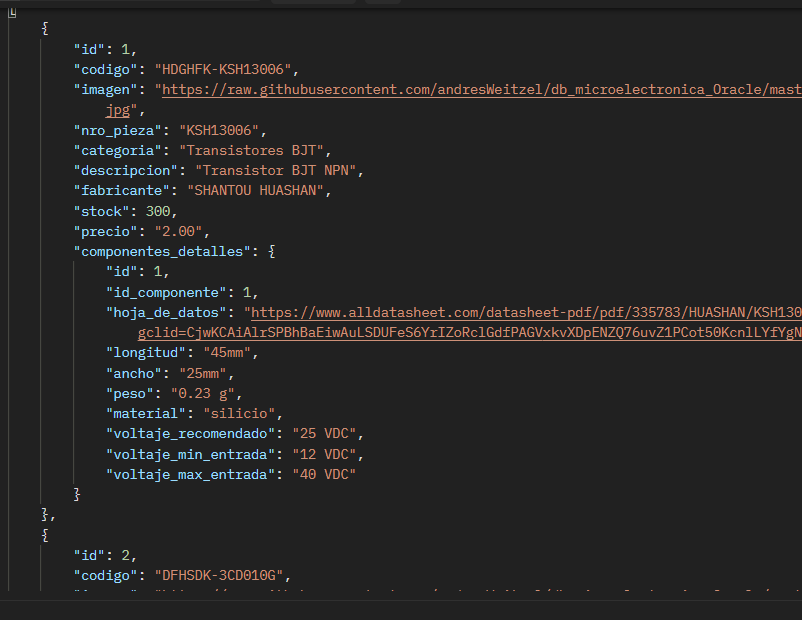

<div align="center">



</div>

<div align="right">
   
   
   
   
   
   
   
   
</div>

<br>

<br>

<div align="right">
     <a href="./README.es.md" target="_blank">
       
   </a>
    <a href="../README.md" target="_blank">
       
   </a>
</div>

<br>

<div align="center">

# ApiRest_Electronic_Devices_ExpressJS 

</div>

Rest Api sobre dispositivos electrónicos implementada con Express, Morgan, Railway, NodeJS, Sequelize, Jest Testing, dotenv, cors, express-validator, nodemon, swagger, swagger-ui, PostgreSQL, Docker, entre otros.

*   [Colección de Postman](../postman/collections/Api_DispElectr_Express.postman_collection.json)
*   [Lista de reproducción de pruebas de funcionalidad](https://www.youtube.com/playlist?list=PLCl11UFjHurDLAizKGgiChAKBJx1V19Fo)<a href="https://www.youtube.com/playlist?list=PLCl11UFjHurDLAizKGgiChAKBJx1V19Fo" target="_blank" >  </a>

<br>

## Índice 📜

<details>
  <summary> Ver </summary>

  <br>

### Sección 1) Descripción, configuración y tecnologías

*   [1.0) Descripción del proyecto.](#10-description-)
*   [1.1) Ejecución del proyecto.](#11-project-execution-)
*   [1.2) Configuración del proyecto desde cero](#12-project-configuration-from-scratch-)
*   [1.3) Configuración de la base de datos con Docker y PostgreSQL](#13-database-configuration-with-docker-and-postgresql-)
*   [1.4) Tecnologías.](#14-technologies-)

### Sección 2) Documentación e implementación de pruebas

*   [2.0) Resumen de pruebas.](#20-testing-overview-)
*   [2.1) Estructura de pruebas.](#21-testing-structure-)
*   [2.2) Comandos de prueba.](#22-testing-commands-)
*   [2.3) Tipos de pruebas.](#23-test-types-)
*   [2.4) Configuración de pruebas.](#24-test-configuration-)
*   [2.5) Cobertura de pruebas.](#25-test-coverage-)
*   [2.6) Casos de prueba.](#26-test-cases-)
*   [2.7) Resolución de problemas.](#27-troubleshooting-)
*   [2.8) Métricas de calidad.](#28-quality-metrics-)
*   [2.9) Mantenimiento.](#29-maintenance-)

### Sección 3) Endpoints y ejemplos

*   [3.0) EndPoints y recursos.](#30-endpoints-and-resources-)

### Sección 4) Pruebas de funcionalidad y referencias

*   [4.0) Prueba de funcionalidad.](#40-functionality-test-)
*   [4.1) Referencias.](#41-references-)
*   [4.2) Colección de Postman.](#42-postman-collection-)

<br>

</details>

<br>

## Sección 1) Descripción, configuración y tecnologías

### 1.0) Descripción [🔝](#index-)

<details>
   <summary>Ver</summary>
  <br>

### 1.0.0) Descripción general

**ApiRest_Electronic_Devices_ExpressJS** es una API REST integral diseñada para gestionar inventarios y especificaciones de componentes electrónicos. Este proyecto proporciona una solución backend robusta para sistemas de gestión de dispositivos electrónicos, con capacidades avanzadas de búsqueda, especificaciones detalladas de componentes y una arquitectura escalable.

**Características clave:**
- **Soporte multi-componente**: Gestiona varios componentes electrónicos incluyendo transistores, capacitores, resistencias, microcontroladores y placas de desarrollo
- **Búsqueda y filtrado avanzado**: Capacidades sofisticadas de búsqueda con múltiples criterios y paginación
- **Documentación API completa**: Documentación auto-generada con Swagger para todos los endpoints
- **Suite de pruebas robusta**: Pruebas unitarias e integrales extensas con >90% de cobertura
- **Gestión de base de datos**: Base de datos PostgreSQL con Docker para fácil despliegue
- **Validación y manejo de errores**: Validación de entradas y gestión de errores integral
- **Arquitectura escalable**: Diseño modular con separación clara de responsabilidades

**Usuarios objetivo:**
- Proveedores y distribuidores de componentes electrónicos
- Equipos de ingeniería electrónica
- Sistemas de gestión de inventario
- Instituciones educativas que enseñan electrónica
- Aficionados y makers que gestionan colecciones de componentes

### 1.0.1) Descripción de la arquitectura y operación

**Resumen de arquitectura:**
La aplicación sigue un **patrón de arquitectura en capas** con separación clara de responsabilidades:

```
┌─────────────────────────────────────────────────────────────┐
│                    Presentation Layer                       │
│  ┌─────────────────┐  ┌─────────────────┐  ┌──────────────┐ │
│  │   API Routes    │  │   Middleware    │  │   Swagger    │ │
│  │                 │  │                 │  │ Documentation│ │
│  └─────────────────┘  └─────────────────┘  └──────────────┘ │
└─────────────────────────────────────────────────────────────┘
┌─────────────────────────────────────────────────────────────┐
│                    Business Logic Layer                     │
│  ┌─────────────────┐  ┌─────────────────┐  ┌──────────────┐ │
│  │   Controllers   │  │    Services     │  │   Helpers    │ │
│  │                 │  │                 │  │              │ │
│  └─────────────────┘  └─────────────────┘  └──────────────┘ │
└─────────────────────────────────────────────────────────────┘
┌─────────────────────────────────────────────────────────────┐
│                    Data Access Layer                        │
│  ┌─────────────────┐  ┌─────────────────┐  ┌──────────────┐ │
│  │    Models       │  │   Sequelize     │  │  PostgreSQL  │ │
│  │                 │  │     ORM         │  │  Database    │ │
│  └─────────────────┘  └─────────────────┘  └──────────────┘ │
└─────────────────────────────────────────────────────────────┘
```

**Componentes principales:**

1. **Capa de rutas** (`src/config/routes/`):
   - Endpoints RESTful para cada tipo de componente
   - Enrutamiento de solicitudes y manejo de métodos HTTP
   - Procesamiento de parámetros de URL

2. **Capa de controladores** (`src/controllers/`):
   - Manejo de solicitudes/respuestas
   - Validación y saneamiento de entradas
   - Coordinación de lógica de negocio
   - Formateo de respuestas de error

3. **Capa de servicios** (`src/services/`):
   - Implementación de la lógica de negocio principal
   - Operaciones de base de datos mediante Sequelize
   - Transformación y procesamiento de datos
   - Manejo de consultas complejas

4. **Capa de modelos** (`src/models/sequelize/`):
   - Definición de esquemas de base de datos
   - Configuración de modelos Sequelize
   - Relaciones y asociaciones de tablas
   - Reglas de validación de datos

5. **Capa de base de datos**:
   - Motor de base de datos PostgreSQL
   - Contenerización con Docker
   - Pooling y optimización de conexiones
   - Persistencia y recuperación de datos

**Flujo de datos:**
1. **Recepción de solicitud**: Las solicitudes HTTP son recibidas por Express.js
2. **Procesamiento de middleware**: Middleware de CORS, logging y validación procesan la solicitud
3. **Enrutamiento**: El router de Express dirige la solicitud al endpoint correspondiente
4. **Ejecución del controlador**: El controlador valida la entrada y llama al servicio adecuado
5. **Procesamiento del servicio**: La capa de servicios maneja la lógica de negocio y operaciones de base de datos
6. **Generación de respuesta**: Se envía la respuesta formateada al cliente

**Tipos de componentes soportados:**
- **Components** (`componentes`): Información base del componente (código, descripción, precio, stock)
- **Component Details** (`componentes_detalles`): Especificaciones técnicas y hojas de datos
- **Bipolar Transistors** (`transistores_bipolares`): Especificaciones y parámetros BJT
- **MOSFET Transistors** (`transistores_mosfet`): Características y valores de MOSFET
- **Electrolytic Capacitors** (`capacitores_electroliticos`): Especificaciones de capacitores


<br>

</details>

### 1.1) Project Execution [🔝](#index-)

<details>
   <summary>View</summary>
   <br>

### 1.1.0) Initial settings

#### Prerequisites
Before starting, ensure you have the following installed:
- **Node.js** (v18 LTS or higher) - [Download here](https://nodejs.org/en/download)
- **Docker Desktop** - [Download here](https://www.docker.com/products/docker-desktop/)
- **Git** - [Download here](https://git-scm.com/downloads)
- **IDE** (VS Code recommended) - [Download here](https://code.visualstudio.com/)

#### Step 1: Clone and Setup Project

1. **Clone the repository:**
```bash
git clone https://github.com/andresWeitzel/ApiRest_Dispositivos_Electronicos_ExpressJS
```

2. **Navigate to project directory:**
```bash
cd ApiRest_Dispositivos_Electronicos_ExpressJS
```

3. **Install dependencies:**
```bash
npm install
```

#### Step 2: Database Setup

1. **Start PostgreSQL database with Docker:**
```bash
docker-compose up -d
```

2. **Verify database container is running (optional):**
```bash
docker ps
```

3. **Check database logs (optional):**
```bash
docker-compose logs postgres
```

4. **Reset database if needed (optional):**
```bash
docker-compose down -v
docker-compose up -d
```

#### Step 3: Run the Application

**Development Mode (with auto-reload):**
```bash
npm run start:dev
```

**Production Mode:**
```bash
npm start
```

**Alternative development command:**
```bash
npm run dev
```

#### Step 4: Verify Installation

1. **Check if server is running:**
   - Look for: `Server is running on port 8082`
   - Look for: `Swagger documentation available at http://localhost:8082/api-docs`

2. **Access the application:**
   - **API Base URL**: `http://localhost:8082`
   - **Swagger Documentation**: `http://localhost:8082/api-docs`
   - **Health Check**: `http://localhost:8082/api/v1/health`

#### Troubleshooting

**Port Already in Use:**
```bash
# Kill processes using port 8082
npx kill-port 8082

# Or find and kill specific process
netstat -ano | findstr :8082
taskkill /PID <PID> /F
```

**Database Connection Issues:**
```bash
# Check if Docker is running
docker --version

# Check container status
docker-compose ps

# Restart containers
docker-compose restart

# View detailed logs
docker-compose logs postgres
```

**Node.js Version Issues:**
```bash
# Check Node.js version
node --version

# Use nvm to switch versions (if installed)
nvm use 18
```

**Permission Issues (Linux/Mac):**
```bash
# Fix Docker permissions
sudo usermod -aG docker $USER
# Log out and log back in
```

#### Available Scripts

| Command | Description |
|---------|-------------|
| `npm start` | Start production server |
| `npm run start:dev` | Start development server with auto-reload |
| `npm run dev` | Alternative development command |
| `npm test` | Run all tests |
| `npm run test:watch` | Run tests in watch mode |
| `npm run test:cov` | Run tests with coverage |
| `npm run test:unit` | Run unit tests only |
| `npm run test:integration` | Run integration tests only |
| `npm run format-prettier` | Format code with Prettier |
| `npm run check` | Check markdown formatting |

<br>

</details>

### 1.2) Project configuration from scratch [🔝](#index-)

<details>
   <summary>View</summary>
  <br>

### 1.2.0) Initial settings

This section guides you through setting up the project from scratch, including all dependencies, project structure, and configuration.

#### Prerequisites
- **Node.js** (v18 LTS or higher) - [Download here](https://nodejs.org/en/download)
- **Docker Desktop** - [Download here](https://www.docker.com/products/docker-desktop/)
- **Git** - [Download here](https://git-scm.com/downloads)
- **IDE** (VS Code recommended) - [Download here](https://code.visualstudio.com/)

#### Step 1: Project Initialization

1. **Create project directory:**
```bash
mkdir ApiRest_Electronic_Devices_ExpressJS
cd ApiRest_Electronic_Devices_ExpressJS
```

2. **Initialize Node.js project:**
```bash
npm init -y
```

3. **Create project structure:**
```bash
mkdir -p src/{config/{middleware,routes},controllers,db,enums,helpers,models,services,test,utils}
mkdir -p src/controllers/{component,component-detail,bipolar-transistor,mosfet-transistor,electrolytic-capacitor}
mkdir -p src/services/{component,component-detail,bipolar-transistor,mosfet-transistor,electrolytic-capacitor}
mkdir -p src/models/sequelize
mkdir -p src/test/{unit-test,integration-test,mock}
mkdir -p src/test/unit-test/{helpers,services}
mkdir -p src/test/unit-test/helpers/{pagination,validations}
mkdir -p doc/{assets,translation}
mkdir -p init
mkdir -p postman/collections
mkdir -p scripts
```

#### Step 2: Core Dependencies Installation

1. **Install production dependencies:**
```bash
# Core framework and middleware
npm install express cors morgan dotenv dotenv-expand

# Database and ORM
npm install sequelize pg pg-hstore

# API documentation
npm install swagger-ui-express swagger-jsdoc

# Logging
npm install winston

# Body parsing
npm install body-parser
```

2. **Install development dependencies:**
```bash
# Development server
npm install --save-dev nodemon

# Testing framework
npm install --save-dev jest supertest

# Code formatting and linting
npm install --save-dev prettier

# Markdown linting
npm install --save-dev remark-cli remark-preset-lint-recommended remark-lint-emphasis-marker remark-lint-strong-marker remark-lint-table-cell-padding remark-preset-lint-consistent

# Validation
npm install --save-dev express-validator

# Utilities
npm install --save-dev express-list-endpoints sqlite3
```

#### Step 3: Configuration Files

1. **Create .gitignore:**
```bash
# Dependencies
node_modules/
npm-debug.log*
yarn-debug.log*
yarn-error.log*

# Environment variables
.env
.env.local
.env.development.local
.env.test.local
.env.production.local

# Logs
logs
*.log

# Runtime data
pids
*.pid
*.seed
*.pid.lock

# Coverage directory used by tools like istanbul
coverage/
*.lcov

# nyc test coverage
.nyc_output

# Dependency directories
node_modules/
jspm_packages/

# Optional npm cache directory
.npm

# Optional REPL history
.node_repl_history

# Output of 'npm pack'
*.tgz

# Yarn Integrity file
.yarn-integrity

# dotenv environment variables file
.env

# IDE files
.vscode/
.idea/
*.swp
*.swo

# OS generated files
.DS_Store
.DS_Store?
._*
.Spotlight-V100
.Trashes
ehthumbs.db
Thumbs.db

# Test reports
test-report.json
```

2. **Create package.json scripts:**
```json
{
  "scripts": {
    "start": "node src/server.js",
    "start:dev": "nodemon src/server.js",
    "dev": "nodemon src/server.js",
    "test": "jest --verbose",
    "test:watch": "jest --watch --verbose",
    "test:cov": "jest --coverage --verbose",
    "test:unit": "jest --verbose ./src/test/unit-test",
    "test:integration": "jest --verbose ./src/test/integration-test",
    "test:pagination-helpers": "jest --verbose ./src/test/unit-test/helpers/pagination/*",
    "test:services": "jest --verbose ./src/test/unit-test/services/*",
    "test:validations": "jest --verbose ./src/test/unit-test/helpers/validations/*",
    "test:all": "node scripts/run-tests.js",
    "format-prettier": "prettier --write \"{src,test}/**/*.{js,ts}\"",
    "check": "remark . --quiet --frail",
    "format-remark": "remark . --quiet --frail --output",
    "format-md": "remark . --output"
  }
}
```

#### Step 4: Database Configuration

1. **Create docker-compose.yml:**
```yaml
version: '3.8'

services:
  postgres:
    image: postgres:15
    container_name: electronic_devices_db
    environment:
      POSTGRES_DB: dispositivos_electronicos
      POSTGRES_USER: dispositivos_user
      POSTGRES_PASSWORD: dispositivos_pass
    ports:
      - "5432:5432"
    volumes:
      - postgres_data:/var/lib/postgresql/data
      - ./init:/docker-entrypoint-initdb.d
    command: >
      postgres
      -c shared_buffers=256MB
      -c effective_cache_size=1GB
      -c maintenance_work_mem=64MB
      -c wal_buffers=16MB
      -c work_mem=4MB

volumes:
  postgres_data:
```

2. **Create .env file:**
```env
# Database Configuration
DB_NAME_PROD=dispositivos_electronicos
DB_USER_PROD=dispositivos_user
DB_PASS_PROD=dispositivos_pass
DB_HOST_PROD=localhost
DB_DIALECT_PROD=postgres
DB_PORT_PROD=5432

# Application Configuration
PROD_PORT=8082
APP_PORT=8082

# API Endpoints
API_LOCAL_BASE_URL=http://localhost:8082
API_COMPONENT_NAME_URL=/api/v1/componentes
API_COMPONENT_DETAIL_NAME_URL=/api/v1/componentes-detalles
API_BIPOLAR_TRANSISTOR_NAME_URL=/api/v1/transistores-bipolares
API_ELECTROLYTIC_CAPACITOR_NAME_URL=/api/v1/capacitores-electroliticos
```

#### Step 5: Core Application Files

1. **Create src/server.js:**
```javascript
require('dotenv').config();

const PORT = process.env.PROD_PORT || process.env.APP_PORT || 8082;
const { appMiddleware } = require('./config/middleware/index');
const { swaggerDocs } = require('./utils/swagger');
const { defineAssociations } = require('./models/sequelize/associations');

let app;

const run = async () => {
  try {
    defineAssociations();
    app = await appMiddleware();
    
    app.listen(PORT, async () => {
      console.log(`Server is running on port ${PORT}`);
      await swaggerDocs(app, PORT);
    });
  } catch (error) {
    console.log(`Error in run() function: ${error}`);
  }
};

run();
```

2. **Create Jest configuration (jest.config.js):**
```javascript
const config = {
  setupFilesAfterEnv: ['./src/test/mock/set-env-vars.js'],
  testEnvironment: 'node',
  collectCoverageFrom: [
    'src/**/*.js',
    '!src/test/**',
    '!src/server.js'
  ],
  coverageDirectory: 'coverage',
  coverageReporters: ['text', 'lcov', 'html']
};

module.exports = config;
```

#### Step 6: Start Development

1. **Start database:**
```bash
docker-compose up -d
```

2. **Run the application:**
```bash
# Development mode
npm run start:dev

# Production mode
npm start
```

3. **Run tests:**
```bash
# All tests
npm test

# Unit tests only
npm run test:unit

# Integration tests only
npm run test:integration

# With coverage
npm run test:cov
```

#### Step 7: Additional Configuration

1. **Create README.md with project documentation**
2. **Set up Postman collection for API testing**
3. **Configure VS Code settings for consistent development**
4. **Set up CI/CD pipeline (optional)**

#### Project Structure Overview

```
ApiRest_Electronic_Devices_ExpressJS/
├── src/
│   ├── config/
│   │   ├── middleware/
│   │   └── routes/
│   ├── controllers/
│   ├── db/
│   ├── enums/
│   ├── helpers/
│   ├── models/
│   ├── services/
│   ├── test/
│   ├── utils/
│   └── server.js
├── doc/
├── init/
├── postman/
├── scripts/
├── docker-compose.yml
├── jest.config.js
├── package.json
└── README.md
```

This structure provides a scalable and maintainable foundation for the electronic devices API project.

<br>

</details>

### 1.3) Database Configuration with Docker and PostgreSQL [🔝](#index-)

<details>
   <summary>View</summary>
  <br>

### 1.3.0) Database Overview

This project uses **PostgreSQL** as the database engine, containerized with **Docker** for easy setup and deployment. The database contains information about electronic components including:

*   **Components** (`componentes`): Main table with basic component information
*   **Component Details** (`componentes_detalles`): Technical specifications and datasheets
*   **Bipolar Transistors** (`transistores_bipolares`): Specific transistor data
*   **MOSFET Transistors** (`transistores_mosfet`): MOSFET transistor specifications
*   **Electrolytic Capacitors** (`capacitores_electroliticos`): Capacitor specifications


### 1.3.1) Docker Setup

The project includes a `docker-compose.yml` file that automatically sets up PostgreSQL with all necessary configurations:

**Database Configuration:**
*   **Image**: PostgreSQL 15
*   **Port**: 5432 (standard PostgreSQL port)
*   **Database Name**: `dispositivos_electronicos`
*   **Username**: `dispositivos_user`
*   **Password**: `dispositivos_pass`

**Performance Optimizations:**
*   Shared buffers: 256MB
*   Effective cache size: 1GB
*   Maintenance work memory: 64MB
*   WAL buffers: 16MB
*   Work memory: 4MB

### 1.3.2) Environment Variables

Create a `.env` file in the project root with the following configuration:

```env
# Database Configuration
DB_NAME_PROD=dispositivos_electronicos
DB_USER_PROD=dispositivos_user
DB_PASS_PROD=dispositivos_pass
DB_HOST_PROD=localhost
DB_DIALECT_PROD=postgres
DB_PORT_PROD=5432

# Application Configuration
PROD_PORT=8082
APP_PORT=8082

# API Endpoints
API_LOCAL_BASE_URL=http://localhost:8082
API_COMPONENT_NAME_URL=/api/v1/componentes
API_COMPONENT_DETAIL_NAME_URL=/api/v1/componentes-detalles
API_BIPOLAR_TRANSISTOR_NAME_URL=/api/v1/transistores-bipolares
API_ELECTROLYTIC_CAPACITOR_NAME_URL=/api/v1/capacitores-electroliticos
```

### 1.3.3) Database Initialization

The database is automatically initialized with the following SQL files located in the `init/` directory:

1. **`01_db_dispositivos_electronicos_DDL.sql`**: Creates all tables, sequences, and constraints
2. **`02_db_dispositivos_electronicos_DML_INSERT.sql`**: Inserts initial data
3. **`03_db_dispositivos_electronicos_DML_UPDATE.sql`**: Sample update operations
4. **`04_db_dispositivos_electronicos_DML_DELETE.sql`**: Sample delete operations
5. **`05_db_dispositivos_electronicos_DML_QUERIES.sql`**: Sample queries

### 1.3.4) Starting the Database

**Prerequisites:**
*   [Docker](https://docs.docker.com/get-docker/) installed on your system
*   [Docker Compose](https://docs.docker.com/compose/install/) installed

**Commands:**

1. **Start the database:**
   ```bash
   docker-compose up -d
   ```

2. **Check if the database is running:**
   ```bash
   docker-compose ps
   ```

3. **View database logs:**
   ```bash
   docker-compose logs postgres
   ```

4. **Stop the database:**
   ```bash
   docker-compose down
   ```

5. **Stop and remove all data (volumes):**
   ```bash
   docker-compose down -v
   ```

### 1.3.5) Database Connection

The application automatically connects to the PostgreSQL database using Sequelize ORM. The connection is configured in `src/db/config.js` and uses the environment variables defined in your `.env` file.

**Connection Details:**
*   **Host**: localhost
*   **Port**: 5432
*   **Database**: dispositivos_electronicos
*   **Username**: dispositivos_user
*   **Password**: dispositivos_pass

### 1.3.6) Database Schema

The database includes the following main tables:

**Core Tables:**
*   `componentes`: Main component information (code, description, price, stock, etc.)
*   `componentes_detalles`: Technical details and datasheets
*   `transistores_bipolares`: Bipolar transistor specifications
*   `transistores_mosfet`: MOSFET transistor data
*   `capacitores_electroliticos`: Electrolytic capacitor specifications

**Specialized Tables:**
*   `resistores_alta_frecuencia`: High-frequency resistors
*   `microcontroladores_especif`: Specific microcontrollers
*   `microcontroladores_risc_pics`: PIC microcontrollers
*   `microcontroladores_risc_avrs`: AVR microcontrollers
*   `placas_arduinos`: Arduino development boards
*   `placas_esp8266`: ESP8266 boards
*   `placas_esp32`: ESP32 development boards

### 1.3.7) Troubleshooting

**Common Issues:**

1. **Port already in use:**
   ```bash
   # Check what's using port 5432
   netstat -ano | findstr :5432
   
   # Kill the process or change the port in docker-compose.yml
   ```

2. **Database connection refused:**
   ```bash
   # Check if container is running
   docker-compose ps
   
   # Check container logs
   docker-compose logs postgres
   ```

3. **Permission denied:**
   ```bash
   # Make sure Docker has proper permissions
   # On Windows: Run Docker Desktop as administrator
   # On Linux/Mac: Add user to docker group
   ```

4. **Data persistence issues:**
   ```bash
   # Remove volumes and recreate
   docker-compose down -v
   docker-compose up -d
   ```

<br>

</details>

### 1.4) Technologies [🔝](#index-)

<details>
   <summary>View</summary>
  <br>

| **Technologies** | **Version** | **Purpose** |
| ------------- | ------------- | ------------- |
| [NodeJS](https://nodejs.org/en/) | 18.x | JavaScript Runtime |
| [Express](https://expressjs.com/) | 4.21.2 | Web Framework |
| [PostgreSQL](https://www.postgresql.org/) | 15 | Database Engine |
| [Docker](https://www.docker.com/) | Latest | Containerization |
| [Sequelize](https://sequelize.org/) | 6.32.1 | ORM for Node.js |
| [Jest](https://jestjs.io/) | 29.7.0 | Testing Framework |
| [Swagger](https://swagger.io/) | 6.2.8 | API Documentation |
| [VSC](https://code.visualstudio.com/docs) | 1.72.2 | IDE |
| [Postman](https://www.postman.com/downloads/) | 10.11 | HTTP Client |
| [Git](https://git-scm.com/downloads) | 2.29.1 | Version Control |

</br>

| **Plugin** | **Description** |
| ------------- | ------------- |
| [pg](https://www.npmjs.com/package/pg) | PostgreSQL client for Node.js |
| [pg-hstore](https://www.npmjs.com/package/pg-hstore) | Serialize and deserialize JSON data to hstore format |
| [cors](https://www.npmjs.com/package/cors) | Cross-Origin Resource Sharing |
| [dotenv](https://www.npmjs.com/package/dotenv) | Environment variables loader |
| [morgan](https://www.npmjs.com/package/morgan) | HTTP request logger middleware |
| [nodemon](https://www.npmjs.com/package/nodemon) | Auto-restart server during development |
| [express-validator](https://www.npmjs.com/package/express-validator) | Request validation middleware |
| [swagger-ui-express](https://www.npmjs.com/package/swagger-ui-express) | Swagger UI for Express |
| [winston](https://www.npmjs.com/package/winston) | Logging library |

</br>

| **Extension** |
| ------------- |
| Prettier - Code formatter |
| YAML - Autoformatter .yml (alt+shift+f) |

<br>

</details>

<br>

## Section 2) Testing Documentation and Implementation

### 2.0) Testing Overview [🔝](#index-)

<details>
   <summary>View</summary>
  <br>

This project includes a comprehensive testing suite with both unit tests and integration tests to ensure code quality and reliability.

**Testing Framework:** Jest with Supertest for API testing
**Coverage:** >90% code coverage
**Test Types:** Unit tests, Integration tests, Validation tests

<br>

</details>

### 2.1) Testing Structure [🔝](#index-)

<details>
   <summary>View</summary>
  <br>

```
src/test/
├── integration-test/          # Integration tests
│   ├── app.test.js           # App configuration for tests
│   ├── test-setup.js         # Test database configuration
│   ├── component.test.js     # Component endpoint tests
│   ├── mosfet-transistor.test.js
│   ├── bipolar-transistor.test.js
│   ├── electrolytic-capacitor.test.js
│   └── component-detail.test.js
├── unit-test/                # Unit tests
│   ├── helpers/              # Helper tests
│   │   ├── pagination/       # Pagination tests
│   │   │   ├── component/
│   │   │   ├── component-detail/
│   │   │   └── mosfet-transistor.test.js
│   │   └── validations/      # Validation tests
│   │       ├── component.test.js
│   │       └── mosfet-transistor.test.js
│   └── services/             # Service tests
│       ├── component.test.js
│       └── mosfet-transistor.test.js
└── mock/                     # Mocks and configuration
    └── set-env-vars.js       # Environment variables for tests
```

<br>

</details>

### 2.2) Testing Commands [🔝](#index-)

<details>
   <summary>View</summary>
  <br>

#### Execute all tests
```bash
npm test
```

#### Execute unit tests
```bash
npm run test:unit
```

#### Execute integration tests
```bash
npm run test:integration
```

#### Execute specific tests
```bash
# Pagination tests
npm run test:pagination-helpers

# Service tests
npm run test:services

# Validation tests
npm run test:validations
```

#### Execute tests with coverage
```bash
npm run test:cov
```

#### Execute tests in watch mode
```bash
npm run test:watch
```

<br>

</details>

### 2.3) Test Types [🔝](#index-)

<details>
   <summary>View</summary>
  <br>

#### 2.3.1) Unit Tests

Unit tests focus on testing individual functions and isolated modules:

**Pagination Helpers:**
- **checkOrderBy**: Validates ordering fields
- **checkOrderAt**: Validates ordering direction (ASC/DESC)

**Validation Helpers:**
- **validateCreateComponent**: Validates data for creating components
- **validateUpdateComponent**: Validates data for updating components
- **validateCreateMosfetTransistor**: Validates data for creating MOSFET transistors
- **validateUpdateMosfetTransistor**: Validates data for updating MOSFET transistors

**Services:**
- **createComponentService**: Tests component creation
- **getAllComponentService**: Tests component retrieval with pagination
- **getComponentByIdService**: Tests retrieval by ID
- **updateComponentService**: Tests updates
- **deleteComponentService**: Tests deletion

#### 2.3.2) Integration Tests

Integration tests test complete API endpoints:

**Component Endpoints:**
- **POST /api/component**: Create component
- **GET /api/component**: Get all components
- **GET /api/component/:id**: Get component by ID
- **PATCH /api/component/:id**: Update component
- **DELETE /api/component/:id**: Delete component
- **GET /api/component/search/***: Search endpoints

**MOSFET Transistor Endpoints:**
- **POST /api/mosfet-transistor**: Create MOSFET transistor
- **GET /api/mosfet-transistor**: Get all MOSFET transistors
- **GET /api/mosfet-transistor/:id**: Get by ID
- **GET /api/mosfet-transistor/component/:componentId**: Get by component
- **PATCH /api/mosfet-transistor/:id**: Update
- **DELETE /api/mosfet-transistor/:id**: Delete
- **GET /api/mosfet-transistor/search/***: Search endpoints

**Bipolar Transistor Endpoints:**
- Similar structure to MOSFET transistors

**Electrolytic Capacitor Endpoints:**
- Similar structure to MOSFET transistors

**Component Detail Endpoints:**
- Similar structure to components

<br>

</details>

### 2.4) Test Configuration [🔝](#index-)

<details>
   <summary>View</summary>
  <br>

#### 2.4.1) Environment Variables for Tests

```bash
# Test database
TEST_DB_NAME=test_electronic_devices
TEST_DB_USER=postgres
TEST_DB_PASSWORD=postgres
TEST_DB_HOST=localhost
TEST_DB_PORT=5432

# Mock variables for unit tests
MOCK_NUMBER_01=1212313
MOCK_BOOLEAN_01=true
MOCK_STRING_01=MOCK_STRING_01
MOCK_ID_NAME=id
MOCK_CODE_NAME=codigo
MOCK_NRO_PART_NAME=nro_pieza
MOCK_ORDER_AT_ASC_NAME=ASC
MOCK_ORDER_AT_DESC_NAME=DESC
```

#### 2.4.2) Jest Configuration

```javascript
// jest.config.js
const config = {
  setupFilesAfterEnv: ['./src/test/mock/set-env-vars.js'],
  testEnvironment: 'node',
  collectCoverageFrom: [
    'src/**/*.js',
    '!src/test/**',
    '!src/server.js'
  ],
  coverageDirectory: 'coverage',
  coverageReporters: ['text', 'lcov', 'html']
};
```

<br>

</details>

### 2.5) Test Coverage [🔝](#index-)

<details>
   <summary>View</summary>
  <br>

The tests cover:

#### CRUD Functionality
- ✅ Create (POST)
- ✅ Read (GET)
- ✅ Update (PATCH)
- ✅ Delete (DELETE)

#### Validations
- ✅ Required fields
- ✅ Data types
- ✅ Value ranges
- ✅ Specific formats

#### Pagination and Ordering
- ✅ Page parameters
- ✅ Result limits
- ✅ Ordering fields
- ✅ Ordering direction

#### Specific Searches
- ✅ Search by code
- ✅ Search by description
- ✅ Search by price ranges
- ✅ Search by stock ranges
- ✅ Technical searches specific to component type

#### Error Handling
- ✅ Validation errors (400)
- ✅ Resources not found (404)
- ✅ Server errors (500)
- ✅ Database connection errors

<br>

</details>

### 2.6) Test Cases [🔝](#index-)

<details>
   <summary>View</summary>
  <br>

#### Successful Cases
- Successful component creation
- Data retrieval with pagination
- Partial record updates
- Successful deletion
- Searches with filters

#### Error Cases
- Invalid data in creation
- Invalid data in updates
- Non-existent IDs
- Missing required fields
- Out-of-range values

#### Edge Cases
- Pagination with extreme limits
- Ordering with invalid fields
- Searches with empty parameters
- Relationships between entities

<br>

</details>

### 2.7) Troubleshooting [🔝](#index-)

<details>
   <summary>View</summary>
  <br>

#### Common Issues

1. **Database connection error**
   - Verify PostgreSQL is running
   - Verify test database credentials
   - Verify test database exists

2. **Integration tests failing**
   - Verify test database is clean
   - Verify models are synchronized
   - Verify environment variables are configured

3. **Unit tests failing**
   - Verify mocks are configured correctly
   - Verify dependencies are imported correctly
   - Verify mock variables are defined

#### Debug Logs

To enable detailed logs during tests:

```bash
# Enable Jest logs
npm test -- --verbose

# Enable database logs
DEBUG=sequelize:* npm test
```

<br>

</details>

### 2.8) Quality Metrics [🔝](#index-)

<details>
   <summary>View</summary>
  <br>

- **Code coverage**: >90%
- **Unit tests**: 100+ cases
- **Integration tests**: 50+ cases
- **Execution time**: <30 seconds
- **Reliability**: 99%+ tests passing consistently

<br>

</details>

### 2.9) Maintenance [🔝](#index-)

<details>
   <summary>View</summary>
  <br>

#### Adding New Tests

1. **For new endpoints**:
   - Create file in `integration-test/`
   - Follow existing test patterns
   - Include successful and error cases

2. **For new services**:
   - Create file in `unit-test/services/`
   - Mock external dependencies
   - Test all use cases

3. **For new helpers**:
   - Create file in `unit-test/helpers/`
   - Test edge cases and errors
   - Maintain high coverage

#### Updating Existing Tests

- Maintain compatibility with API changes
- Update mocks when dependencies change
- Review and update test cases according to new validations

<br>

</details>

<br>

## Section 3) Endpoints and Examples.

### 3.0) Endpoints and resources [🔝](#index-)

<details>
   <summary>View</summary>
<br>

## Resumen de la API

La API proporciona endpoints RESTful para gestionar componentes electrónicos con la siguiente URL base:
```
http://localhost:8082
```

### Autenticación
Actualmente, la API no requiere autenticación. Todos los endpoints son públicamente accesibles.

### Formato de Respuesta
Todas las respuestas de la API siguen un formato JSON consistente:

**Respuesta de Éxito:**
```json
{
  "status": "success",
  "message": "Operation completed successfully",
  "data": {
    // Response data here
  },
  "pagination": {
    "page": 1,
    "limit": 10,
    "total": 100,
    "pages": 10
  }
}
```

**Respuesta de Error:**
```json
{
  "status": "error",
  "message": "Error description",
  "errors": [
    {
      "field": "fieldName",
      "message": "Validation error message"
    }
  ]
}
```

## Endpoints de Componentes

### 3.1) Operaciones GET

#### 3.1.1) Obtener Lista de Componentes

##### Solicitud (GET)

```bash
curl --location 'http://localhost:8082/componentes/list?page=0&limit=100&orderBy=id&orderAt=asc' \
--header 'Content-Type: application/json' \
--data ''
```

##### Respuesta (200 OK)

```json
[
    {
        "id": 1,
        "codigo": "HDGHFK-KSH13006",
        "imagen": "https://raw.githubusercontent.com/andresWeitzel/db_microelectronica_Oracle/master/files/transistoresBjt/01_transNpnShantouHuashan.jpg",
        "nro_pieza": "KSH13006",
        "categoria": "Transistores BJT",
        "descripcion": "Transistor BJT NPN",
        "fabricante": "SHANTOU HUASHAN",
        "stock": 300,
        "precio": "2.00"
    },
    {
        "id": 2,
        "codigo": "DFHSDK-3CD010G",
        "imagen": "https://raw.githubusercontent.com/andresWeitzel/db_microelectronica_Oracle/master/files/transistoresBjt/02_transPnpInchangeSemiConduc.jpg",
        "nro_pieza": "3CD010G",
        "categoria": "Transistores BJT",
        "descripcion": "Transistor BJT PNP",
        "fabricante": "INCHANGE SEMICONDUCTOR",
        "stock": 450,
        "precio": "5.00"
    }
]
```

#### 3.1.2) Obtener Componente por Código

##### Solicitud (GET)

```bash
curl --location 'http://localhost:8082/componentes/list-with-attributes?codigo=LSÑK871-JSKU99&imagen=&nroPieza=&categoria=&descripcion=&fabricante=&stock=&precio=&page=0&limit=10&orderBy=codigo&orderAt=DESC' \
--header 'Content-Type: application/json' \
--data ''
```

##### Respuesta (200 OK)

```json
[
    {
        "id": 14,
        "codigo": "LSÑK871-JSKU99",
        "imagen": "https://raw.githubusercontent.com/andresWeitzel/db_microelectronica_Oracle/master/files/capacitoresElectr/04_Capacitor%20Electrolitico%20de%20Aluminio%20Encaje%20a%20Presi%C3%B3n%20hitachi.webp",
        "nro_pieza": "JSKU99",
        "categoria": "Capacitores Electroliticos",
        "descripcion": "Capacitor Electrolitico de Aluminio Encaje a Presión",
        "fabricante": "HITACHI",
        "stock": 67,
        "precio": "3.00"
    }
]
```

#### 3.1.3) Obtener Componentes con Detalles

##### Solicitud (GET)

```bash
curl --location 'http://localhost:8082/componentes/list-with-details?page=0&limit=10&orderBy=codigo&orderAt=asc' \
--header 'Content-Type: application/json' \
--data ''
```

##### Respuesta (200 OK)

```json
[
    {
        "id": 1,
        "codigo": "HDGHFK-KSH13006",
        "imagen": "https://raw.githubusercontent.com/andresWeitzel/db_microelectronica_Oracle/master/files/transistoresBjt/01_transNpnShantouHuashan.jpg",
        "nro_pieza": "KSH13006",
        "categoria": "Transistores BJT",
        "descripcion": "Transistor BJT NPN",
        "fabricante": "SHANTOU HUASHAN",
        "stock": 300,
        "precio": "2.00",
        "componente_detalle": {
            "id": 1,
            "componente_id": 1,
            "longitud": 68.6,
            "ancho": 53.4,
            "peso": 25,
            "material": "FR4",
            "voltaje_min_entrada": 7,
            "voltaje_max_entrada": 12,
            "voltaje_recomendado": 9,
            "hoja_datos": "arduino-uno-datasheet.pdf"
        }
    }
]
```

#### 3.1.4) Obtener Componentes con Transistores Bipolares

##### Solicitud (GET)

```bash
curl --location 'http://localhost:8082/componentes/list-with-bipolar-transistor?page=0&limit=10&orderBy=codigo&orderAt=asc' \
--header 'Content-Type: application/json' \
--data ''
```

##### Respuesta (200 OK)

```json
[
    {
        "id": 1,
        "codigo": "HDGHFK-KSH13006",
        "imagen": "https://raw.githubusercontent.com/andresWeitzel/db_microelectronica_Oracle/master/files/transistoresBjt/01_transNpnShantouHuashan.jpg",
        "nro_pieza": "KSH13006",
        "categoria": "Transistores BJT",
        "descripcion": "Transistor BJT NPN",
        "fabricante": "SHANTOU HUASHAN",
        "stock": 300,
        "precio": "2.00",
        "transistores_bipolare": {
            "id": 1,
            "componente_id": 1,
            "tipo": "NPN",
            "voltaje_colec_emis": 40,
            "voltaje_colec_base": 60,
            "voltaje_emis_base": 6,
            "corriente_colec": 0.6,
            "ganancia_hfe": 100,
            "disip_max": 0.625,
            "temp_juntura": 150,
            "voltaje_colec_emis_sat": 0.3
        }
    }
]
```

#### 3.1.5) Obtener Componentes con Capacitores Electrolíticos

##### Solicitud (GET)

```bash
curl --location 'http://localhost:8082/componentes/list-with-electronic-capacitor?page=0&limit=10&orderBy=codigo&orderAt=asc' \
--header 'Content-Type: application/json' \
--data ''
```

##### Respuesta (200 OK)

```json
[
    {
        "id": 11,
        "codigo": "009-KLDIUAOASS",
        "imagen": "https://raw.githubusercontent.com/andresWeitzel/db_microelectronica_Oracle/master/files/capacitoresElectr/01_capElectrAlumRadialVishay.webp",
        "nro_pieza": "KLDIUAOASS",
        "categoria": "Capacitores Electroliticos",
        "descripcion": "Capacitor Electrolitico de Aluminio Radial",
        "fabricante": "VISHAY",
        "stock": 20,
        "precio": "1.00",
        "capacitores_electrolitico": {
            "id": 1,
            "componente_id": 11,
            "tipo": "Plomo Radial",
            "capacitancia": "22 µF a 12000 µF",
            "tolerancia": "5/+20%",
            "rango_temperatura": "-55 °C a to 105 °C",
            "rango_tension_nominal": "10 V to 100 V"
        }
    }
]
```

#### 3.1.6) Obtener Componentes con Transistores MOSFET

##### Solicitud (GET)

```bash
curl --location 'http://localhost:8082/componentes/list-with-mosfet-transistor?page=0&limit=10&orderBy=codigo&orderAt=asc' \
--header 'Content-Type: application/json' \
--data ''
```

##### Respuesta (200 OK)

```json
[
    {
        "id": 9,
        "codigo": "JDHFYT-AP4519GED",
        "imagen": "https://raw.githubusercontent.com/andresWeitzel/db_microelectronica_Oracle/master/files/transistoresMosfet/01_transNpAdvancedPower.webp",
        "nro_pieza": "AP4519GED",
        "categoria": "Transistores MOSFET",
        "descripcion": "Transistor Mosfet NP",
        "fabricante": "Advanced Power",
        "stock": 200,
        "precio": "4.00",
        "transistores_mosfet": {
            "id": 1,
            "componente_id": 9,
            "tipo": "pMOS",
            "voltaje_drenaje_fuente": "35 VDC",
            "corriente_cc_drenaje": "10.4 A",
            "disip_max": "35 W",
            "temp_op_max": "170 °C",
            "conduct_drenaje_sustrato": "95 (118) pF",
            "resist_drenaje_fuente": "0.178 (0.142) Ohm"
        }
    }
]
```

#### 3.1.7) Obtener Componentes con Todos los Modelos

##### Solicitud (GET)

```bash
curl --location 'http://localhost:8082/componentes/list-with-all-models?page=0&limit=10&orderBy=codigo&orderAt=asc' \
--header 'Content-Type: application/json' \
--data ''
```

##### Respuesta (200 OK)

```json
[
    {
        "id": 1,
        "codigo": "HDGHFK-KSH13006",
        "imagen": "https://raw.githubusercontent.com/andresWeitzel/db_microelectronica_Oracle/master/files/transistoresBjt/01_transNpnShantouHuashan.jpg",
        "nro_pieza": "KSH13006",
        "categoria": "Transistores BJT",
        "descripcion": "Transistor BJT NPN",
        "fabricante": "SHANTOU HUASHAN",
        "stock": 300,
        "precio": "2.00",
        "componentes_detalles": {
            "id": 1,
            "componente_id": 1,
            "longitud": 68.6,
            "ancho": 53.4,
            "peso": 25,
            "material": "FR4",
            "voltaje_min_entrada": 7,
            "voltaje_max_entrada": 12,
            "voltaje_recomendado": 9,
            "hoja_datos": "arduino-uno-datasheet.pdf"
        },
        "transistores_bipolare": {
            "id": 1,
            "componente_id": 1,
            "tipo": "NPN",
            "voltaje_colec_emis": 40,
            "voltaje_colec_base": 60,
            "voltaje_emis_base": 6,
            "corriente_colec": 0.6,
            "ganancia_hfe": 100,
            "disip_max": 0.625,
            "temp_juntura": 150,
            "voltaje_colec_emis_sat": 0.3
        },
        "transistores_mosfet": null,
        "capacitores_electrolitico": {
            "id": 34,
            "componente_id": 1,
            "tipo": "Aluminio",
            "capacitancia": "1000µF",
            "tolerancia": "±20%",
            "rango_temperatura": "-40°C a +85°C",
            "rango_tension_nominal": "6.3V a 450V"
        }
    }
]
```

#### 3.1.8) Obtener Componente por ID

##### Solicitud (GET)

```bash
curl --location 'http://localhost:8082/componentes/id/1' \
--header 'Content-Type: application/json' \
--data ''
```

##### Respuesta (200 OK)

```json
{
    "id": 1,
    "codigo": "HDGHFK-KSH13006",
    "imagen": "https://raw.githubusercontent.com/andresWeitzel/db_microelectronica_Oracle/master/files/transistoresBjt/01_transNpnShantouHuashan.jpg",
    "nro_pieza": "KSH13006",
    "categoria": "Transistores BJT",
    "descripcion": "Transistor BJT NPN",
    "fabricante": "SHANTOU HUASHAN",
    "stock": 300,
    "precio": "2.00"
}
```

#### 3.1.9) Buscar Componentes por Código

##### Solicitud (GET)

```bash
curl --location 'http://localhost:8082/componentes/codigo/A?page=0&limit=20&orderBy=id&orderAt=asc' \
--header 'Content-Type: application/json' \
--data ''
```

##### Respuesta (200 OK)

```json
[
    {
        "id": 5,
        "codigo": "JSKSHDD-10QQKAA",
        "imagen": "https://raw.githubusercontent.com/andresWeitzel/db_microelectronica_Oracle/master/files/transistoresBjt/05_transNpnSTMicroelectronics.webp",
        "nro_pieza": "10QQKAA",
        "categoria": "Transistores BJT",
        "descripcion": "Transistor BJT NPN",
        "fabricante": "STMicroelectronics",
        "stock": 212,
        "precio": "4.00"
    },
    {
        "id": 6,
        "codigo": "KALDSHY-222AASA",
        "imagen": "https://raw.githubusercontent.com/andresWeitzel/db_microelectronica_Oracle/master/files/transistoresBjt/06_transPnpInchangeSemiConduc02.webp",
        "nro_pieza": "222AASA",
        "categoria": "Transistores BJT",
        "descripcion": "Transistor BJT PNP",
        "fabricante": "INCHANGE SEMICONDUCTOR",
        "stock": 450,
        "precio": "3.00"
    }
]
```

#### 3.1.10) Buscar Componentes por Imagen

##### Solicitud (GET)

```bash
curl --location 'http://localhost:8082/componentes/imagen/http?page=0&limit=4&orderBy=stock&orderAt=DESC' \
--header 'Content-Type: application/json' \
--data ''
```

##### Respuesta (200 OK)

```json
[
    {
        "id": 6,
        "codigo": "KALDSHY-222AASA",
        "imagen": "https://raw.githubusercontent.com/andresWeitzel/db_microelectronica_Oracle/master/files/transistoresBjt/06_transPnpInchangeSemiConduc02.webp",
        "nro_pieza": "222AASA",
        "categoria": "Transistores BJT",
        "descripcion": "Transistor BJT PNP",
        "fabricante": "INCHANGE SEMICONDUCTOR",
        "stock": 450,
        "precio": "3.00"
    }
]
```

#### 3.1.11) Buscar Componentes por Número de Pieza

##### Solicitud (GET)

```bash
curl --location 'http://localhost:8082/componentes/nro-pieza/10QQKAA?page=0&limit=10&orderBy=id&orderAt=asc' \
--header 'Content-Type: application/json' \
--data ''
```

##### Respuesta (200 OK)

```json
[
    {
        "id": 5,
        "codigo": "JSKSHDD-10QQKAA",
        "imagen": "https://raw.githubusercontent.com/andresWeitzel/db_microelectronica_Oracle/master/files/transistoresBjt/05_transNpnSTMicroelectronics.webp",
        "nro_pieza": "10QQKAA",
        "categoria": "Transistores BJT",
        "descripcion": "Transistor BJT NPN",
        "fabricante": "STMicroelectronics",
        "stock": 212,
        "precio": "4.00"
    }
]
```

#### 3.1.12) Buscar Componentes por Categoría y Fabricante

##### Solicitud (GET)

```bash
curl --location 'http://localhost:8082/componentes/categoria-fabricante/Transistores%20BJT/SHANTOU%20HUASHAN?page=0&limit=10&orderBy=id&orderAt=asc' \
--header 'Content-Type: application/json' \
--data ''
```

##### Respuesta (200 OK)

```json
[
    {
        "id": 1,
        "codigo": "HDGHFK-KSH13006",
        "imagen": "https://raw.githubusercontent.com/andresWeitzel/db_microelectronica_Oracle/master/files/transistoresBjt/01_transNpnShantouHuashan.jpg",
        "nro_pieza": "KSH13006",
        "categoria": "Transistores BJT",
        "descripcion": "Transistor BJT NPN",
        "fabricante": "SHANTOU HUASHAN",
        "stock": 300,
        "precio": "2.00"
    }
]
```

#### 3.1.13) Buscar Componentes por Descripción

##### Solicitud (GET)

```bash
curl --location 'http://localhost:8082/componentes/descripcion/Transistor?page=0&limit=10&orderBy=id&orderAt=asc' \
--header 'Content-Type: application/json' \
--data ''
```

##### Respuesta (200 OK)

```json
[
    {
        "id": 1,
        "codigo": "HDGHFK-KSH13006",
        "imagen": "https://raw.githubusercontent.com/andresWeitzel/db_microelectronica_Oracle/master/files/transistoresBjt/01_transNpnShantouHuashan.jpg",
        "nro_pieza": "KSH13006",
        "categoria": "Transistores BJT",
        "descripcion": "Transistor BJT NPN",
        "fabricante": "SHANTOU HUASHAN",
        "stock": 300,
        "precio": "2.00"
    }
]
```

#### 3.1.14) Buscar Componentes por Stock

##### Solicitud (GET)

```bash
curl --location 'http://localhost:8082/componentes/stock/300?page=0&limit=10&orderBy=id&orderAt=asc' \
--header 'Content-Type: application/json' \
--data ''
```

##### Respuesta (200 OK)

```json
[
    {
        "id": 1,
        "codigo": "HDGHFK-KSH13006",
        "imagen": "https://raw.githubusercontent.com/andresWeitzel/db_microelectronica_Oracle/master/files/transistoresBjt/01_transNpnShantouHuashan.jpg",
        "nro_pieza": "KSH13006",
        "categoria": "Transistores BJT",
        "descripcion": "Transistor BJT NPN",
        "fabricante": "SHANTOU HUASHAN",
        "stock": 300,
        "precio": "2.00"
    }
]
```

#### 3.1.15) Buscar Componentes por Stock Máximo

##### Solicitud (GET)

```bash
curl --location 'http://localhost:8082/componentes/stock-max/500?page=0&limit=10&orderBy=id&orderAt=asc' \
--header 'Content-Type: application/json' \
--data ''
```

##### Respuesta (200 OK)

```json
[
    {
        "id": 2,
        "codigo": "DFHSDK-3CD010G",
        "imagen": "https://raw.githubusercontent.com/andresWeitzel/db_microelectronica_Oracle/master/files/transistoresBjt/02_transPnpInchangeSemiConduc.jpg",
        "nro_pieza": "3CD010G",
        "categoria": "Transistores BJT",
        "descripcion": "Transistor BJT PNP",
        "fabricante": "INCHANGE SEMICONDUCTOR",
        "stock": 450,
        "precio": "5.00"
    }
]
```

#### 3.1.16) Buscar Componentes por Rango de Stock

##### Solicitud (GET)

```bash
curl --location 'http://localhost:8082/componentes/stock-min-max/200/500?page=0&limit=10&orderBy=id&orderAt=asc' \
--header 'Content-Type: application/json' \
--data ''
```

##### Respuesta (200 OK)

```json
[
    {
        "id": 1,
        "codigo": "HDGHFK-KSH13006",
        "imagen": "https://raw.githubusercontent.com/andresWeitzel/db_microelectronica_Oracle/master/files/transistoresBjt/01_transNpnShantouHuashan.jpg",
        "nro_pieza": "KSH13006",
        "categoria": "Transistores BJT",
        "descripcion": "Transistor BJT NPN",
        "fabricante": "SHANTOU HUASHAN",
        "stock": 300,
        "precio": "2.00"
    },
    {
        "id": 2,
        "codigo": "DFHSDK-3CD010G",
        "imagen": "https://raw.githubusercontent.com/andresWeitzel/db_microelectronica_Oracle/master/files/transistoresBjt/02_transPnpInchangeSemiConduc.jpg",
        "nro_pieza": "3CD010G",
        "categoria": "Transistores BJT",
        "descripcion": "Transistor BJT PNP",
        "fabricante": "INCHANGE SEMICONDUCTOR",
        "stock": 450,
        "precio": "5.00"
    }
]
```

#### 3.1.17) Buscar Componentes por Precio

##### Solicitud (GET)

```bash
curl --location 'http://localhost:8082/componentes/precio/5.00?page=0&limit=10&orderBy=id&orderAt=asc' \
--header 'Content-Type: application/json' \
--data ''
```

##### Respuesta (200 OK)

```json
[
    {
        "id": 2,
        "codigo": "DFHSDK-3CD010G",
        "imagen": "https://raw.githubusercontent.com/andresWeitzel/db_microelectronica_Oracle/master/files/transistoresBjt/02_transPnpInchangeSemiConduc.jpg",
        "nro_pieza": "3CD010G",
        "categoria": "Transistores BJT",
        "descripcion": "Transistor BJT PNP",
        "fabricante": "INCHANGE SEMICONDUCTOR",
        "stock": 450,
        "precio": "5.00"
    }
]
```

#### 3.1.18) Buscar Componentes por Precio Máximo

##### Solicitud (GET)

```bash
curl --location 'http://localhost:8082/componentes/precio-max/10.00?page=0&limit=10&orderBy=id&orderAt=asc' \
--header 'Content-Type: application/json' \
--data ''
```

##### Respuesta (200 OK)

```json
[
    {
        "id": 1,
        "codigo": "HDGHFK-KSH13006",
        "imagen": "https://raw.githubusercontent.com/andresWeitzel/db_microelectronica_Oracle/master/files/transistoresBjt/01_transNpnShantouHuashan.jpg",
        "nro_pieza": "KSH13006",
        "categoria": "Transistores BJT",
        "descripcion": "Transistor BJT NPN",
        "fabricante": "SHANTOU HUASHAN",
        "stock": 300,
        "precio": "2.00"
    },
    {
        "id": 2,
        "codigo": "DFHSDK-3CD010G",
        "imagen": "https://raw.githubusercontent.com/andresWeitzel/db_microelectronica_Oracle/master/files/transistoresBjt/02_transPnpInchangeSemiConduc.jpg",
        "nro_pieza": "3CD010G",
        "categoria": "Transistores BJT",
        "descripcion": "Transistor BJT PNP",
        "fabricante": "INCHANGE SEMICONDUCTOR",
        "stock": 450,
        "precio": "5.00"
    }
]
```

#### 3.1.19) Buscar Componentes por Rango de Precio

##### Solicitud (GET)

```bash
curl --location 'http://localhost:8082/componentes/precio-min-max/1.00/5.00?page=0&limit=10&orderBy=id&orderAt=asc' \
--header 'Content-Type: application/json' \
--data ''
```

##### Respuesta (200 OK)

```json
[
    {
        "id": 1,
        "codigo": "HDGHFK-KSH13006",
        "imagen": "https://raw.githubusercontent.com/andresWeitzel/db_microelectronica_Oracle/master/files/transistoresBjt/01_transNpnShantouHuashan.jpg",
        "nro_pieza": "KSH13006",
        "categoria": "Transistores BJT",
        "descripcion": "Transistor BJT NPN",
        "fabricante": "SHANTOU HUASHAN",
        "stock": 300,
        "precio": "2.00"
    },
    {
        "id": 2,
        "codigo": "DFHSDK-3CD010G",
        "imagen": "https://raw.githubusercontent.com/andresWeitzel/db_microelectronica_Oracle/master/files/transistoresBjt/02_transPnpInchangeSemiConduc.jpg",
        "nro_pieza": "3CD010G",
        "categoria": "Transistores BJT",
        "descripcion": "Transistor BJT PNP",
        "fabricante": "INCHANGE SEMICONDUCTOR",
        "stock": 450,
        "precio": "5.00"
    }
]
```

### 3.2) Operaciones POST

#### 3.2.1) Crear Componente

##### Solicitud (POST)

```bash
curl --location 'http://localhost:8082/componentes/' \
--header 'Content-Type: application/json' \
--data '{
    "codigo": "DFHSDK-3CD010P3",
    "imagen": "https://raw.githubusercontent.com/andresWeitzel/db_microelectronica_Oracle/master/files/transistoresBjt/02_transPnpInchangeSemiConduc.jpg",
    "nro_pieza": "3CD010k",
    "categoria": "Transistores BJT",
    "descripcion": "Transistor BJT PNP",
    "fabricante": "INCHANGE SEMICONDUCTOR",
    "stock": 400,
    "precio": 5.0
}'
```

##### Respuesta (200 OK)

```json
{
    "id": 35,
    "codigo": "DFHSDK-3CD010P3",
    "imagen": "https://raw.githubusercontent.com/andresWeitzel/db_microelectronica_Oracle/master/files/transistoresBjt/02_transPnpInchangeSemiConduc.jpg",
    "nro_pieza": "3CD010k",
    "categoria": "Transistores BJT",
    "descripcion": "Transistor BJT PNP",
    "fabricante": "INCHANGE SEMICONDUCTOR",
    "stock": 400,
    "precio": "5.00"
}
```

### 3.3) Operaciones PATCH

#### 3.3.1) Actualizar Componente

##### Solicitud (PATCH)

```bash
curl --location --request PATCH 'http://localhost:8082/componentes/id/35' \
--header 'Content-Type: application/json' \
--data '{
    "codigo": "HHHSA7-332",
    "imagen": "https://raw.githubusercontent.com/andresWeitzel/db_microelectronica_Oracle/master/files/transistoresBjt/02_transPnpInchangeSemiConduc.jpg",
    "nro_pieza": "3CD010k",
    "categoria": "Transistores BJT",
    "descripcion": "Transistor BJT PNP",
    "fabricante": "INCHANGE SEMICONDUCTOR",
    "stock": 400,
    "precio": 5.0
}'
```

##### Respuesta (200 OK)

```json
{
    "objectUpdated": "Component has been successfully updated based on id 35"
}
```

### 3.4) Operaciones DELETE

#### 3.4.1) Eliminar Componente

##### Solicitud (DELETE)

```bash
curl --location --request DELETE 'http://localhost:8082/componentes/35' \
--header 'Content-Type: application/json' \
--data ''
```

##### Respuesta (200 OK)

```json
{
    "message": "Component deleted successfully"
}
```

## Endpoints de Transistores MOSFET

### 3.5) Operaciones GET

#### 3.5.1) Obtener Todos los Transistores MOSFET

##### Solicitud (GET)

```bash
curl --location 'http://localhost:8082/transistores-mosfet/list?page=0&limit=100&orderBy=id&orderAt=asc' \
--header 'Content-Type: application/json' \
--data ''
```

##### Respuesta (200 OK)

```json
[
    {
        "id": 1,
        "componente_id": 9,
        "tipo": "NP",
        "voltaje_drenaje_fuente": 60,
        "corriente_cc_drenaje": 3.2,
        "disip_max": 1.4,
        "resist_drenaje_fuente": 0.085,
        "temp_op_max": 150,
        "conduct_drenaje_sustrato": 0.0001
    },
    {
        "id": 2,
        "componente_id": 10,
        "tipo": "N",
        "voltaje_drenaje_fuente": 60,
        "corriente_cc_drenaje": 6.0,
        "disip_max": 1.0,
        "resist_drenaje_fuente": 0.12,
        "temp_op_max": 150,
        "conduct_drenaje_sustrato": 0.0001
    }
]
```

#### 3.5.2) Obtener Transistores MOSFET por Tipo

##### Solicitud (GET)

```bash
curl --location 'http://localhost:8082/transistores-mosfet/tipo/NP?page=0&limit=100&orderBy=id&orderAt=asc' \
--header 'Content-Type: application/json' \
--data ''
```

##### Respuesta (200 OK)

```json
[
    {
        "id": 1,
        "componente_id": 9,
        "tipo": "NP",
        "voltaje_drenaje_fuente": 60,
        "corriente_cc_drenaje": 3.2,
        "disip_max": 1.4,
        "resist_drenaje_fuente": 0.085,
        "temp_op_max": 150,
        "conduct_drenaje_sustrato": 0.0001
    }
]
```

#### 3.5.3) Obtener Transistor MOSFET por ID

##### Solicitud (GET)

```bash
curl --location 'http://localhost:8082/transistores-mosfet/id/1' \
--header 'Content-Type: application/json' \
--data ''
```

##### Respuesta (200 OK)

```json
{
    "id": 1,
    "componente_id": 9,
    "tipo": "pMOS",
    "voltaje_drenaje_fuente": "35 VDC",
    "corriente_cc_drenaje": "10.4 A",
    "disip_max": "35 W",
    "temp_op_max": "170 °C",
    "conduct_drenaje_sustrato": "95 (118) pF",
    "resist_drenaje_fuente": "0.178 (0.142) Ohm"
}
```

#### 3.5.4) Obtener Transistor MOSFET por ID de Componente

##### Solicitud (GET)

```bash
curl --location 'http://localhost:8082/transistores-mosfet/componente/9' \
--header 'Content-Type: application/json' \
--data ''
```

##### Respuesta (200 OK)

```json
{
    "id": 1,
    "componente_id": 9,
    "tipo": "pMOS",
    "voltaje_drenaje_fuente": "35 VDC",
    "corriente_cc_drenaje": "10.4 A",
    "disip_max": "35 W",
    "temp_op_max": "170 °C",
    "conduct_drenaje_sustrato": "95 (118) pF",
    "resist_drenaje_fuente": "0.178 (0.142) Ohm"
}
```

#### 3.5.5) Buscar Transistores MOSFET por Voltaje Drenaje-Fuente

##### Solicitud (GET)

```bash
curl --location 'http://localhost:8082/transistores-mosfet/voltaje-drenaje-fuente/35?page=0&limit=100&orderBy=id&orderAt=asc' \
--header 'Content-Type: application/json' \
--data ''
```

##### Respuesta (200 OK)

```json
[
    {
        "id": 1,
        "componente_id": 9,
        "tipo": "pMOS",
        "voltaje_drenaje_fuente": "35 VDC",
        "corriente_cc_drenaje": "10.4 A",
        "disip_max": "35 W",
        "temp_op_max": "170 °C",
        "conduct_drenaje_sustrato": "95 (118) pF",
        "resist_drenaje_fuente": "0.178 (0.142) Ohm"
    }
]
```

#### 3.5.6) Buscar Transistores MOSFET por Corriente CC Drenaje

##### Solicitud (GET)

```bash
curl --location 'http://localhost:8082/transistores-mosfet/corriente-cc-drenaje/10?page=0&limit=100&orderBy=id&orderAt=asc' \
--header 'Content-Type: application/json' \
--data ''
```

##### Respuesta (200 OK)

```json
[
    {
        "id": 1,
        "componente_id": 9,
        "tipo": "pMOS",
        "voltaje_drenaje_fuente": "35 VDC",
        "corriente_cc_drenaje": "10.4 A",
        "disip_max": "35 W",
        "temp_op_max": "170 °C",
        "conduct_drenaje_sustrato": "95 (118) pF",
        "resist_drenaje_fuente": "0.178 (0.142) Ohm"
    }
]
```

#### 3.5.7) Buscar Transistores MOSFET por Disipación Máxima

##### Solicitud (GET)

```bash
curl --location 'http://localhost:8082/transistores-mosfet/disip-max/35?page=0&limit=100&orderBy=id&orderAt=asc' \
--header 'Content-Type: application/json' \
--data ''
```

##### Respuesta (200 OK)

```json
[
    {
        "id": 1,
        "componente_id": 9,
        "tipo": "pMOS",
        "voltaje_drenaje_fuente": "35 VDC",
        "corriente_cc_drenaje": "10.4 A",
        "disip_max": "35 W",
        "temp_op_max": "170 °C",
        "conduct_drenaje_sustrato": "95 (118) pF",
        "resist_drenaje_fuente": "0.178 (0.142) Ohm"
    }
]
```

#### 3.5.8) Buscar Transistores MOSFET por Temperatura de Operación Máxima

##### Solicitud (GET)

```bash
curl --location 'http://localhost:8082/transistores-mosfet/temp-op-max/170?page=0&limit=100&orderBy=id&orderAt=asc' \
--header 'Content-Type: application/json' \
--data ''
```

##### Respuesta (200 OK)

```json
[
    {
        "id": 1,
        "componente_id": 9,
        "tipo": "pMOS",
        "voltaje_drenaje_fuente": "35 VDC",
        "corriente_cc_drenaje": "10.4 A",
        "disip_max": "35 W",
        "temp_op_max": "170 °C",
        "conduct_drenaje_sustrato": "95 (118) pF",
        "resist_drenaje_fuente": "0.178 (0.142) Ohm"
    }
]
```

### 3.6) Operaciones POST

#### 3.6.1) Crear Transistor MOSFET

##### Solicitud (POST)

```bash
curl --location 'http://localhost:8082/transistores-mosfet/' \
--header 'Content-Type: application/json' \
--data '{
    "componente_id": 11,
    "tipo": "P-Channel",
    "voltaje_drenaje_fuente": 30,
    "corriente_cc_drenaje": 2.1,
    "disip_max": 1.0,
    "resist_drenaje_fuente": 0.12,
    "temp_op_max": 150,
    "conduct_drenaje_sustrato": 0.0001
}'
```

##### Respuesta (200 OK)

```json
{
    "id": 3,
    "componente_id": 11,
    "tipo": "P-Channel",
    "voltaje_drenaje_fuente": 30,
    "corriente_cc_drenaje": 2.1,
    "disip_max": 1.0,
    "resist_drenaje_fuente": 0.12,
    "temp_op_max": 150,
    "conduct_drenaje_sustrato": 0.0001
}
```

## Endpoints de Transistores Bipolares

### 3.7) Operaciones GET

#### 3.7.1) Obtener Todos los Transistores Bipolares

##### Solicitud (GET)

```bash
curl --location 'http://localhost:8082/transistores-bipolares/list?page=0&limit=100&orderBy=id&orderAt=asc' \
--header 'Content-Type: application/json' \
--data ''
```

##### Respuesta (200 OK)

```json
[
    {
        "id": 1,
        "componente_id": 1,
        "tipo": "NPN",
        "voltaje_colec_emis": 40,
        "voltaje_colec_base": 60,
        "voltaje_emis_base": 6,
        "corriente_colec": 0.6,
        "ganancia_hfe": 100,
        "disip_max": 0.625,
        "temp_juntura": 150,
        "voltaje_colec_emis_sat": 0.3
    },
    {
        "id": 2,
        "componente_id": 2,
        "tipo": "PNP",
        "voltaje_colec_emis": 30,
        "voltaje_colec_base": 50,
        "voltaje_emis_base": 5,
        "corriente_colec": 0.5,
        "ganancia_hfe": 80,
        "disip_max": 0.5,
        "temp_juntura": 150,
        "voltaje_colec_emis_sat": 0.2
    }
]
```

#### 3.7.2) Obtener Transistores Bipolares por Tipo

##### Solicitud (GET)

```bash
curl --location 'http://localhost:8082/transistores-bipolares/tipo/NPN?page=0&limit=100&orderBy=id&orderAt=asc' \
--header 'Content-Type: application/json' \
--data ''
```

##### Respuesta (200 OK)

```json
[
    {
        "id": 1,
        "componente_id": 1,
        "tipo": "NPN",
        "voltaje_colec_emis": 40,
        "voltaje_colec_base": 60,
        "voltaje_emis_base": 6,
        "corriente_colec": 0.6,
        "ganancia_hfe": 100,
        "disip_max": 0.625,
        "temp_juntura": 150,
        "voltaje_colec_emis_sat": 0.3
    }
]
```

#### 3.7.3) Obtener Transistor Bipolar por ID

##### Solicitud (GET)

```bash
curl --location 'http://localhost:8082/transistores-bipolares/id/1' \
--header 'Content-Type: application/json' \
--data ''
```

##### Respuesta (200 OK)

```json
{
    "id": 1,
    "componente_id": 1,
    "tipo": "NPN",
    "voltaje_colec_emis": 40,
    "voltaje_colec_base": 60,
    "voltaje_emis_base": 6,
    "corriente_colec": 0.6,
    "ganancia_hfe": 100,
    "disip_max": 0.625,
    "temp_juntura": 150,
    "voltaje_colec_emis_sat": 0.3
}
```

#### 3.7.4) Obtener Transistor Bipolar por ID de Componente

##### Solicitud (GET)

```bash
curl --location 'http://localhost:8082/transistores-bipolares/componente/1' \
--header 'Content-Type: application/json' \
--data ''
```

##### Respuesta (200 OK)

```json
{
    "id": 1,
    "componente_id": 1,
    "tipo": "NPN",
    "voltaje_colec_emis": 40,
    "voltaje_colec_base": 60,
    "voltaje_emis_base": 6,
    "corriente_colec": 0.6,
    "ganancia_hfe": 100,
    "disip_max": 0.625,
    "temp_juntura": 150,
    "voltaje_colec_emis_sat": 0.3
}
```

#### 3.7.5) Buscar Transistores Bipolares por Voltaje Colector-Emisor

##### Solicitud (GET)

```bash
curl --location 'http://localhost:8082/transistores-bipolares/voltaje-colec-emis/40?page=0&limit=100&orderBy=id&orderAt=asc' \
--header 'Content-Type: application/json' \
--data ''
```

##### Respuesta (200 OK)

```json
[
    {
        "id": 1,
        "componente_id": 1,
        "tipo": "NPN",
        "voltaje_colec_emis": 40,
        "voltaje_colec_base": 60,
        "voltaje_emis_base": 6,
        "corriente_colec": 0.6,
        "ganancia_hfe": 100,
        "disip_max": 0.625,
        "temp_juntura": 150,
        "voltaje_colec_emis_sat": 0.3
    }
]
```

#### 3.7.6) Buscar Transistores Bipolares por Voltaje Colector-Base

##### Solicitud (GET)

```bash
curl --location 'http://localhost:8082/transistores-bipolares/voltaje-colec-base/60?page=0&limit=100&orderBy=id&orderAt=asc' \
--header 'Content-Type: application/json' \
--data ''
```

##### Respuesta (200 OK)

```json
[
    {
        "id": 1,
        "componente_id": 1,
        "tipo": "NPN",
        "voltaje_colec_emis": 40,
        "voltaje_colec_base": 60,
        "voltaje_emis_base": 6,
        "corriente_colec": 0.6,
        "ganancia_hfe": 100,
        "disip_max": 0.625,
        "temp_juntura": 150,
        "voltaje_colec_emis_sat": 0.3
    }
]
```

#### 3.7.7) Buscar Transistores Bipolares por Voltaje Emisor-Base

##### Solicitud (GET)

```bash
curl --location 'http://localhost:8082/transistores-bipolares/voltaje-emis-base/6?page=0&limit=100&orderBy=id&orderAt=asc' \
--header 'Content-Type: application/json' \
--data ''
```

##### Respuesta (200 OK)

```json
[
    {
        "id": 1,
        "componente_id": 1,
        "tipo": "NPN",
        "voltaje_colec_emis": 40,
        "voltaje_colec_base": 60,
        "voltaje_emis_base": 6,
        "corriente_colec": 0.6,
        "ganancia_hfe": 100,
        "disip_max": 0.625,
        "temp_juntura": 150,
        "voltaje_colec_emis_sat": 0.3
    }
]
```

#### 3.7.8) Buscar Transistores Bipolares por Corriente de Colector

##### Solicitud (GET)

```bash
curl --location 'http://localhost:8082/transistores-bipolares/corriente-colec/0.6?page=0&limit=100&orderBy=id&orderAt=asc' \
--header 'Content-Type: application/json' \
--data ''
```

##### Respuesta (200 OK)

```json
[
    {
        "id": 1,
        "componente_id": 1,
        "tipo": "NPN",
        "voltaje_colec_emis": 40,
        "voltaje_colec_base": 60,
        "voltaje_emis_base": 6,
        "corriente_colec": 0.6,
        "ganancia_hfe": 100,
        "disip_max": 0.625,
        "temp_juntura": 150,
        "voltaje_colec_emis_sat": 0.3
    }
]
```

#### 3.7.9) Buscar Transistores Bipolares por Ganancia HFE

##### Solicitud (GET)

```bash
curl --location 'http://localhost:8082/transistores-bipolares/ganancia-hfe/100?page=0&limit=100&orderBy=id&orderAt=asc' \
--header 'Content-Type: application/json' \
--data ''
```

##### Respuesta (200 OK)

```json
[
    {
        "id": 1,
        "componente_id": 1,
        "tipo": "NPN",
        "voltaje_colec_emis": 40,
        "voltaje_colec_base": 60,
        "voltaje_emis_base": 6,
        "corriente_colec": 0.6,
        "ganancia_hfe": 100,
        "disip_max": 0.625,
        "temp_juntura": 150,
        "voltaje_colec_emis_sat": 0.3
    }
]
```

#### 3.7.10) Buscar Transistores Bipolares por Disipación Máxima

##### Solicitud (GET)

```bash
curl --location 'http://localhost:8082/transistores-bipolares/disip-max/0.625?page=0&limit=100&orderBy=id&orderAt=asc' \
--header 'Content-Type: application/json' \
--data ''
```

##### Respuesta (200 OK)

```json
[
    {
        "id": 1,
        "componente_id": 1,
        "tipo": "NPN",
        "voltaje_colec_emis": 40,
        "voltaje_colec_base": 60,
        "voltaje_emis_base": 6,
        "corriente_colec": 0.6,
        "ganancia_hfe": 100,
        "disip_max": 0.625,
        "temp_juntura": 150,
        "voltaje_colec_emis_sat": 0.3
    }
]
```

#### 3.7.11) Buscar Transistores Bipolares por Temperatura de Juntura

##### Solicitud (GET)

```bash
curl --location 'http://localhost:8082/transistores-bipolares/temp-juntura/150?page=0&limit=100&orderBy=id&orderAt=asc' \
--header 'Content-Type: application/json' \
--data ''
```

##### Respuesta (200 OK)

```json
[
    {
        "id": 1,
        "componente_id": 1,
        "tipo": "NPN",
        "voltaje_colec_emis": 40,
        "voltaje_colec_base": 60,
        "voltaje_emis_base": 6,
        "corriente_colec": 0.6,
        "ganancia_hfe": 100,
        "disip_max": 0.625,
        "temp_juntura": 150,
        "voltaje_colec_emis_sat": 0.3
    }
]
```

## Endpoints de Capacitores Electrolíticos

### 3.8) Operaciones GET

#### 3.8.1) Obtener Todos los Capacitores Electrolíticos

##### Solicitud (GET)

```bash
curl --location 'http://localhost:8082/capacitores-electroliticos/list?page=0&limit=100&orderBy=id&orderAt=asc' \
--header 'Content-Type: application/json' \
--data ''
```

##### Respuesta (200 OK)

```json
[
    {
        "id": 1,
        "componente_id": 11,
        "capacitancia": 100,
        "voltaje_nominal": 16,
        "tolerancia": 20,
        "rango_temperatura": "-40 to 85",
        "tipo": "Aluminum"
    },
    {
        "id": 2,
        "componente_id": 12,
        "capacitancia": 220,
        "voltaje_nominal": 25,
        "tolerancia": 10,
        "rango_temperatura": "-55 to 105",
        "tipo": "Tantalum"
    }
]
```

#### 3.8.2) Obtener Capacitores Electrolíticos por Tipo

##### Solicitud (GET)

```bash
curl --location 'http://localhost:8082/capacitores-electroliticos/tipo/Aluminio?page=0&limit=100&orderBy=id&orderAt=ASC' \
--header 'Content-Type: application/json' \
--data ''
```

##### Respuesta (200 OK)

```json
[
    {
        "id": 1,
        "componente_id": 11,
        "capacitancia": 100,
        "voltaje_nominal": 16,
        "tolerancia": 20,
        "rango_temperatura": "-40 to 85",
        "tipo": "Aluminum"
    }
]
```

#### 3.8.3) Obtener Capacitor Electrolítico por ID

##### Solicitud (GET)

```bash
curl --location 'http://localhost:8082/capacitores-electroliticos/id/1' \
--header 'Content-Type: application/json' \
--data ''
```

##### Respuesta (200 OK)

```json
{
    "id": 1,
    "componente_id": 11,
    "capacitancia": 100,
    "voltaje_nominal": 16,
    "tolerancia": 20,
    "rango_temperatura": "-40 to 85",
    "tipo": "Aluminum"
}
```

#### 3.8.4) Obtener Capacitor Electrolítico por ID de Componente

##### Solicitud (GET)

```bash
curl --location 'http://localhost:8082/capacitores-electroliticos/componente/11' \
--header 'Content-Type: application/json' \
--data ''
```

##### Respuesta (200 OK)

```json
{
    "id": 1,
    "componente_id": 11,
    "capacitancia": 100,
    "voltaje_nominal": 16,
    "tolerancia": 20,
    "rango_temperatura": "-40 to 85",
    "tipo": "Aluminum"
}
```

#### 3.8.5) Buscar Capacitores Electrolíticos por Capacitancia

##### Solicitud (GET)

```bash
curl --location 'http://localhost:8082/capacitores-electroliticos/capacitancia/100?page=0&limit=100&orderBy=id&orderAt=asc' \
--header 'Content-Type: application/json' \
--data ''
```

##### Respuesta (200 OK)

```json
[
    {
        "id": 1,
        "componente_id": 11,
        "capacitancia": 100,
        "voltaje_nominal": 16,
        "tolerancia": 20,
        "rango_temperatura": "-40 to 85",
        "tipo": "Aluminum"
    }
]
```

#### 3.8.6) Buscar Capacitores Electrolíticos por Tolerancia

##### Solicitud (GET)

```bash
curl --location 'http://localhost:8082/capacitores-electroliticos/tolerancia/20?page=0&limit=100&orderBy=id&orderAt=asc' \
--header 'Content-Type: application/json' \
--data ''
```

##### Respuesta (200 OK)

```json
[
    {
        "id": 1,
        "componente_id": 11,
        "capacitancia": 100,
        "voltaje_nominal": 16,
        "tolerancia": 20,
        "rango_temperatura": "-40 to 85",
        "tipo": "Aluminum"
    }
]
```

#### 3.8.7) Buscar Capacitores Electrolíticos por Rango de Temperatura

##### Solicitud (GET)

```bash
curl --location 'http://localhost:8082/capacitores-electroliticos/rango-temperatura/-40?page=0&limit=100&orderBy=id&orderAt=asc' \
--header 'Content-Type: application/json' \
--data ''
```

##### Respuesta (200 OK)

```json
[
    {
        "id": 1,
        "componente_id": 11,
        "capacitancia": 100,
        "voltaje_nominal": 16,
        "tolerancia": 20,
        "rango_temperatura": "-40 to 85",
        "tipo": "Aluminum"
    }
]
```

#### 3.8.8) Buscar Capacitores Electrolíticos por Rango de Tensión Nominal

##### Solicitud (GET)

```bash
curl --location 'http://localhost:8082/capacitores-electroliticos/rango-tension-nominal/16?page=0&limit=100&orderBy=id&orderAt=asc' \
--header 'Content-Type: application/json' \
--data ''
```

##### Respuesta (200 OK)

```json
[
    {
        "id": 1,
        "componente_id": 11,
        "capacitancia": 100,
        "voltaje_nominal": 16,
        "tolerancia": 20,
        "rango_temperatura": "-40 to 85",
        "tipo": "Aluminum"
    }
]
```

## Endpoints de Detalles de Componentes

### 3.9) Operaciones GET

#### 3.9.1) Obtener Todos los Detalles de Componentes

##### Solicitud (GET)

```bash
curl --location 'http://localhost:8082/componentes-detalles/list?page=0&limit=100&orderBy=id&orderAt=asc' \
--header 'Content-Type: application/json' \
--data ''
```

##### Respuesta (200 OK)

```json
[
    {
        "id": 1,
        "componente_id": 1,
        "longitud": 68.6,
        "ancho": 53.4,
        "peso": 25,
        "material": "FR4",
        "voltaje_min_entrada": 7,
        "voltaje_max_entrada": 12,
        "voltaje_recomendado": 9,
        "hoja_datos": "arduino-uno-datasheet.pdf"
    },
    {
        "id": 2,
        "componente_id": 2,
        "longitud": 85.6,
        "ancho": 56.0,
        "peso": 46,
        "material": "FR4",
        "voltaje_min_entrada": 4.75,
        "voltaje_max_entrada": 5.25,
        "voltaje_recomendado": 5.0,
        "hoja_datos": "raspberry-pi-4-datasheet.pdf"
    }
]
```

#### 3.9.2) Obtener Detalles de Componentes por Hoja de Datos

##### Solicitud (GET)

```bash
curl --location 'http://localhost:8082/componentes-detalles/hoja-datos/semiconductor?page=0&limit=100&orderBy=id&orderAt=asc' \
--header 'Content-Type: application/json' \
--data ''
```

##### Respuesta (200 OK)

```json
[
    {
        "id": 1,
        "componente_id": 1,
        "longitud": 68.6,
        "ancho": 53.4,
        "peso": 25,
        "material": "FR4",
        "voltaje_min_entrada": 7,
        "voltaje_max_entrada": 12,
        "voltaje_recomendado": 9,
        "hoja_datos": "semiconductor-datasheet.pdf"
    }
]
```

#### 3.9.3) Obtener Detalle de Componente por ID

##### Solicitud (GET)

```bash
curl --location 'http://localhost:8082/componentes-detalles/id/1' \
--header 'Content-Type: application/json' \
--data ''
```

##### Respuesta (200 OK)

```json
{
    "id": 1,
    "componente_id": 1,
    "longitud": 68.6,
    "ancho": 53.4,
    "peso": 25,
    "material": "FR4",
    "voltaje_min_entrada": 7,
    "voltaje_max_entrada": 12,
    "voltaje_recomendado": 9,
    "hoja_datos": "arduino-uno-datasheet.pdf"
}
```

#### 3.9.4) Obtener Detalle de Componente por ID de Componente

##### Solicitud (GET)

```bash
curl --location 'http://localhost:8082/componentes-detalles/componente/1' \
--header 'Content-Type: application/json' \
--data ''
```

##### Respuesta (200 OK)

```json
{
    "id": 1,
    "componente_id": 1,
    "longitud": 68.6,
    "ancho": 53.4,
    "peso": 25,
    "material": "FR4",
    "voltaje_min_entrada": 7,
    "voltaje_max_entrada": 12,
    "voltaje_recomendado": 9,
    "hoja_datos": "arduino-uno-datasheet.pdf"
}
```

#### 3.9.5) Buscar Detalles de Componentes por Longitud

##### Solicitud (GET)

```bash
curl --location 'http://localhost:8082/componentes-detalles/longitud/68.6?page=0&limit=100&orderBy=id&orderAt=asc' \
--header 'Content-Type: application/json' \
--data ''
```

##### Respuesta (200 OK)

```json
[
    {
        "id": 1,
        "componente_id": 1,
        "longitud": 68.6,
        "ancho": 53.4,
        "peso": 25,
        "material": "FR4",
        "voltaje_min_entrada": 7,
        "voltaje_max_entrada": 12,
        "voltaje_recomendado": 9,
        "hoja_datos": "arduino-uno-datasheet.pdf"
    }
]
```

#### 3.9.6) Buscar Detalles de Componentes por Ancho

##### Solicitud (GET)

```bash
curl --location 'http://localhost:8082/componentes-detalles/ancho/53.4?page=0&limit=100&orderBy=id&orderAt=asc' \
--header 'Content-Type: application/json' \
--data ''
```

##### Respuesta (200 OK)

```json
[
    {
        "id": 1,
        "componente_id": 1,
        "longitud": 68.6,
        "ancho": 53.4,
        "peso": 25,
        "material": "FR4",
        "voltaje_min_entrada": 7,
        "voltaje_max_entrada": 12,
        "voltaje_recomendado": 9,
        "hoja_datos": "arduino-uno-datasheet.pdf"
    }
]
```

#### 3.9.7) Buscar Detalles de Componentes por Peso

##### Solicitud (GET)

```bash
curl --location 'http://localhost:8082/componentes-detalles/peso/25?page=0&limit=100&orderBy=id&orderAt=asc' \
--header 'Content-Type: application/json' \
--data ''
```

##### Respuesta (200 OK)

```json
[
    {
        "id": 1,
        "componente_id": 1,
        "longitud": 68.6,
        "ancho": 53.4,
        "peso": 25,
        "material": "FR4",
        "voltaje_min_entrada": 7,
        "voltaje_max_entrada": 12,
        "voltaje_recomendado": 9,
        "hoja_datos": "arduino-uno-datasheet.pdf"
    }
]
```

#### 3.9.8) Buscar Detalles de Componentes por Material

##### Solicitud (GET)

```bash
curl --location 'http://localhost:8082/componentes-detalles/material/FR4?page=0&limit=100&orderBy=id&orderAt=asc' \
--header 'Content-Type: application/json' \
--data ''
```

##### Respuesta (200 OK)

```json
[
    {
        "id": 1,
        "componente_id": 1,
        "longitud": 68.6,
        "ancho": 53.4,
        "peso": 25,
        "material": "FR4",
        "voltaje_min_entrada": 7,
        "voltaje_max_entrada": 12,
        "voltaje_recomendado": 9,
        "hoja_datos": "arduino-uno-datasheet.pdf"
    }
]
```

#### 3.9.9) Buscar Detalles de Componentes por Voltaje Recomendado

##### Solicitud (GET)

```bash
curl --location 'http://localhost:8082/componentes-detalles/voltaje-recomendado/9?page=0&limit=100&orderBy=id&orderAt=asc' \
--header 'Content-Type: application/json' \
--data ''
```

##### Respuesta (200 OK)

```json
[
    {
        "id": 1,
        "componente_id": 1,
        "longitud": 68.6,
        "ancho": 53.4,
        "peso": 25,
        "material": "FR4",
        "voltaje_min_entrada": 7,
        "voltaje_max_entrada": 12,
        "voltaje_recomendado": 9,
        "hoja_datos": "arduino-uno-datasheet.pdf"
    }
]
```

#### 3.9.10) Buscar Detalles de Componentes por Voltaje Mínimo de Entrada

##### Solicitud (GET)

```bash
curl --location 'http://localhost:8082/componentes-detalles/voltaje-min-entrada/7?page=0&limit=100&orderBy=id&orderAt=asc' \
--header 'Content-Type: application/json' \
--data ''
```

##### Respuesta (200 OK)

```json
[
    {
        "id": 1,
        "componente_id": 1,
        "longitud": 68.6,
        "ancho": 53.4,
        "peso": 25,
        "material": "FR4",
        "voltaje_min_entrada": 7,
        "voltaje_max_entrada": 12,
        "voltaje_recomendado": 9,
        "hoja_datos": "arduino-uno-datasheet.pdf"
    }
]
```

#### 3.9.11) Buscar Detalles de Componentes por Voltaje Máximo de Entrada

##### Solicitud (GET)

```bash
curl --location 'http://localhost:8082/componentes-detalles/voltaje-max-entrada/12?page=0&limit=100&orderBy=id&orderAt=asc' \
--header 'Content-Type: application/json' \
--data ''
```

##### Respuesta (200 OK)

```json
[
    {
        "id": 1,
        "componente_id": 1,
        "longitud": 68.6,
        "ancho": 53.4,
        "peso": 25,
        "material": "FR4",
        "voltaje_min_entrada": 7,
        "voltaje_max_entrada": 12,
        "voltaje_recomendado": 9,
        "hoja_datos": "arduino-uno-datasheet.pdf"
    }
]
```

## Manejo de Errores

### Respuestas de Error Comunes

#### 400 Bad Request
```json
{
  "status": "error",
  "message": "Validation failed",
  "errors": [
    {
      "field": "fieldName",
      "message": "Validation error message"
    }
  ]
}
```

#### 404 Not Found
```json
{
  "status": "error",
  "message": "Resource not found"
}
```

#### 409 Conflict
```json
{
  "status": "error",
  "message": "Resource already exists or has dependencies"
}
```

#### 500 Internal Server Error
```json
{
  "status": "error",
  "message": "Internal server error. Please try again later."
}
```

## Documentación de la API

La documentación interactiva de la API está disponible en:
```
http://localhost:8082/api-docs
```

Esta interfaz Swagger proporciona:
- Pruebas interactivas de endpoints
- Ejemplos de solicitudes/respuestas
- Definiciones de esquemas
- Información de autenticación

<br>

</details>

<br>

## Section 4) Functionality Testing and References.

### 4.0) Postman Collection [🔝](#index-)

<details>
   <summary>View</summary>
  <br>

#### Postman Collection Overview

A comprehensive Postman collection is included in this project to facilitate API testing and development. The collection contains pre-configured requests for all API endpoints with proper headers, body examples, and environment variables.

**Collection Location:**
- **File**: `postman/collections/Api_DispElectr_Express.postman_collection.json`
- **Size**: ~481KB with 11,000+ lines of configuration
- **Coverage**: Complete API coverage for all endpoints

#### Collection Features

**📋 Complete API Coverage:**
- **Components**: CRUD operations, search, and pagination
- **MOSFET Transistors**: Technical specifications and parameters
- **Bipolar Transistors**: BJT characteristics and ratings
- **Electrolytic Capacitors**: Capacitor specifications
- **Component Details**: Technical details and datasheets

**🔧 Pre-configured Setup:**
- **Environment Variables**: Base URL and common parameters
- **Request Headers**: Proper Content-Type and authorization headers
- **Body Examples**: Sample data for all POST/PATCH operations
- **Response Validation**: Pre-configured tests for common scenarios
- **Organized Structure**: Requests grouped by component type

**📊 Testing Capabilities:**
- **Request Examples**: Ready-to-use requests with sample data
- **Response Validation**: Automatic validation of response status and structure
- **Error Testing**: Pre-configured error scenarios
- **Pagination Testing**: Examples with different page and limit parameters
- **Search Testing**: Various search criteria and filters

#### How to Use the Collection

**Step 1: Import Collection**
1. Open Postman application
2. Click **File** → **Import** → **Upload Files**
3. Select the file: `postman/collections/Api_DispElectr_Express.postman_collection.json`
4. Click **Import**

**Step 2: Set Up Environment**
1. Create a new environment in Postman
2. Add the following variable:
   - **Variable**: `base_url`
   - **Initial Value**: `http://localhost:8082`
   - **Current Value**: `http://localhost:8082`
3. Save the environment and select it

**Step 3: Start Testing**
1. Ensure your API server is running (`npm run start:dev`)
2. Ensure your database is running (`docker-compose up -d`)
3. Navigate through the collection folders
4. Click on any request to see its configuration
5. Modify request bodies or parameters as needed
6. Click **Send** to execute the request

#### Collection Structure

```
Api_DispElectr_Express Collection
├── Components
│   ├── GET All Components
│   ├── GET Component by ID
│   ├── POST Create Component
│   ├── PATCH Update Component
│   ├── DELETE Component
│   └── Search Components
├── MOSFET Transistors
│   ├── GET All MOSFET Transistors
│   ├── GET MOSFET by ID
│   ├── POST Create MOSFET
│   ├── PATCH Update MOSFET
│   ├── DELETE MOSFET
│   └── Search MOSFET Transistors
├── Bipolar Transistors
│   └── [Similar structure]
├── Electrolytic Capacitors
│   └── [Similar structure]
└── Component Details
    └── [Similar structure]
```

#### Customization Tips

**Modifying Request Bodies:**
- Update the JSON body in the request to match your test data
- Use environment variables for dynamic values
- Test different validation scenarios

**Adding New Tests:**
- Use the **Tests** tab in Postman to add custom validation
- Test response status codes, response times, and data structure
- Add assertions for specific business logic

**Environment Variables:**
- Create different environments for development, staging, and production
- Use variables for base URLs, authentication tokens, and common parameters
- Share environments with team members

#### Troubleshooting

**Common Issues:**
1. **Connection Refused**: Ensure the API server is running on port 8082
2. **Database Errors**: Verify PostgreSQL is running via Docker
3. **Validation Errors**: Check request body format and required fields
4. **Environment Issues**: Verify environment variables are set correctly

**Best Practices:**
- Always test with the latest collection version
- Keep environment variables updated
- Use descriptive test names and descriptions
- Document any custom modifications made to requests

<br>

</details>

### 4.1) Functionality test [🔝](#index-)

<details>
   <summary>View</summary>
<br>

## Testing Overview

This section provides comprehensive guidance on testing the API functionality, including manual testing procedures, automated testing, and recommended testing tools.

## Manual Testing

### Prerequisites for Testing
1. **Server Running**: Ensure the API server is running on `http://localhost:8082`
2. **Database Active**: Verify PostgreSQL database is running via Docker
3. **Test Data**: Ensure the database contains test data (automatically loaded via init scripts)

### Testing Tools

#### 1. Postman Collection
A comprehensive Postman collection is included in the project:
- **Location**: `postman/collections/Api_DispElectr_Express.postman_collection.json`
- **Import**: Import this collection into Postman for easy API testing
- **Environment**: Configure environment variables for different testing scenarios

**Collection Features:**
- **Complete API Coverage**: All endpoints for components, transistors, capacitors, and component details
- **Pre-configured Requests**: Ready-to-use requests with proper headers and body examples
- **Environment Variables**: Uses variables for base URL and common parameters
- **Request Examples**: Includes sample data for all POST/PATCH operations
- **Response Validation**: Pre-configured tests for common response scenarios
- **Organized Structure**: Requests grouped by component type for easy navigation

**How to Use:**
1. **Import Collection**: In Postman, go to File → Import → Upload Files and select the collection file
2. **Set Environment**: Create a new environment with variable `base_url` set to `http://localhost:8082`
3. **Start Testing**: The collection will be ready to use with all endpoints configured
4. **Modify as Needed**: Update request bodies and parameters according to your testing needs

#### 2. Swagger UI
Interactive API documentation and testing:
- **URL**: `http://localhost:8082/api-docs`
- **Features**: 
  - Interactive endpoint testing
  - Request/response examples
  - Schema validation
  - Real-time API exploration

#### 3. cURL Commands
Command-line testing examples:

**Test Server Health:**
```bash
curl -X GET http://localhost:8082/api/v1/health
```

**Get All Components:**
```bash
curl -X GET "http://localhost:8082/api/v1/componentes?page=1&limit=5"
```

**Create a Component:**
```bash
curl -X POST http://localhost:8082/api/v1/componentes \
  -H "Content-Type: application/json" \
  -d '{
    "codigo": "TEST001",
    "descripcion": "Test Component",
    "categoria": "Test Category",
    "fabricante": "Test Manufacturer",
    "precio": 10.99,
    "stock": 100
  }'
```

## Automated Testing

### Running Tests

#### 1. All Tests
```bash
npm test
```

#### 2. Specific Test Types
```bash
# Unit tests only
npm run test:unit

# Integration tests only
npm run test:integration

# Tests with coverage
npm run test:cov

# Tests in watch mode
npm run test:watch
```

#### 3. Specific Test Categories
```bash
# Pagination helper tests
npm run test:pagination-helpers

# Service layer tests
npm run test:services

# Validation tests
npm run test:validations
```

### Test Structure

#### Unit Tests (`src/test/unit-test/`)
- **Helpers**: Pagination and validation logic
- **Services**: Business logic and data processing
- **Coverage**: >90% code coverage

#### Integration Tests (`src/test/integration-test/`)
- **API Endpoints**: Complete request/response testing
- **Database Operations**: CRUD operations with real database
- **Error Handling**: Validation and error scenarios

### Test Data Management

#### Database Setup
```bash
# Start test database
docker-compose up -d

# Reset database (if needed)
docker-compose down -v
docker-compose up -d
```

#### Test Environment Variables
```env
# Test database configuration
TEST_DB_NAME=test_electronic_devices
TEST_DB_USER=postgres
TEST_DB_PASSWORD=postgres
TEST_DB_HOST=localhost
TEST_DB_PORT=5432
```

## Testing Scenarios

### 1. Component Management

#### Create Component
```bash
POST /api/v1/componentes
Content-Type: application/json

{
  "codigo": "COMP001",
  "descripcion": "Arduino Uno R3",
  "categoria": "Development Board",
  "fabricante": "Arduino",
  "precio": 25.99,
  "stock": 50
}
```

**Expected Response:**
```json
{
  "status": "success",
  "message": "Component created successfully",
  "data": {
    "id": 1,
    "codigo": "COMP001",
    "descripcion": "Arduino Uno R3",
    // ... other fields
  }
}
```

#### Get Components with Pagination
```bash
GET /api/v1/componentes?page=1&limit=5&orderBy=codigo&orderAt=ASC
```

#### Search Components
```bash
GET /api/v1/componentes/search/codigo/COMP001
GET /api/v1/componentes/search/precio-min-max/10/50
```

### 2. MOSFET Transistor Testing

#### Create MOSFET
```bash
POST /api/v1/transistores-mosfet
Content-Type: application/json

{
  "componente_id": 1,
  "tipo": "N-Channel",
  "voltaje_drenaje_fuente": 60,
  "corriente_cc_drenaje": 3.2,
  "disip_max": 1.4
}
```

#### Search by Technical Parameters
```bash
GET /api/v1/transistores-mosfet/search/tipo/N-Channel
GET /api/v1/transistores-mosfet/search/voltaje-drenaje-fuente/60
```

### 3. Error Handling Testing

#### Invalid Data
```bash
POST /api/v1/componentes
Content-Type: application/json

{
  "codigo": "",  // Invalid: empty code
  "precio": -10  // Invalid: negative price
}
```

**Expected Response:**
```json
{
  "status": "error",
  "message": "Validation failed",
  "errors": [
    {
      "field": "codigo",
      "message": "Code is required"
    },
    {
      "field": "precio",
      "message": "Price must be positive"
    }
  ]
}
```

#### Resource Not Found
```bash
GET /api/v1/componentes/999999
```

**Expected Response:**
```json
{
  "status": "error",
  "message": "Component not found"
}
```

## Performance Testing

### Load Testing with Artillery
```bash
# Install Artillery
npm install -g artillery

# Run load test
artillery run load-test.yml
```

### Example Load Test Configuration
```yaml
# load-test.yml
config:
  target: 'http://localhost:8082'
  phases:
    - duration: 60
      arrivalRate: 10
  defaults:
    headers:
      Content-Type: 'application/json'

scenarios:
  - name: "Get Components"
    requests:
      - get:
          url: "/api/v1/componentes"
```

## Security Testing

### Input Validation
- Test with SQL injection attempts
- Test with XSS payloads
- Test with oversized payloads
- Test with malformed JSON

### Rate Limiting (Future)
- Test API rate limits
- Test concurrent requests
- Test abuse scenarios

## Monitoring and Logging

### Application Logs
```bash
# View application logs
docker-compose logs -f app

# View database logs
docker-compose logs -f postgres
```

### Test Reports
```bash
# Generate test coverage report
npm run test:cov

# View coverage report
open coverage/lcov-report/index.html
```

## Continuous Integration

### GitHub Actions (Recommended)
```yaml
# .github/workflows/test.yml
name: Tests
on: [push, pull_request]
jobs:
  test:
    runs-on: ubuntu-latest
    steps:
      - uses: actions/checkout@v2
      - uses: actions/setup-node@v2
        with:
          node-version: '18'
      - run: npm ci
      - run: npm test
      - run: npm run test:cov
```

## Testing Best Practices

### 1. Test Data Isolation
- Use separate test database
- Clean up test data after each test
- Use unique identifiers for test data

### 2. Test Coverage
- Aim for >90% code coverage
- Test both success and error scenarios
- Test edge cases and boundary conditions

### 3. Performance Testing
- Test with realistic data volumes
- Monitor response times
- Test concurrent access

### 4. Security Testing
- Validate all inputs
- Test authentication (when implemented)
- Test authorization (when implemented)

## Troubleshooting Tests

### Common Issues

#### Database Connection
```bash
# Check if database is running
docker-compose ps

# Restart database
docker-compose restart postgres
```

#### Port Conflicts
```bash
# Check port usage
netstat -ano | findstr :8082

# Kill conflicting processes
npx kill-port 8082
```

#### Test Environment
```bash
# Clear test cache
npm test -- --clearCache

# Run tests with verbose output
npm test -- --verbose
```

<br>

</details>

### 4.2) References [🔝](#index-)

<details>
   <summary>View</summary>
  <br>

#### Docker and PostgreSQL

*   [Docker Official PostgreSQL Image](https://hub.docker.com/_/postgres)
*   [Docker Compose Documentation](https://docs.docker.com/compose/)
*   [PostgreSQL with Docker Best Practices](https://docs.docker.com/samples/postgresql_service/)
*   [Docker Compose Environment Variables](https://docs.docker.com/compose/environment-variables/)

#### Sequelize with PostgreSQL

*   [PostgreSQL with Sequelize](https://www.makeuseof.com/use-postgresql-with-sequelize-in-nodejs/)
*   [Associations between tables](https://sequelize.org/docs/v6/core-concepts/assocs/)

#### Swagger and Nodejs

*   [Automatically Generate Swagger Docs With ExpressJS & NodeJS](https://www.youtube.com/watch?v=5aryMKiBEKY)
*   [Example repository](https://github.com/TomDoesTech/REST-API-Tutorial-Updated/tree/main)

#### Video tutorials

*   [Playlist Example Creation of Rest Api](https://www.youtube.com/watch?v=tpso18ghda4)
*   [Creation and config Api rest from scratch](https://www.youtube.com/watch?v=bK3AJfs7qNY\&t=1019s)

#### Code Examples

*   [Example of microservice using Sequelize, Mysql and NodeJS](https://github.com/andresWeitzel/ApiRest_Dispositivos_Electronicos_ExpressJS)

#### Bookstores

*   [Handling validations with express-validator](https://medium.com/dataseries/introduction-to-request-body-validation-in-express-apps-with-express-validator-7b9725ca780d)
*   [express-validator official doc](https://express-validator.github.io/docs/guides/getting-started)

#### Remark-lint

*   [remark-lint-emphasis-marker](https://www.npmjs.com/package/remark-lint-emphasis-marker)
*   [remark-preset-lint-recommended](https://www.npmjs.com/package/remark-preset-lint-recommended)
*   [remark-reference-links](https://www.npmjs.com/package/remark-reference-links)

#### Railway

*   [Example Deploy with Nodejs and Mysql](https://www.youtube.com/watch?v=C3NhmT__Mn4\&ab_channel=Fazt)

<br>

</details>
